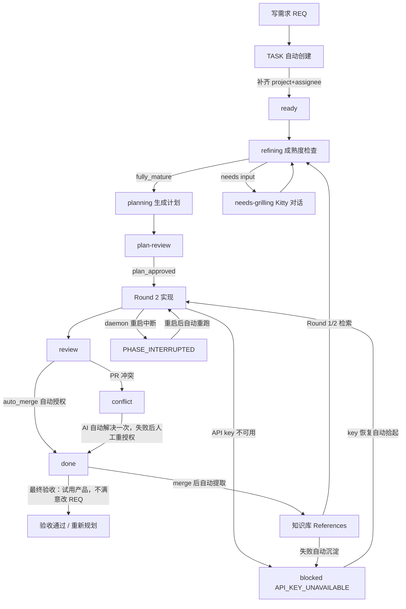
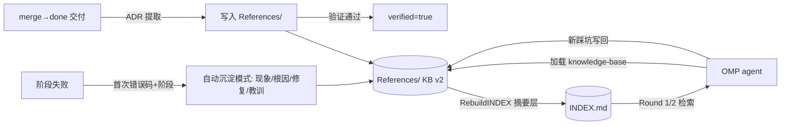

# Obsidian Task Runner

> 在 Obsidian 写需求，自动生成任务、制定计划、实现代码、创建 PR 并合并——你只负责写需求、把握方向，最后验收产品。

Obsidian Task Runner（命令 `otg`）把 Obsidian Vault 当作轻量的需求入口，把项目代码目录当作执行目标。你只需要写需求、在两处确认、最后验收产品，其他步骤（计划、实现、测试、PR、合并）由 OMP Agent 和守护进程自动完成。

## 适合谁

- 用 Obsidian 管理需求，同时希望 AI 在真实 Git 仓库中实现代码。
- 需要保留计划、实现记录、验收结果和决策记忆，方便追溯。
- 希望全程自动化：从需求到计划、实现、PR 创建与合并都由系统完成，只保留「需求方向」和「最终产品验收」两个人工节点。

> 当前版本面向 Linux + systemd + OMP。其他操作系统可以使用单次命令，但没有内置的 systemd 常驻服务。

## 工作方式：你只需确认方向并验收产品
```text
写需求 REQ-xxx.md
        │
        ▼
自动创建 TASK-xxx.md ──(填写 project + assignee)──> ready
        │
        ▼
refining（headless 成熟度检查）
        │
        ├── fully_mature ──> planning（生成版本化实现计划）
        │                         │
        │                         ▼
        │                    plan-review
        │                         │ 你确认 plan_approved: true
        │                         ▼
        │                    Round 2：实现、测试、提交
        │
        └── 仅真争议 ──> needs-grilling
                              │ fact/auto 自动收敛（不问用户）；
                              │ Kitty tab 通知，你完成对话
                              ▼
                          refining（复验）→ planning → …
                          ↳ 重复争议（≥2 轮未答）→ 项目级清单一次性回答 → 自动分发回 refining

Round 2 完成后：
        │
        ▼
    review ──(auto_merge 默认 true，全自动)──> 自动创建 PR + 合并 ──> done
        │
        ▼
    最终验收：运行/试用产品
        │
        ├── 符合预期 ──> 任务结束
        └── 有问题 ──> 修改 REQ，自动重新规划
```

- **Grilling 对话**：AI 在 Kitty tab 中逐项追问，你确认方向。完成后自动回到成熟度检查。
- `plan_approved: true`：允许 Agent 按计划写代码（实现前唯一需要你确认的步骤）；声明 `auto_approve: true` 的完全自主任务（无 ADR 提议）首次规划自动批准，跳过此确认。
- **自动 PR 与合并**（`auto_merge: true` 默认）：实现完成后自动创建 PR、等待 CI 检查通过并合并，无需你操作；合并遇到冲突时 AI 自动尝试解决一次，仍失败才通知你手动处理。个别任务可设 `auto_merge: false` 恢复人工确认。
- **最终验收**：合并完成后（done）运行/试用产品；不满意直接修改 REQ，系统自动重新规划实现。



> 📖 想了解每一步系统具体做什么、调用哪个 Skill、写回哪些字段（含失败恢复与知识库回流）：见 [docs/workflow.md §0 自动化任务完整链路](docs/workflow.md)。

## 阶段化交付（大型项目按阶段走）

新项目与大型需求按**阶段**交付——每阶段有可演示成果，阶段收尾由 PM 评审评分，你决定继续 / 补充 / 结束，避免"任务永无止境"（release-manager 教训：76 个任务跑一个月无原型体验）。

- **自动分组**：daemon 每轮 scan 把未分阶段（`stage` 空）的进行中任务按依赖拓扑**确定性分组**为阶段（秒级、幂等），写入 `Notes/Stage-Plan.md` 并回填 TASK/REQ 的 `stage: "P{N}"` 字段——无需人工规划；也可手动 `otg stage-plan init <project>`（`--force` 重建 / `--dry-run` 预览）。
- **阶段归属**：`stage` 字段是权威判定（TASK 创建时从 REQ 继承，PM 拆分落地时写入）。
- **阶段完成**：某阶段任务全部 done+merged 后，daemon 自动触发 PM 阶段评审（四维评分写 `Notes/Stage-Review.md`）。你只需回答「评审决策:」：
  - `continue` — 进入下一阶段；
  - `supplement:{建议}` — 建议并入下一阶段；
  - `end` — 功能满足即结束，后续阶段任务自动关闭（不维护积压）。
- **贯穿型需求**（e2e/测试/环境/CI）：按阶段拆成**场景包**，只依赖同阶段或更早阶段——禁止一次性全量（TASK-066 17 轮 replan 死锁的教训）。

## 5 分钟安装

### 1. 准备依赖

需要安装：

- Go 1.24 或更高版本（从源码构建时需要）。
- `git`。
- `omp` 命令，并已配置可用模型。
- Linux 下建议使用 `systemd --user`。
- **推荐**：Kitty 终端（`allow_remote_control yes`）用于 Grilling 通知时自动创建新 tab。同一 TASK 只会保留一个活跃 Grilling tab；daemon 会跨 Kitty 窗口按任务 ID 去重，任务标题变化或 daemon 重启不会重复创建。
- 桌面通知还需要 `notify-send` 和通知服务。`kitty @ ls` 失败时 daemon 使用本次尝试写入的 5 分钟 debounce 阻止重复创建；Kitty JSON 无法解析时也不会冒险创建 tab，而是使用桌面通知 fallback 并等待后续扫描重试。


### 2. 构建并安装 `otg`

在仓库根目录执行：

```bash
git clone https://github.com/ndzuki/obsidian-task-runner.git
cd obsidian-task-runner
make build
make install
```

这会把二进制复制到 `~/.local/bin/otg`。确认该目录在 `PATH` 中：

```bash
otg version
```

### 3. 安装 Skill、配置文件和守护进程

`otg install` 会安装 Skill、生成 `vault-map.json`、部署任务看板，并在启用时注册 systemd 单元：

```bash
otg install \
  --vault "$HOME/Documents/Obsidian/MainVault" \
  --new-project-root "$HOME/src"
```

常用选项：

| 选项 | 默认值 | 作用 |
|------|--------|------|
| `--vault` | `~/Documents/Obsidian/MainVault` | Obsidian Vault 路径 |
| `--new-project-root` | `~/src` | 新项目创建根目录 |
| `--notifications` | `true` | 开启桌面通知 |
| `--poll-interval` | `30` | systemd 兜底扫描间隔（分钟） |
| `--systemd` | `true` | 是否安装 user systemd 服务 |
| `--dry-run` | `false` | 只预览，不写入文件 |
| `--force` | `false` | 强制覆盖安装文件；`vault-map.json` 中的用户配置（项目映射、模型）不会丢失 |

也可以使用环境变量：`OBSIDIAN_VAULT`、`NEW_PROJECT_ROOT`、`NOTIFY_ENABLED`、`POLL_INTERVAL_MINUTES`、`SYSTEMD_ENABLED`。

### 4. 配置项目映射

编辑：

```text
~/.omp/skills/obsidian-task-runner/config/vault-map.json
```

最小配置示例：

```json
{
  "obsidian_vault": "/home/you/Documents/Obsidian/MainVault",
  "projects": [
    {
      "name": "my-backend",
      "path": "/home/you/src/my-backend"
    }
  ],
  "new_project_root": "/home/you/src",
  "models": {
    "deepseek": "deepseek/deepseek-v4-flash",
    "gpt": "gateway/gpt-5.6-sol:xhigh",
    "default": "deepseek/deepseek-v4-flash"
  },
  "fallback_models": {
    "gpt": "deepseek/deepseek-v4-flash",
    "default": "deepseek/deepseek-v4-flash",
    "deepseek": "deepseek/deepseek-v4-flash"
  },
  "notifications": { "desktop": true },
  "poll_interval_minutes": 30,
  "max_concurrent_tasks": 2
}
```

`project` 必须匹配 `projects[].name`（如 `magic-models-manager`；带数字前缀的目录名 `002-magic-models-manager` 亦被兼容识别，新文档推荐使用 name）。`assignee` 必须匹配 `models` 的 key；未知 key 会回退到 `default`。完整字段见 [`obsidian-task-runner/config/vault-map.example.json`](obsidian-task-runner/config/vault-map.example.json)。

### 阶段并发上限（`phase_concurrency`）

`max_concurrent_tasks` 只限制 implementing；其它阶段（refining/planning/merge/priority/PM）默认各有限额，防止多任务同时启动 OMP 会话导致 token 快速消耗、API 限速或资源抢占：

```json
"phase_concurrency": {
  "refining": 3,
  "planning": 2,
  "merge": 1,
  "priority": 1,
  "pm": 1
}
```

- 达到上限的任务留在待调度队列，等其它任务完成释放槽位后自动启动（无需手动操作）。
- 任意 key 可调大/调小；置 `0` 或删除 = 该阶段不限并发；`round2` 由 `max_concurrent_tasks` 控制（不在此配置）。
- 修改后重启 daemon 生效。

### 并发任务

`max_concurrent_tasks` 是 daemon 同时运行的 **implementing（Round 2）任务**上限，默认 `2`，配置值必须至少为 `1`。该限制覆盖同一 daemon 内所有批次和扫描周期，避免多个实现任务同时占用过多 LSP、debug adapter、编译器以及本机 CPU/内存资源。

- **implementing / Round 2**：必须先获取全局 implementation slot；同一时刻最多运行 `max_concurrent_tasks` 个。
- **planning / refining / priority / merge**：受 `phase_concurrency` 各自上限约束（见下），避免 20+ 个 OMP 会话同时启动导致 token 快速消耗、API 限速和 CPU/内存抢占。
- **同一仓库的 Round 2**：daemon 先在仓库短锁内创建或复用 `~/.omp/worktrees/` 下的任务专属 Git worktree，再释放仓库锁；实际 OMP 在独立 worktree 中运行。
- **新项目 implementing**：虽然不使用 Round 2 worktree，但仍会占用 implementation slot，因为同样会使用代码分析和构建资源。
- **任务分支绑定**：如果 TASK frontmatter 已有 `target_branch`，daemon 创建或复用 worktree 时会绑定并校验该分支；若分支不存在则通过 `git worktree add -b <target_branch>` 创建。已有 worktree 分支不匹配时拒绝执行，避免代码写入错误分支。
- **空分支字段兼容**：尚未进入 Round 2 的任务可以保留 `target_branch: ""`。daemon 先提供任务专属 worktree，agent 在其中创建 `task/<id>-<slug>`；Round 2 完成后把实际分支写回 `target_branch`。
- **安全边界**：Round 2 使用独立 worktree；多个 Merge 或新项目任务仍不会同时修改主工作区。Planning / Refining 阶段不使用仓库。
- **任务身份与恢复**：运行去重、PID 文件和审计日志基于任务文件路径，而非单独的 `id`；不同项目可安全使用相同任务编号。

修改 `max_concurrent_tasks` 或安装新调度器二进制后，常驻 watcher daemon 需要重启才能生效；`otg daemon --once` 会在每次启动时读取配置。

### 思考模式（Thinking Mode）

DeepSeek-V4 系列支持思考模式（chain-of-thought）。daemon 按阶段自动传入 `--thinking`，无需手动配置：

| 阶段 | thinking | 理由 |
|------|----------|------|
| priority | `off` | 快速 JSON 评估 |
| refining | `low` | 对话式，轻推理 |
| planning | `high` | 深度思维链，提升计划质量 |
| round2 | `max` | 最深推理，代码质量优先 |

`deepseek/deepseek-v4-flash` 与 `deepseek/deepseek-v4-pro` 均支持 `max`；fallback 时保持相同 thinking 档位。兜底由 vault-map.json 的 `fallback_models` 映射配置：key 是 assignee（对应 `models` 的 key），value 是任意 OMP 模型标识。默认 `gpt`/`default`/`deepseek` 均指向 `deepseek/deepseek-v4-flash`；可增删 key（如给 `gemini` 也配兜底）、改任意模型（如切回 `deepseek/deepseek-v4-pro` 做深度推理兜底）、置 `""` 禁用单个 assignee 的兜底——全部无需改代码。模型标识不再使用 `:xhigh` 等后缀，推理强度完全由 `--thinking` 控制。

### 阻塞依赖自动恢复

daemon 每次扫描会检查 `blocked` 任务的 `blocked_by` 上游：若上游因**阶段失败**（`blocked_phase` + `MODEL_FAILED`/`PHASE_TIMEOUT` 等可恢复错误码）阻塞且未批准 resume，自动批准其恢复以解开依赖链。

- **只有 resume 后再次失败才累计** `auto_resume_count`（首次失败和人工 resume 后失败不消耗预算）。
- 连续失败达 2 次后停止自动恢复，并发桌面通知提醒你手动修复并设置 `resume_approved=true`。
- 人工 resume（无 `auto_resume_pending` 标记）会清零计数，重新获得自动恢复机会。
- 用户决策型阻塞（无 `blocked_phase`）与 `REQ_MISSING` 等错误永不自动恢复。

### API Key 不可用（KeePassXC 未解锁）

当 OMP 因无法获取模型 API Key（`No API key found`，通常 KeePassXC/secret service 未解锁）而失败时，任务以 `phase_error_code=API_KEY_UNAVAILABLE` 进入 `blocked`：

- **不重试、不 fallback**：所有 provider 共用同一 key 来源，重复尝试无意义；也不消耗 `planning_retry_count` 等重试预算。
- **自动拾起**：daemon 每次扫描先探测 key 可用性（环境变量 `DEEPSEEK_API_KEY`/`CODEX_API_KEY`，或 `secret-tool lookup app keepassxc type db-password`），不可用则不启动 OMP 并保持 `blocked`；可用后自动还原 `blocked_phase` 继续执行，无需手动 `resume_approved`。
- systemd 单元需要 `XDG_RUNTIME_DIR=/run/user/%U` 与 `DBUS_SESSION_BUS_ADDRESS` 才能访问 keyring；KeePassXC 未随桌面会话解锁时 key 不可达。

### 优雅停机

daemon 收到 SIGTERM（`systemctl stop`/重启/`otg install`）时，运行中的 OMP 会话先收 SIGTERM 保存 session 后退出，30 秒内未退出则强制终止；停机期间不会启动 fallback 模型。被中断的任务**不视为失败**：保持原状态并标记 `phase_error_code=PHASE_INTERRUPTED`，重启后下一轮扫描自动拾起继续执行（无 `blocked`、无需手动 `resume_approved`）；阶段成功后标记自动清除。`otg install` 的 stopDaemon 阻塞等待优雅停机完成，不与新实例竞态。

### 知识库（KB v2）：自动沉淀 + 主动检索

知识库位于 Vault 的 `References/`，按**主题域**分目录（分类稳定，不随项目活跃度变化）：`core/` 平台与架构技术（Go、K8s、容器、网络、GitOps）、`extended/` 运维与工具（数据库、可观测、Linux、Helm、方法论）、`archived/` 已废弃（仅人工归档）。使用频率是**元数据**（frontmatter `activity: high|normal|low`），由 INDEX 展示层按 `verified → activity → updated` 排序——**不移动文件、不破坏链接**，项目停更只影响元数据与检索优先级：



- **自动沉淀**：阶段失败时，`handlePhaseFailure` 自动把首次出现的错误码+阶段组合（`API_KEY_UNAVAILABLE`/`PHASE_INTERRUPTED`/`MODEL_FAILED` 等）追加为知识库「模式」（现象→根因→修复→教训），按错误码+阶段去重，跨重启有效——**踩坑在发生时即记录，不等人工**。
- **自动提取**：merge→done 交付后按任务提取其 `adr_written` 的 ADR 到 References/（`knowledge_extracted` 幂等）；分类由知识库自身 topics/aliases/tags 数据驱动（tag 优先 + 置信门槛），未匹配自动归档 `References/uncategorized/` 并在词表扩展后自动重分类归位；翻转 `verified=true`（实践验证信号）。ADR 写入时 daemon 自动打标（additive，用户可在 Obsidian 属性面板审查）。
- **主动检索**：Round 1/2 的 skill 强制加载 `skill://knowledge-base`：Round 1 执行 Step -1 项目知识图谱（CONTEXT + ADR + References 三源交叉）并把技术栈约束纳入计划，命中的知识文档写入 TASK `knowledge_refs` 形成跨会话引用链；Round 2 按 `knowledge_refs` 清单逐项应用，实现中发现的坑写回知识库；merge 时 daemon 度量 `knowledge_applied`（hit/total）；refining 对 REQ 细化做增量重关联（新术语 → CONTEXT 回写 + 检索注入）。
- **KB v2 格式**：每个文件 H1 后强制摘要（INDEX 自动提取为检索摘要列）、>300 行强制目录、要点化/表格化、零 AI 聊天链接与项目文件清单（`RebuildINDEX` 自动标记噪音）。

### 5. 确认服务状态

```bash
systemctl --user status omp-task-watcher.service
systemctl --user list-timers | grep omp-task-runner
journalctl --user -u omp-task-watcher.service -n 50
```

如果暂时不想安装常驻服务，可以手动运行一次扫描：

```bash
otg daemon --once
```

## 第一个需求

需求文件放在 Vault 的 `Projects/<project>/Requirements/` 下，文件名使用 `REQ-<id>-<slug>.md`，例如 `REQ-001-login.md`：

```markdown
---
id: "001"
title: 用户登录 API
project: my-backend
priority: P2
tags: [auth]
---

## 要做什么
实现 JWT 鉴权的登录接口。

## 完成标准
- [ ] POST /api/login 返回 token
- [ ] 无效凭证返回 401
```

保存后 watcher 会创建对应的 `Projects/<project>/Tasks/TASK-001-login.md`。打开任务文件，补齐至少这些字段：

```yaml
project: my-backend
assignee: deepseek
```

通常不需要手动修改 `status`。当必填字段齐全且没有未完成依赖时，`blocked` 会自动变成 `ready`。

> 旧版 Vault 根目录的 `Requirements/REQ-xxx.md` 仍可使用；新项目推荐使用项目目录结构。

## Obsidian Dataview 看板

安装 Dataview 后，打开 Vault 根目录的 `Tasks-Dashboard.md`，即可查看任务汇总、待处理任务、阻塞任务和最近完成记录。

Dataview 的安装、字段格式、查询解释和常见问题见：[`docs/dataview.md`](docs/dataview.md)。

如果安装命令没有部署看板，可以手动复制仓库中的 [`Tasks-Dashboard.md`](Tasks-Dashboard.md) 到 Vault 根目录。Dataview 只负责读取和展示，不会替你修改任务状态。

## 状态与人工操作

| 状态 | 含义 | 你的操作 |
|------|------|----------|
| `blocked` | 缺少项目、执行者或依赖未完成 | 补齐 `project`、`assignee`，检查 `blocked_by` |
| `ready` | 已就绪，等待 priority assessment 完成 | daemon 自动转入 `refining` |
| `refining` | 正在 headless 检查需求成熟度 | 无需操作；fact/auto 自动收敛，成熟后自动进入 planning，仅真争议进 needs-grilling |
| `needs-refining` | 旧版状态（已废弃） | daemon 自动迁移为 needs-grilling 后正常处理 |
| `needs-grilling` | 等待你交互式对话对齐需求或解决阻塞 | 在 Kitty 新 tab 中与 OMP 对话，完成后自动恢复；`grill_parked=true` 时静默等待项目级清单回答；清单 `status=paused`（需求未想好）时暂停提醒，REQ 更新后 daemon 自动重新激活 |
| `planning` | 正在生成版本化实现计划 | 无需操作；成功后进入 plan-review |
| `plan-review` | 计划已生成 | 审阅计划 + ADR 提议，确认后设 `plan_approved: true`；`auto_approve` 合格任务自动批准（有 ADR 提议除外） |
| `implementing` | Agent 正在改代码 | 不要同时手改同一分支；可能卡住回到 `needs-grilling` |
| `review` | 本地实现已提交，正在自动合并（`auto_merge: true`） | 无需操作；合并失败时按通知处理 |
| `conflict` | 合并遇到冲突（AI 已自动尝试解决一次） | 手动解决并设 `merge_approved: true` 重新授权 |
| `done` | 已合并完成 | 任务结束；REQ 变更时自动回 refining |
| `closed` | 已关闭（重复/取消/不予处理） | 终态，不可恢复 |
Round 1 和 Round 2 只在本地创建分支、改文件和提交，不会 push。进入 Merge Phase 需 `merge_approved: true`——`auto_merge: true`（默认）时 daemon 在 review 阶段自动授权，无需你操作；PR 冲突时 AI 自动解决一次，失败才通知你手动处理。Round 2 遇到阻塞时会暂停为 `needs-grilling`，等待你交互式解决问题后自动恢复。

## 常用命令

| 命令 | 用途 |
|------|------|
| `otg install` | 安装 Skill、配置和 systemd |
| `otg install --dry-run` | 预览安装动作 |
| `otg daemon` | 常驻监听 Vault 并处理任务 |
| `otg daemon --once` | 扫描一次后退出 |
| `otg daemon --map-file <path>` | 使用指定的 `vault-map.json` |
| `otg status` | 查看守护进程状态、运行中任务数 |
| `otg config show` | 显示当前配置（含来源标注） |
| `otg find-ready <vault>` | 输出可执行任务（NDJSON） |
| `otg on-req-changed <vault> <req>` | 手动处理需求变化 |
| `otg update-status <task> [key=value ...]` | 原子更新任务 frontmatter |
| `otg review <task>` | 显示任务的 review bundle |
| `otg stage-plan init <project>` | 按依赖拓扑生成/追加阶段计划（`--force` 重建，`--dry-run` 预览） |
| `otg validate-doc <path>` | 校验任意文档（自动识别 TASK/REQ/ADR）+ body tag 扫描 |
| `otg repair-doc <task>` | 修复损坏的 frontmatter + body tag 自动转义 |
| `otg version` | 查看版本（tag + commit hash） |

## 文件在哪里

| 路径 | 内容 |
|------|------|
| `~/.local/bin/otg` | Go 二进制（systemd 守护进程使用） |
| `~/go/bin/otg` | Go 二进制（终端直接调用） |
| `~/.omp/skills/obsidian-task-runner/` | Agent Skill、参考文档和配置 |
| `~/.omp/skills/obsidian-task-runner/config/vault-map.json` | Vault 与项目映射、模型映射 |
| `~/.omp/logs/` | daemon 和任务审计日志 |
| `~/Vault/Projects/<project>/Requirements/` | 你编写的需求 |
| `~/Vault/Projects/<project>/Tasks/` | Agent 自动创建和更新的任务 |
## 故障排查

1. **没有生成 TASK**：确认文件名是 `REQ-<id>-<slug>.md`，并查看 `~/.omp/logs/otg-daemon.log`。
2. **TASK 一直是 `blocked`**：检查 `project` 是否存在于 `vault-map.json`，`assignee` 是否填写且是有效 model key，`blocked_by` 是否为空。
3. **没有自动执行**：查看 `systemctl --user status` 和 `~/.omp/logs/otg-daemon.log`；也可运行 `otg daemon --once` 验证配置。
4. **计划或代码没有继续**：确认对应 gate 字段已设为 `true`，保存任务文件后等待下一次扫描。
5. **看板为空**：确认已安装并启用 Dataview，查询来源目录是 `Projects`，任务位于 `Projects/<project>/Tasks/`，然后在 Obsidian 中重新加载索引。
6. **任务 frontmatter 损坏（"parse error"）**：运行 `otg validate-doc <task>` 诊断（现在会同时检查必填字段），`otg repair-doc <task>` 修复（可恢复块标量、列表，并将损坏的双引号标量转为块标量）。修复后 `validate-doc` 应输出 `frontmatter OK`。
7. **需要重新安装 Skill**：先执行 `otg install --dry-run`，确认路径无误后再执行 `otg install --force`。用户的 `vault-map.json`（项目映射、模型配置）不会被覆盖。

更多状态字段、需求变更、断点续跑和冲突处理说明见 [`obsidian-task-runner/reference.md`](obsidian-task-runner/reference.md)。架构时序图见 [`docs/workflow.md`](docs/workflow.md)。

## 文档索引

- [`docs/dataview.md`](docs/dataview.md)：Dataview 安装和看板配置（推荐先读）。
- [`docs/workflow.md`](docs/workflow.md)：架构和完整业务流程（含 §12 知识库知识流）。
- [`obsidian-task-runner/SKILL.md`](obsidian-task-runner/SKILL.md)：Agent 执行规则（含 KB v2 格式规范）。
- [`obsidian-task-runner/reference.md`](obsidian-task-runner/reference.md)：状态、字段、故障排查参考。
- [`REQ-000-template.md`](REQ-000-template.md)：需求模板。
- [`TASK-000-template.md`](TASK-000-template.md)：任务模板。

## License

MIT © 2026 ndzuki and contributors
