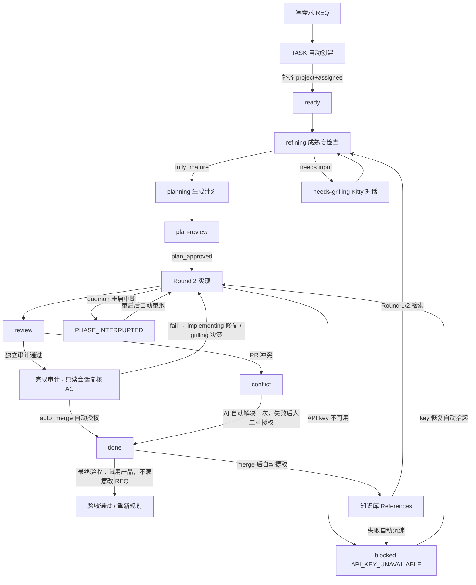
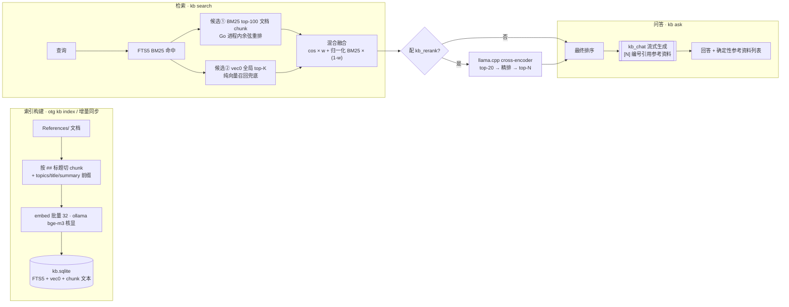
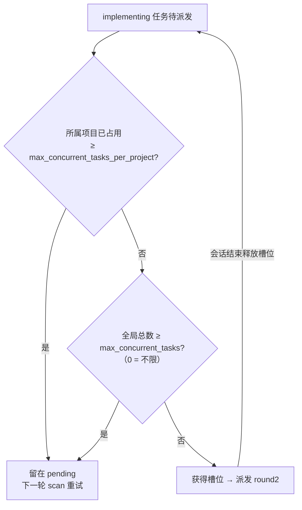
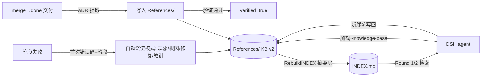

# Obsidian Task Runner

> 在 Obsidian 写需求，自动生成任务、制定计划、实现代码、创建 PR 并合并——你只负责写需求、把握方向，最后验收产品。

Obsidian Task Runner（命令 `otg`）把 Obsidian Vault 当作轻量的需求入口，把项目代码目录当作执行目标。你只需要写需求、在两处确认、最后验收产品，其他步骤（计划、实现、测试、PR、合并）由 DSH Agent 和守护进程自动完成。

## DSH 2.0 时代：长驻 Agent 运行时 + 插件生态

本项目运行在 **DSH 2.0（DeepSeek Harness 插件时代）** 之上：daemon 管理一个长驻 `agent-server`（`headless-agent-server` profile），自动化阶段经 `/agent/run` 复用同一运行时，交互问答经 `/agent/chat` 同源接入——不再每阶段冷启动短命进程。相比 spawn 一代，关键优势：

| 维度 | spawn 一代 | DSH 2.0（embed + 插件） |
| --- | --- | --- |
| 会话生命周期 | 每阶段新进程，中断即丢 | **durable resume**：daemon 重启/会话中断后按 sessionId 重挂继续执行，不重跑（TASK-058 教训固化进实现） |
| 推理强度 | 无法 per-阶段传递 | 每阶段自动传 `reasoningEffort`（`low/medium/high/xhigh`），grilling 单独分级（见「推理强度」节） |
| 交互会话 | 与自动化割裂 | grilling / dsh web / Agent Town 问答统一走 `/agent/chat`：**KB-first 服务端预检索 + 项目上下文注入**（CONTEXT.md / ADR / 规范摘要），本地优先零豁免（见「交互会话本地优先」节） |
| 知识沉淀 | 依赖模型自觉 | `kb-distill` 会话结束自动提炼（确定性踩坑抽取零 LLM token + 门控小模型语义提炼）、daemon merge 自动提取、watcher 自动建索引——"写入即检索" |
| 监控 | 翻日志 | **Agent Town** 俯视 RPG 像素小镇（960×540）实时看并发会话：职业建筑/四季昼夜/实时太阳影子/A* 寻路/装饰居民互动 + 问答弹窗 + 「📊 KB 预检索」小图（命中率 / 耗时直方图） |

**插件矩阵**（cordis patch 挂载，dsh 升级不丢；📦 = 随 `make deploy` 从本仓库同步）：

| 插件 | 位置 | 职责 |
| --- | --- | --- |
| `agent-server` 📦 | repo → `~/.dsh/plugins/` | 长驻 RPC：`/agent/run` 自动化阶段、`/agent/chat` 交互问答、`/agents` `/kb-stats` 监控 |
| `kb-preflight` 📦 | repo → `~/.dsh/plugins/` | dsh web / dsh-tui 原生聊天 KB-first 注入（项目上下文 + 预检索，非阻塞首问） |
| `fallback` | home patch | 跨模型自动降级（免费渠道优先，仅自动化阶段生效） |
| `kb-distill` | home patch | 会话结束 / 空闲知识提炼 → `otg kb absorb` |
| `dsh-commands` | home patch | `/review` `/handoff` `/scaffold` `/grill` `/model-catalog` 斜杠命令 |
| `vault-dashboard` | home patch | `/vault` 打开项目看板（`otg web serve` 提供） |
| `mcp-context7` | home patch | 第三方库/框架文档 MCP（本地库未命中时兜底外查） |

**dsh web 多工作区 = 项目会话**：工作区对应 vault-map 注册项目的 checkout——在该会话提问项目相关问题，首问自动注入该项目上下文（CONTEXT/ADR/规范）与全局知识库预检索命中，**先查本地知识再推理**；模型由你在会话里自选（或 `~/.dsh/settings.yaml` 的 `agent-default-model`），失败不自动切换（防长会话被免费重试占住）。

## 适合谁

- 用 Obsidian 管理需求，同时希望 AI 在真实 Git 仓库中实现代码。
- 需要保留计划、实现记录、验收结果和决策记忆，方便追溯。
- 希望全程自动化：从需求到计划、实现、PR 创建与合并都由系统完成，只保留「需求方向」和「最终产品验收」两个人工节点。

> 当前版本面向 Linux + systemd + DSH（默认 `executor: dsh-embed`，长驻 agent-server 运行时）。其他操作系统可以使用单次命令，但没有内置的 systemd 常驻服务。

## 工作方式：你只需确认方向并验收产品

```text
写需求 REQ-xxx.md
        │
        ▼
自动创建 TASK-xxx.md ──(填写 project + assignee)──> ready
        │
        ▼
refining（headless 成熟度检查）
        │
        ├── fully_mature ──> planning（生成版本化实现计划）
        │                         │
        │                         ▼
        │                    plan-review
        │                         │ 你确认 plan_approved: true
        │                         ▼
        │                    Round 2：实现、测试、提交
        │
        └── 仅真争议 ──> needs-grilling
                              │ fact/auto 自动收敛（不问用户）；
                              │ Kitty tab 通知，你完成对话
                              ▼
                          refining（复验）→ planning → …
                          ↳ 重复争议（≥2 轮未答）→ 项目级清单一次性回答 → 自动分发回 refining

Round 2 完成后：
        │
        ▼
    review ──(auto_merge 默认 true)──> 独立完成审计（只读复核 AC 证据）──> 自动创建 PR + 合并 ──> done
        │
        ▼
    最终验收：运行/试用产品
        │
        ├── 符合预期 ──> 任务结束
        └── 有问题 ──> 修改 REQ，自动重新规划
```

- **Grilling 对话**：AI 在 Kitty tab 中逐项追问，你确认方向。完成后自动回到成熟度检查。
- **计划与实现全自动**（`auto_approve: true` 默认）：计划生成后自动批准进入实现——**Grilling 是唯一人工关卡**；个别任务可设 `auto_approve: false` 恢复人工审计划（`plan_approved: true`）。
- **自动 PR 与合并**（`auto_merge: true` 默认）：实现完成后先由**独立只读审计会话**逐条复核验收标准（AC）的原始证据（测试/命令输出，非实现者自证），通过后才自动创建 PR、等待 CI 检查通过并合并，无需你操作；审计失败自动转回实现修复（详见 [docs/workflow.md §7.4](docs/workflow.md)）；合并遇到冲突时 AI 自动尝试解决一次，仍失败才通知你手动处理。个别任务可设 `auto_merge: false` 恢复人工确认。
- **最终验收**：合并完成后（done）运行/试用产品；不满意直接修改 REQ，系统自动重新规划实现。



> 📖 想了解每一步系统具体做什么、调用哪个 Skill、写回哪些字段（含失败恢复与知识库回流）：见 [docs/workflow.md §0 自动化任务完整链路](docs/workflow.md)。想了解 daemon 与 DSH agent-server 的进程拓扑、模型路由与恢复层级：见 [docs/architecture.md](docs/architecture.md)。

## 阶段化交付（大型项目按阶段走）

新项目与大型需求按**阶段**交付——每阶段有可演示成果，阶段收尾由 PM 评审评分，你决定继续 / 补充 / 结束，避免"任务永无止境"（release-manager 教训：76 个任务跑一个月无原型体验）。

- **自动分组**：daemon 每轮 scan 把未分阶段（`stage` 空）的进行中任务按依赖拓扑**确定性分组**为阶段（秒级、幂等），写入 `Notes/Stage-Plan.md` 并回填 TASK/REQ 的 `stage: "P{N}"` 字段——无需人工规划；也可手动 `otg stage-plan init <project>`（`--force` 重建 / `--dry-run` 预览）。
- **阶段归属**：`stage` 字段是权威判定（TASK 创建时从 REQ 继承，PM 拆分落地时写入）。
- **阶段完成**：某阶段任务全部 done+merged 后，daemon 自动触发 PM 阶段评审（四维评分写 `Notes/Stage-Review.md`）。你只需回答「评审决策:」：
  - `continue` — 进入下一阶段；
  - `supplement:{建议}` — 建议并入下一阶段；
  - `end` — 功能满足即结束，后续阶段任务自动关闭（不维护积压）。
- **贯穿型需求**（e2e/测试/环境/CI）：按阶段拆成**场景包**，只依赖同阶段或更早阶段——禁止一次性全量（TASK-066 17 轮 replan 死锁的教训）。

## 5 分钟安装

### 1. 准备依赖

需要安装：

- Go 1.24 或更高版本（从源码构建时需要）。
- `git`。
- `dsh` 命令，并已配置可用模型。
- Linux 下建议使用 `systemd --user`。
- **推荐**：Kitty 终端（`allow_remote_control yes`）用于 Grilling 通知时自动创建新 tab。同一 TASK 只会保留一个活跃 Grilling tab；daemon 会跨 Kitty 窗口按任务 ID 去重，任务标题变化或 daemon 重启不会重复创建。
- 桌面通知还需要 `notify-send` 和通知服务。`kitty @ ls` 失败时 daemon 使用本次尝试写入的 5 分钟 debounce 阻止重复创建；Kitty JSON 无法解析时也不会冒险创建 tab，而是使用桌面通知 fallback 并等待后续扫描重试。

### 2. 构建并安装 `otg`

在仓库根目录执行：

```bash
git clone https://github.com/ndzuki/obsidian-task-runner.git
cd obsidian-task-runner
make build
make install
```

这会把二进制复制到 `~/.local/bin/otg`。确认该目录在 `PATH` 中：

```bash
otg version
```

### 3. 安装 Skill、配置文件和守护进程

`otg install` 会安装 Skill、生成 `vault-map.json`、部署任务看板，并在启用时注册 systemd 单元：

```bash
otg install \
  --vault "$HOME/Documents/Obsidian/MainVault" \
  --new-project-root "$HOME/src"
```

常用选项：

| 选项 | 默认值 | 作用 |
| ------ | -------- | ------ |
| `--vault` | `~/Documents/Obsidian/MainVault` | Obsidian Vault 路径 |
| `--new-project-root` | `~/src` | 新项目创建根目录 |
| `--notifications` | `true` | 开启桌面通知 |
| `--poll-interval` | `30` | systemd 兜底扫描间隔（分钟） |
| `--systemd` | `true` | 是否安装 user systemd 服务 |
| `--dry-run` | `false` | 只预览，不写入文件 |
| `--force` | `false` | 强制覆盖安装文件；`vault-map.json` 中的用户配置（项目映射、模型）不会丢失 |

也可以使用环境变量：`OBSIDIAN_VAULT`、`NEW_PROJECT_ROOT`、`NOTIFY_ENABLED`、`POLL_INTERVAL_MINUTES`、`SYSTEMD_ENABLED`。

### 4. 配置项目映射

编辑：

```text
~/.dsh/skills/obsidian-task-runner/config/vault-map.json
```

最小配置示例：

```json
{
  "obsidian_vault": "/home/you/Documents/Obsidian/MainVault",
  "projects": [
    {
      "name": "my-backend",
      "path": "/home/you/src/my-backend"
    }
  ],
  "new_project_root": "/home/you/src",
  "models": {
    "default": "deepseek_magic/gpt-5.4-mini",
    "deepseek": "deepseek_magic/deepseek-v4-pro",
    "gpt": "openai/gpt-5.6-sol",
    "openai": "openai/gpt-5.6-sol",
    "deepseek_magic": "deepseek_magic/deepseek-v4-pro",
    "ds-official": "ds-official/deepseek-v4-pro"
  },
  "notifications": { "desktop": true },
  "poll_interval_minutes": 30,
  "max_concurrent_tasks": 0,
  "max_concurrent_tasks_per_project": 2,
  "auto_resume_aged_after_hours": 24
}
```

### 环境收尾（`env_cleanup`，opt-in，默认关闭）

实现会话（round2）常为冒烟测试自建 k3d 集群 / k3d registry / docker 网络，偶尔忘记拆除。daemon 提供兜底清理，但**默认不启用**（删除集群是有损操作，必须由运维显式声明）：

```json
"env_cleanup": {
  "on_merge": true,
  "on_block": true,
  "exclude": ["my-persistent-cluster"],
  "dry_run": false
}
```

- `on_merge`：任务进入 merged/done 终态时自动删除 k3d 集群、k3d registry 及其残留网络。先删 registry（断开与集群网络的连接）再删集群，最后兜底删 `k3d-<cluster>` 网络。
- `on_block`：任务停止实现但未合并时自动删除同样的可丢弃资源——`blocked`（阶段失败 / 需求变更 / pending_req 重规划）、`needs-grilling`、`closed`。每段阻塞只清理一次（按 `blocked_at` 等状态签名去重）。
- `exclude`：名称子串白名单，永不删除（常驻服务、想保留的持久集群）。**务必把你机器上的非任务集群写进去**。
- `dry_run`：只记录和通知"将清理什么"，不实际删除，用于先审计再信任。
- 该清理只针对 k3d 集群 / k3d registry / k3d 网络，不触碰任意 docker 容器。

`project` 必须匹配 `projects[].name`（如 `magic-models-manager`；带数字前缀的目录名 `002-magic-models-manager` 亦被兼容识别，新文档推荐使用 name）。`assignee` 必须匹配 `models` 的 key；未知 key 会回退到 `default`。完整字段见 [`docs/config-reference.md`](docs/config-reference.md)（示例文件只含最小键，`otg config show --effective` 查看生效值）。

**团队已有项目（私有 Gitea 等）**：手动注册并标记 `project_type: team`（daemon 禁止自动建仓/提升/gh 操作，首个任务自动过只读规范审查门禁）。`merge_mode` 按开发方式选择——`manual`：直接在团队仓库上开发，交付停在推分支、你在仓库 UI 人工合并；`fork-merge`（推荐）：`git_remote` 指向你自己的 fork，自动化 merge 进 fork 默认分支并推送（冲突 AI 解决），再由你手动向团队项目提交 PR。详见 `docs/workflow.md` §6.5.1。

### 阶段并发上限（`phase_concurrency`）

`max_concurrent_tasks` / `max_concurrent_tasks_per_project` 只限制 implementing；其它阶段（refining/planning/merge/priority/PM）默认各有限额，防止多任务同时启动 dsh 会话导致 token 快速消耗、API 限速或资源抢占：

```json
"phase_concurrency": {
  "refining": 3,
  "planning": 2,
  "merge": 1,
  "priority": 1,
  "pm": 1,
  "audit": 1
}
```

- 达到上限的任务留在待调度队列，等其它任务完成释放槽位后自动启动（无需手动操作）。
- 任意 key 可调大/调小；置 `0` 或删除 = 该阶段不限并发；`round2` 由 `max_concurrent_tasks_per_project`（每项目上限）+ `max_concurrent_tasks`（可选全局总封顶）控制（不在此配置）。
- 修改后重启 daemon 生效。

### 阻断任务老化兜底恢复（`auto_resume_aged_after_hours`，默认 24）

`status=blocked` 且错误可自动恢复（MODEL_FAILED/QUOTA/PHASE_TIMEOUT/PHASE_INTERRUPTED/DESIGN_SESSION_FAILED 等）的任务，阻断超过该窗口后 daemon 每轮 scan 自动 `resume_approved=true` 重试（预算 2 次）。想改为 12 小时就在 vault-map.json 设 `"auto_resume_aged_after_hours": 12`；人为决策块（REQ_MISSING/DOCUMENT_INVALID/入口门禁）不按年龄恢复。

### 知识库语义检索（`kb_embedding`，可选）

`otg kb search` 默认 BM25 关键词检索（零依赖、本地）。配置 embedding 后端后可做**语义检索**（同义/跨词面匹配，如「状态机」命中 state-machine 文档）：



```json
"kb_embedding": {
  "backend": "ollama",              // ollama（默认）或 openai（OpenAI 兼容 API）
  "url": "http://127.0.0.1:11434",  // ollama 基址；openai 填 https://api.openai.com/v1
  "model": "bge-m3",                // ollama 推荐 bge-m3（中文友好）
  "api_key": "",                    // 仅 openai 后端需要
  "weight": 0.5,                    // 余弦相似度权重（0.5 = 与 BM25 对半）
  "chunk_chars": 600,               // 每 section 嵌入正文上限（字符；调大捕获更多语义，需重跑 kb index）
  "batch_size": 32,                 // 每次嵌入 API 调用条数（索引构建吞吐）
  "knn_candidates": 100             // BM25 命中文档进入余弦候选集的上限（查询成本）
}
```

配置后执行一次 `otg kb index` 全量重建检索库（存 `~/.local/share/otg/kb.sqlite`，vault 外——云同步的 vault 不背索引；百篇级约 90 秒，以 embedding 推理为主）；之后 `otg kb search` 自动混合 FTS5 BM25 + 余弦，embedding 后端不可用时自动回退纯 BM25。之后每次 `kb absorb`/merge 提取/promote 都会**增量同步**（content_hash 比对，未变文档零成本），无需重复全量重建。需先本地运行 ollama 并 `ollama pull bge-m3`。检索库记录所用 embedding 模型：**切换模型（含切到 OpenAI 兼容云服务）后旧向量自动失效**，`otg kb search` 提示并回退 BM25，重跑 `otg kb index` 全量重建即可——不同模型的向量维度不兼容，绝不混用。库路径可用 vault-map.json 的 `kb_db` 字段覆盖（默认路径不区分 vault——**多 vault 机器必须为每个 vault 配置独立的 `kb_db`**，否则错误的 `--map-file` 会命中别的 vault 的库）；**注意**：配置 `kb_db` 覆盖路径后，`otg kb hit` 的 hits 同步仍走默认库（该命令无配置上下文）——保持默认路径则实时生效，覆盖路径下 hits 在下次内容变更同步时从 frontmatter 补入。

**GPU/特殊硬件**：Ollama 官方镜像不含 Intel GPU 后端；Intel Arc 等设备请使用社区 SYCL 构建镜像，端口保持 11434 即可，`kb_embedding` 配置无需改动。

### 交互会话本地优先（`kb_vault`，KB-first）

自动化任务（round1/round2/refining 等）已强制"先查知识库"。这里把同一原则扩展到**普通交互会话**（`/agent/chat`：grilling、web 聊天、临时需求解决）——即便会话不属于任何 vault 项目，agent 也**带着问题先查全局共享知识库**，命中即引用（标注来源路径 + verified），未命中才自行推理/外搜，减少思考摸索与踩坑：

```json
"kb_vault": "/path/to/global-knowledge-vault"   // 全局共享知识库根（其 References/ 作为语料）
```

- 为空时回退 `obsidian_vault`；两者皆空则交互会话跳过注入（agent-server 仍可独立运行）。
- daemon 拉起 agent-server 时经 `OTR_KB_VAULT` / `OTR_KB_DB` / `OTR_PROJECT_VAULT` 传入。**每个全新交互会话首条消息**，agent-server 注入两块：
  1. **项目工作区上下文**（`/agent/chat` 带 `project` 字段，命中 `<vault>/Projects/<dir>` **已注册项目**时——vault-map 可读则仅注册项目放行，map 缺失/不可解析保持旧行为按目录匹配）：注入该项目 `Notes/CONTEXT.md`（约束/反模式/语言术语——小节标题按别名容错匹配，中英文/大小写变体均可命中；无已知小节时回退注入 CONTEXT 概览，内容不整块丢失）、`Notes/adr/`（架构决策：按 mtime 倒序取最近 8 条，附 status 与决策一行）、`Notes/PROJECT-CONVENTIONS.md`（规范 + 架构约束，最高优先）的紧凑摘要 + 文件路径，并明确"涉及项目本身的问题先据此回答、不要从零推理，需要细节用 read 读全文"。kitty-grill 会自动从任务文件推导项目名并传递。
  2. **KB-first 全局预检索**：首问**非阻塞注入**——命中缓存时注入 top-3 命中（来源/标题/摘要），未命中则先注入毫秒级 `References/INDEX.md` 索引摘要（按查询词相关性排序——相关行排前，零分行保持原序殿后），并在后台异步预热缓存；完整检索走 hybrid-only 快路径（`rerank=false` / `--no-rerank`，FTS5 BM25 + embedding 混合，后端不可用回退 BM25），避免首问和 reranker CPU 延迟挂钩。命中不足时模型可再 `otg kb search` 深挖。
- 客户端可带 `kbQuery` 字段提供更精准的全局检索查询词（kitty-grill 传任务标题）；否则服务端从首条消息派生。
- **预检索缓存与超时**（只注入新会话首条，多轮不重复膨胀；`/agent/run` 不受影响）：
  - 命中缓存：key = vault+库+embedding/rerank 配置指纹+**归一化查询词**（全角转半角/lowercase/去标点——"如何部署 OTG？"与"如何部署otg"共享缓存），TTL 10 分钟，带 TTL 的 LRU（超限逐最旧，不清空热数据）；**检索失败短缓存 30 秒**（瞬时故障不毒化 10 分钟），真无命中才按满 TTL 缓存。
  - 超时自适应：首次/空闲超 5 分钟（embedding 模型卸载冷）/上次慢或超时 → 15s 全预算；上次 ≤3s 完成 → 4s 快预算；超时自动回退 INDEX 摘要，不卡聊天会话。
  - 门禁：问候语/单 token 等无效查询跳过预检索（项目上下文块仍注入）。
  - **非阻塞**：agent-server 与 kb-preflight 一致——首问不等检索子进程/embedding/rerank；未命中只注入毫秒级 INDEX 摘要，后台异步预热缓存。
  - **可观测**：小时日志 `kb-precompute stats(hourly) hits=… avgMs=…`（命中率/平均耗时）；旧 `kb-injected injected=N consumed=M` 只在命中缓存并注入 top-3 路径时统计（未命中首轮为 INDEX 摘要，不产生该日志）。
  - **常驻检索端点（B2）**：agent-server 预检索与 kb-preflight 后台预热**优先走 daemon 内嵌 vaultweb 的 `GET /api/kb/search?q=…&limit=…&rerank=false`**（进程内 FTS5 BM25 + embedding 混合，hybrid-only 快路径；不传 `rerank=false` 时保持含 rerank 的完整语义）——免去每次 spawn otg 重开 SQLite 的固定开销，也避免预检索为 cross-encoder 付 2-3 秒 CPU 延迟；端点不可用（daemon 未起/未配置 vault_web_addr）自动回退 spawn（`--no-rerank`），两条路径共用同一缓存。
- **Web 监控面板内置问答**：`agent-server /monitor`（Agent Town）里选中任意居民点「💬 问答」即打开聊天弹窗，直接走 `/agent/chat`——自动携带该 agent 的 `project`（首问注入项目上下文）与任务标题作 `kbQuery`，同一 agent 的多轮会话自动延续（复用 sessionId），provider/model 可改（默认 `deepseek_magic/deepseek-v4-pro`）。改 `agent-monitor.html` 后 `make deploy` 由重启后的 daemon 拉起新 agent-server 使面板生效。**面板侧栏还内置「📊 KB 预检索」小图**（`GET /kb-stats`，每 30s 轮询）：命中率/均耗/检索次数 + 耗时直方图（累计与小时窗口，桶边界 `<100/100-500/500-1k/1-2k/2-4k/4-16k/≥16k` ms；累计跨 agent-server 重启持久化到 `~/.local/state/dsh/agent-server-kb-stats.json`，重启后自动恢复）——无需再开页面即可观测缓存命中率与 B1 超时预算的分布证据。
- **dsh web / dsh-tui 原生聊天**（2026-09-02 起，`kb-preflight` 插件）：原生交互会话不经过 agent-server，由 `deploy/dsh-plugins/kb-preflight.mjs` 在 DSH 原生 seam（`agent/pre-step`）对新会话首个用户消息注入同款两块内容——**非阻塞设计，首问只快不慢**：项目上下文为毫秒级文件读（CONTEXT 别名容错/ADR 按 mtime 倒序附 status/决策/规范）；KB 块优先命中缓存（归一化查询词，10min TTL，失败短缓存 30s），未命中时**只注入毫秒级的 INDEX 摘要（按查询词相关性排序）并在后台异步 spawn `otg kb search` 预热缓存**，绝不让首问等检索子进程/embedding。项目识别：会话 cwd 匹配 vault-map `projects[].path`（或其子目录）或 `<vault>/Projects/<dir>`——**仅已注册项目**（map 缺失/不可解析时放行）。防双注入：会话已含 `<knowledge_base>`/`<project_context>` 块则跳过，同 agent 每会话仅一次。挂载方式（仅交互 profile，headless 自动化不加载）：
  ```yaml
  # ~/.dsh/profiles/web/cordis.patch.yml（dsh-tui 同理）
  - insert:
      - id: kb-preflight
        name: ~/.dsh/plugins/kb-preflight.mjs
        config: {}   # mapFile/vault/db/otgPath 缺省自动读 vault-map.json
  ```

### 检索精排（`kb_rerank`，可选）

混合检索的 top-N（默认 20）可再接一个 **cross-encoder 精排**，把强相关文档顶到前面（对长尾/近义查询收益最明显）——`kb search` 与 `kb ask` 均生效（ask 先取 top-N 候选精排，再截断到 `--limit`）：

```json
"kb_rerank": {
  "backend": "openai",                       // openai（默认，/v1/rerank）或 llamacpp（/rerank）
  "url": "http://127.0.0.1:11435",           // llama.cpp server 基址（Ollama 0.32.x 无 rerank 路由）
  "model": "bge-reranker-v2-m3",
  "top_n": 20                                // 精排候选数
}
```

llama.cpp 部署示例：`llama-server -m bge-reranker-v2-m3-f16.gguf --port 11435`（GPU 编译版可加 `--device` 参数）。**后端不可用时自动降级**：保持混合检索原序，不影响搜索结果。精排文本 = 标题 + 摘要 + 最佳 section 嵌入文本（索引时落库，无需重读 vault）。

容器化部署示例（`ghcr.io/ggml-org/llama.cpp:server`，GGUF 模型放本地目录）：

```bash
docker run -d --name reranker --restart unless-stopped \
  -p 127.0.0.1:11435:8080 \
  -v "$(pwd)/models:/models:ro" \
  ghcr.io/ggml-org/llama.cpp:server \
  -m /models/bge-reranker-v2-m3.gguf --reranking --host 0.0.0.0 --port 8080
```

两个实测注意点：① 默认 `-ub 512` 放不下 query+600 字 chunk（会报 `input (530 tokens) is too large` → 该次精排静默跳过），必须 `-ub 1024`；② 容器健康检查通过前 `/v1/rerank` 可能未就绪，RerankClient 的降级兜底不受影响。

### 知识库问答（`kb_chat` + `otg kb ask`，可选）

完整 RAG：`otg kb ask "问题"` 先用混合检索取 top-k 参考资料（以 [N] 编号拼进 prompt），再让 `kb_chat` 模型**流式生成**回答；回答后打印的「参考资料」列表是**实际检索结果**（确定性，模型无法编造来源）：

```json
"kb_chat": {
  "backend": "ollama",              // ollama（默认）或 openai（OpenAI 兼容）
  "url": "http://127.0.0.1:11434",
  "model": "qwen3:1.7b",            // 核显甜点；需先 ollama pull
  "temperature": 0.2                // 低温度，检索接地回答
}
```

依赖：`kb_embedding`（检索是 RAG 的 R）+ `kb_chat`（生成是 G）。用法：`otg kb ask "如何排查慢查询" --limit 5`；`--model` 可临时覆盖 chat 模型。检索为空时不调生成、直接提示换 web_search。

### 检索模式与 ollama 依赖（实测）

以下数据基于 **2026-08-07 实测（53 篇语料）**，规模推演为机制分析 [INFERENCE]。

**三种检索模式**：

| 模式 | 触发 | 依赖 |
| --- | --- | --- |
| Hybrid（默认） | `kb_embedding` 已配置 + ollama 可用 + 向量库健康 | ollama（查询 embed + 建库 embed） |
| BM25-only | ollama 不可用 / 未配置向量 | 零依赖 |
| FTS-only 库 | 建库时 ollama 不可用 | 零依赖 |

**命中率对比（53 篇术语型手册，Top-1 重合 6/6 = 100%）**：关键词查询（connect rpc / 日志 查询 / mysql 慢查询 / docker compose / helm chart / k8s kind）hybrid 与纯 BM25 结果一致；差异出现在**近义/零词面查询**——实测「链路追踪」全库词面零命中，hybrid 仍召回 mtr/connect-rpc/tcpdump（网络可观测主题），纯 BM25 完全不可能命中。即：术语型关键词查询无感知差异，抽象词/口语查询是向量层的主战场。

**规模推演（差异随语料放大）**：

| 语料 | Top-1 差异 | Top-5 差异 | 原因 |
| --- | --- | --- | --- |
| 百篇（全手册，术语标准化） | ~0-10% | ~10% | 实测锚点 |
| 千篇（手册 + 项目经验） | ~10% | ~15-30% | 非标文本增多 |
| 万篇（主题面宽 + 非标文本） | ~15-25% | ~25-45% | 词面巧合假阳性 + 近义表述场景上升 |

**ollama 停/恢复行为（docker 实测）**：`docker stop` 后**立即**回退 BM25（0.10s/查，比 hybrid 0.45s 还快）；恢复后首次查询 ~3s（模型冷加载 1.1GB），之后回到 ~0.42s；向量层无需手动补齐（下次增量 sync 自动补 embed）。**唯一禁忌**：不要留**挂起不响应**的 ollama 进程（30s 超时惩罚），宁关勿挂。

**省资源建议**：平时可关 ollama（查询毫秒级降级）；定期开启跑一次 `kb absorb`/`kb index` 补向量即可。彻底不用语义检索则删除 `kb_embedding` 配置。

### 会话结束知识提炼（自动）

交互会话结束后，可复用经验（踩坑/验证结论/架构决策）自动沉淀进知识库，两条路径覆盖两个运行时：

- **dsh 侧（web / tui / headless）**：`kb-distill.mjs`（home patch 插件）监听 `session/disposed` 与 idle 超时——确定性踩坑抽取**零 LLM token** 直接 `otg kb absorb`，语义提炼用门控小模型（`minToolResults`/`minEvents`/`maxInputBytes` 上限）。
- **dsh 侧（主交互会话）**：`~/.dsh/plugins/kb-distill.mjs`（独立工作区维护、非本仓库部署）监听会话停止/空闲钩子，会话有实质工作（含工具调用证据门禁）时注入提炼指令，agent 委派 subagent 分析转录并按 `knowledge-base` Step 0.7 流程入库。仓库自带的 omp 扩展 `.omp/extensions/kb-session-distill.ts` 已随 omp 时代结束退役（2026-09-02 移除，deploy 不再安装/检查）。

手动触发：直接说"提炼本次会话"。

### 并发任务

`max_concurrent_tasks_per_project` 是**每项目**同时运行的 **implementing（Round 2）任务**上限，默认 `2`：N 个项目最多同时运行 N×2 个实现会话，一个项目的满负荷不会饿死其它项目。`max_concurrent_tasks` 是可选的**全局总封顶**（`0` = 不限，默认 `0`；旧配置里的显式值按全局封顶保留，仅此一项的配置行为不变）。两个上限同时生效，取更严格者。该限制覆盖同一 daemon 内所有批次和扫描周期，避免多个实现任务同时占用过多 LSP、debug adapter、编译器以及本机 CPU/内存资源。

- **implementing / Round 2**：必须先获取所属项目的 implementation slot；每项目同时最多运行 `max_concurrent_tasks_per_project` 个，且全部项目合计不超过 `max_concurrent_tasks`（0 = 不限）。
- **planning / refining / priority / merge / audit**：受 `phase_concurrency` 各自上限约束（见下），避免 20+ 个 dsh 会话同时启动导致 token 快速消耗、API 限速和 CPU/内存抢占。
- **同一仓库的 Round 2**：daemon 先在仓库短锁内创建或复用 `<repo parent>/.otg-worktrees/<repoHash>/TASK-<runkey>` 下的任务专属 Git worktree（`worktree_base` 可覆盖根目录），再释放仓库锁；实际 dsh 在独立 worktree 中运行。
- **新项目 implementing**：虽然不使用 Round 2 worktree，但仍会占用所属项目的 implementation slot，因为同样会使用代码分析和构建资源。
- **任务分支绑定**：如果 TASK frontmatter 已有 `target_branch`，daemon 创建或复用 worktree 时会绑定并校验该分支；若分支不存在则通过 `git worktree add -b <target_branch>` 创建。已有 worktree 分支不匹配时拒绝执行，避免代码写入错误分支。
- **空分支字段兼容**：尚未进入 Round 2 的任务可以保留 `target_branch: ""`。daemon 先提供任务专属 worktree，agent 在其中创建 `task/<id>-<slug>`；Round 2 完成后把实际分支写回 `target_branch`。
- **安全边界**：Round 2 使用独立 worktree；多个 Merge 或新项目任务仍不会同时修改主工作区。Planning / Refining 阶段不使用仓库。
- **任务身份与恢复**：运行去重、PID 文件和审计日志基于任务文件路径，而非单独的 `id`；不同项目可安全使用相同任务编号。



判定顺序：先每项目门、后全局门；两上限同时生效取更严格者。

修改 `max_concurrent_tasks` / `max_concurrent_tasks_per_project` 或安装新调度器二进制后，常驻 watcher daemon 需要重启才能生效；`otg daemon --once` 会在每次启动时读取配置。

### 计划文件重叠自动串行（`max_overlap_wait_minutes`）

同仓库两个 implementing 任务计划修改同一文件时（Round 1 写回 `plan_files`），调度器自动**延迟派发**排序靠后的任务（项目内 stage → priority → created），待前序任务实现会话结束（状态离开 implementing 即释放，不跨 merge 生命周期）后自动继续——把合并冲突从 merge 阶段前置消除。

- 等待上限 `max_overlap_wait_minutes`（默认 `720` = 12h，大于 round2 空转冷却上限 ~10.7h）：超限仍重叠则放行并发，merge 冲突走既有 AI 修复兜底，防止上游会话卡死饿死下游。
- 任务无 `plan_files`（如未过 planning）时不参与串行，退化为 merge 阶段兜底。
- 依赖关系（`blocked_by`）在 ready/refining/planning 阶段已由依赖门禁保证上游先行，重叠串行不改变依赖语义。

### Merge 自动化调优

| 配置 | 默认 | 说明 |
|------|------|------|
| `max_auto_merge_fixes` | `3` | AI 冲突/CI 修复预算（`merge_retry_count` 上限）；预算耗尽交还用户 |
| `max_auto_fix_conflicts` | `40` | **冲突规模熔断**：sync 冲突文件数超阈值不启动 AI 直接交还（不耗预算）；`0` = 禁用（TASK-067：90+ 文件 15min 会话必然超时） |
| `upstream_stall_days` | `3` | **上游未完成提醒**：`blocked_by` 上游非终态且 `updated` 超阈值 → 每日一次通知（TASK-067：下游静默阻塞一个多月）；`0` = 禁用 |
| `merge_poll_wait_ticks` | `20` | CI 轮询 ticks（30s 每次）；**push 后 mergeability 未收敛（非 MERGEABLE）也在此轮询窗口内等待**，避免 `gh pr merge` 被服务端拒绝烧重试预算 |

人工在 forge UI 合并了交还任务的 PR 后，daemon 每任务 5 分钟冷却探测并自动收口 `done`（`autoCloseMergedConflictPRs`），无需手动改 frontmatter。

### 推理强度（Reasoning Effort）

DeepSeek-V4 系列支持思考模式（chain-of-thought）。daemon 按阶段自动传入 `reasoningEffort`（dsh-embed 经 agentOptions 传，无需手动配置）：

| 阶段 | effort | 理由 |
| ------ | ---------- | ------ |
| priority | `medium` | 优先级评估（理解任务影响/依赖） |
| refining / conventions / audit / pm | `low` | 对话/整理类，轻推理 |
| planning | `high` | 深度思维链，提升计划质量 |
| round2 | `max`（映射 xhigh） | 最深推理，代码质量优先 |
| merge | `high` | 冲突解决需推理 |
| design（全局设计库） | `max` | 跨需求架构决策 |

模型声明 `low/medium/high/xhigh`（DeepSeek 的 wire 值 `xhigh→max`）。**模型渠道免费优先**：默认全部走 `deepseek_magic`（免费网关），失败由 DSH 的 fallback.mjs 插件按能力映射切换到 `openai`（免费）的 gpt-5.6 系列——`deepseek-v4-pro → gpt-5.6-sol`、`gpt-5.4-mini(flash) → gpt-5.6-luna`，再失败继续在免费渠道间重试（如 `gpt-5.6-terra`）。**fallback 链由 daemon 通过 vault-map.json 的 `fallback` 字段全局控制**（operator 改配置文件即可，无需改插件代码）：daemon 在每次 dsh-embed `/agent/run` 时把链随请求下发给 `headless-agent-server`（该 profile 的 `cordis.patch.yml` 只加载 fallback.mjs 的动态配置、无静态链），仅对自动化阶段生效。**dsh web / dsh-tui 交互会话不加载 fallback**，也不受 vault-map 影响：用户自己在会话里选模型（或 `~/.dsh/settings.yaml` 的 `agent-default-model`），失败时不会自动切模型——避免长会话被免费模型失败重试一直占用。`ds-official`（自费官方 DeepSeek）不在任何自动 fallback 链里：仅当你把任务文档的 `assignee` 改为 `ds-official` 时才使用；免费渠道全部不可用时 daemon 会发通知提醒你改 `assignee=ds-official`。grilling 交互的推理强度单独分级：需求详细化 `high`、决策清单 `low`（kitty-grill `--effort`）。

### 阻塞依赖自动恢复

daemon 每次扫描会检查 `blocked` 任务的 `blocked_by` 上游：若上游因**阶段失败**（`blocked_phase` + `MODEL_FAILED`/`PHASE_TIMEOUT` 等可恢复错误码）阻塞且未批准 resume，自动批准其恢复以解开依赖链。

- **只有 resume 后再次失败才累计** `auto_resume_count`（首次失败和人工 resume 后失败不消耗预算）。
- 连续失败达 2 次后停止自动恢复，并发桌面通知提醒你手动修复并设置 `resume_approved=true`。
- 人工 resume（无 `auto_resume_pending` 标记）会清零计数，重新获得自动恢复机会。
- 用户决策型阻塞（无 `blocked_phase`）与 `REQ_MISSING` 等错误永不自动恢复。

### API Key 不可用（KeePassXC 未解锁）

当 dsh 因无法获取模型 API Key（`No API key found`，通常 KeePassXC/secret service 未解锁）而失败时，任务以 `phase_error_code=API_KEY_UNAVAILABLE` 进入 `blocked`：

- **不重试、不 fallback**：所有 provider 共用同一 key 来源，重复尝试无意义；也不消耗 `planning_retry_count` 等重试预算。
- **自动拾起**：daemon 每次扫描先探测 key 可用性（环境变量 `DEEPSEEK_API_KEY`/`CODEX_API_KEY`，或 `secret-tool lookup app keepassxc type db-password`），不可用则不启动 dsh 并保持 `blocked`；可用后自动还原 `blocked_phase` 继续执行，无需手动 `resume_approved`。
- systemd 单元需要 `XDG_RUNTIME_DIR=/run/user/%U` 与 `DBUS_SESSION_BUS_ADDRESS` 才能访问 keyring；KeePassXC 未随桌面会话解锁时 key 不可达。

### 优雅停机

daemon 收到 SIGTERM（`systemctl stop`/重启/`otg install`）时，长驻 agent-server 由 daemon SIGTERM（10 秒内未退出则 SIGKILL），被中断会话的 executor_session_id 持久化；停机期间不会启动 fallback 模型。被中断的任务**不视为失败**：保持原状态并标记 `phase_error_code=PHASE_INTERRUPTED`，重启后下一轮扫描经 durable resume 重挂会话自动拾起继续执行（无 `blocked`、无需手动 `resume_approved`）；resume 超时/再中断如实上报，**不 fresh start**（daemon 侧 HTTP 超时不终止 agent-server 会话，fresh start 会造成同任务双会话并行写——TASK-058 教训），仅会话终态失败才回退 fresh start；阶段成功后标记自动清除。`otg install` 的 stopDaemon 阻塞等待优雅停机完成，不与新实例竞态。

### 知识库（KB v2）：自动沉淀 + 主动检索

知识库位于 Vault 的 `References/`，按**主题域**分目录（分类稳定，不随项目活跃度变化）：`core/` 平台与架构技术（Go、K8s、容器、网络、GitOps）、`extended/` 运维与工具（数据库、可观测、Linux、Helm、方法论）、`archived/` 已废弃（仅人工归档）。使用频率是**元数据**（frontmatter `activity: high|normal|low`），由 INDEX 展示层按 `verified → activity → updated` 排序——**不移动文件、不破坏链接**，项目停更只影响元数据与检索优先级：



- **自动沉淀**：阶段失败时，`handlePhaseFailure` 自动把首次出现的错误码+阶段组合（`API_KEY_UNAVAILABLE`/`PHASE_INTERRUPTED`/`MODEL_FAILED` 等）追加为知识库「模式」（现象→根因→修复→教训），按错误码+阶段去重，跨重启有效——**踩坑在发生时即记录，不等人工**。
- **自动提取**：merge→done 交付后按任务提取其 `adr_written` 的 ADR 到 References/（`knowledge_extracted` 幂等）；分类由知识库自身 topics/aliases/tags 数据驱动（tag 优先 + 置信门槛），未匹配自动归档 `References/uncategorized/` 并在词表扩展后自动重分类归位；翻转 `verified=true`（实践验证信号）。ADR 写入时 daemon 自动打标（additive，用户可在 Obsidian 属性面板审查）。
- **踩坑回流（防重蹈覆辙）**：Round 2 实现中"以为方案 X 对 → 失败 → 换 Y 成功"的负向经验写入 TASK `## 踩坑记录`（现象/失败方案/根因/成功方案）；merge 时 `ExtractTaskKnowledge` 自动提取到 References 对应文档「踩坑实践」小节（`相关文档` 引用优先，否则按 topics/aliases/tags 分类），未命中归档 `References/uncategorized/`。**日常交互会话**（任务管道之外）用 `otg kb absorb` 沉淀同类经验（踩坑格式或 `--summary` 自由文本总结）。所有写入路径内置**归一化去重**（相同标题/失败方案自动跳过并计数），同一教训不重复占索引。Round 1 规划时检索失败模式（`daemon-stuck-task-patterns.md` + 目标文档踩坑实践），已验证失败的方案作为计划风险输入——负向经验在规划阶段即被消费。系统级失败（模型/key/超时）由 `AppendFailurePattern` 自动沉淀（含 phase_log 日志现场）。
- **经验热度与 core 升级（自排序知识库）**：frontmatter `hits` = 成功应用热度——merge 命中 `knowledge_refs`、`kb absorb` 重复遇到、交互会话 `otg kb hit` 都会 +1；检索排序给每个 hit 约 0.02 BM25 加成，高频复用经验优先命中。`hits ≥ 3` 的 `extended/` 文档自动移入 `core/`（`otg kb promote` 或 daemon merge 后自动），配合 core → extended → archived 逐级检索，让复用热度最高的经验最先被找到。任何提问/需求先按关键字检索知识库，命中实践经验直接作为解决方案输入。
- **主动检索**：Round 1/2 的 skill 强制加载 `skill://knowledge-base`：Round 1 执行 Step -1 项目知识图谱（CONTEXT + ADR + References 三源交叉）并把技术栈约束纳入计划，命中的知识文档写入 TASK `knowledge_refs` 形成跨会话引用链；Round 2 按 `knowledge_refs` 清单逐项应用，实现中发现的坑写回知识库；merge 时 daemon 度量 `knowledge_applied`（hit/total）；refining 对 REQ 细化做增量重关联（新术语 → CONTEXT 回写 + 检索注入）。
- **KB v2 格式**：每个文件 H1 后强制摘要（INDEX 自动提取为检索摘要列）、>300 行强制目录、要点化/表格化、零 AI 聊天链接与项目文件清单（`RebuildINDEX` 自动标记噪音）。
- **索引重建与标签检索**：frontmatter 的 `topics`/`aliases`/`tags` 全部纳入 BM25 与向量检索（`otg kb search "kulala"` 可按 tag 命中）；**References/ 任意写入（agent/用户直接编辑、absorb、merge 提取）由 daemon watcher 10s debounce 自动重建 INDEX.md 并增量同步检索库**（content_hash 跳过未变文档）——写入即检索；`otg kb rebuild-index` 仅在需要立即生效时手动执行。
- **检索性能（万篇级）**：SQLite 单库（`~/.local/share/otg/kb.sqlite`）——FTS5 提供 BM25 排名（倒排索引，增量 INSERT/UPDATE，无全量重建、无指纹扫描）；sqlite-vec `vec0` 提供余弦 KNN（float32 紧凑存储，gob float64 体积的 ~1/4）；同步按文档 content_hash 增量，单篇变更毫秒级；`archived/` 层默认不参与检索（`otg kb search --archived` 显式包含），匹配 core → extended → archived 逐级检索语义。旧 gob 索引文件（`.kb-bm25.gob`/`.kb-vectors.gob`/`.kb-vectors.json`）首次同步时自动清理。

### 5. 确认服务状态

```bash
systemctl --user status otg-task-watcher.service
journalctl --user -u otg-task-watcher.service -n 50
curl -s http://127.0.0.1:8799/health        # agent-server 健康（自管模式下最权威）
```

两个常驻 user 单元（`otg install` / `otg install-systemd` 生成）：
`otg-task-watcher.service`（daemon）、`dsh-web.service`（可选 Web UI）。
**agent-server 的生命周期由 vault-map 的 `agent_server_managed` 决定**：
- `true`（默认）：daemon **自管** agent-server 子进程（daemon 日志可见
  `agent-server starting (pid=…)` / `agent-server healthy`）。此时
  `dsh-agent-server.service` 被 `make deploy` 刻意停用——**systemd 显示
  `inactive (dead)` 是预期状态，不是故障**（2026-08-31 起根治 8799 端口
  双实例死锁）；健康检查以 `curl /health` 与 daemon 日志为准。
- `false`：agent-server 由外部 systemd 单元管理，`systemctl --user status
  dsh-agent-server.service` 才是权威。

**升级/重装 daemon**：`make deploy` —— 一条命令完成：构建（`-tags sqlite_fts5`，
知识库必需）→ 全仓单测 → busy-safe 安装 → 同步 skill/插件到 `~/.dsh/skills/` 与
`~/.dsh/plugins/` → **自动补齐 `~/.dsh/skills/obsidian-task-runner/config/vault-map.json`
缺失的默认字段**（`config migrate --write` 安全追加：只补新版本新增的
`kb_vault`/`env_cleanup` 等键，**绝不覆盖你已有的 projects/models/obsidian_vault 等
手工值**——升级后不必手动加字段）→ 写 systemd drop-in override（daemon 从此始终
加载仓库最新 otg，每次重启/崩溃恢复自动换新代码）→ daemon-reload → 重启 watcher →
`agent-server.mjs`/`agent-monitor.html` 有变更时由重启后的 daemon 拉起新 agent-server；
`kb-preflight.mjs` 变更且 `dsh-web` 在跑时自动重启 dsh-web 使插件生效。`make install-force`
仍是 `deploy` 的别名（旧
肌肉记忆兼容），但新部署一律用 `make deploy`。附带 `make deploy-status`（看仓库 vs
运行时同步差异）与 `make rollback`（撤 drop-in 回固定安装路径）。

如果暂时不想安装常驻服务，可以手动运行一次扫描：

```bash
otg daemon --once
```

## 第一个需求

需求文件放在 Vault 的 `Projects/<project>/Requirements/` 下，文件名使用 `REQ-<id>-<slug>.md`，例如 `REQ-001-login.md`：

```markdown
---
id: "001"
title: 用户登录 API
project: my-backend
priority: P2
tags: [auth]
---

## 要做什么
实现 JWT 鉴权的登录接口。

## 完成标准
- [ ] POST /api/login 返回 token
- [ ] 无效凭证返回 401
```

保存后 watcher 会创建对应的 `Projects/<project>/Tasks/TASK-001-login.md`。打开任务文件，补齐至少这些字段：

```yaml
project: my-backend
assignee: deepseek
```

通常不需要手动修改 `status`。当必填字段齐全且没有未完成依赖时，`blocked` 会自动变成 `ready`。

> 旧版 Vault 根目录的 `Requirements/REQ-xxx.md` 仍可使用；新项目推荐使用项目目录结构。

## Obsidian Dataview 看板

安装 Dataview 后，打开 Vault 根目录的 `Tasks-Dashboard.md`，即可查看任务汇总、阶段看板、待办与完成统计、审批与阻塞队列。

Dataview 的安装、字段格式、查询解释和常见问题见：[`docs/dataview.md`](docs/dataview.md)。

如果安装命令没有部署看板，可以手动复制仓库中的 [`Tasks-Dashboard.md`](Tasks-Dashboard.md) 到 Vault 根目录。Dataview 只负责读取和展示，不会替你修改任务状态。

## 状态与人工操作

| 状态 | 含义 | 你的操作 |
| ------ | ------ | ---------- |
| `blocked` | 缺少项目、执行者或依赖未完成 | 补齐 `project`、`assignee`，检查 `blocked_by` |
| `ready` | 已就绪，等待 priority assessment 完成 | daemon 自动转入 `refining` |
| `refining` | 正在 headless 检查需求成熟度 | 无需操作；fact/auto 自动收敛，成熟后自动进入 planning，仅真争议进 needs-grilling |
| `needs-refining` | 旧版状态（已废弃） | daemon 自动迁移为 needs-grilling 后正常处理 |
| `needs-grilling` | 等待你交互式对话对齐需求或解决阻塞 | 在 Kitty 新 tab 中与 DSH 光标问卷交互，`q` 提交后**后台异步写回并自动关闭 tab**（进度见 `~/.dsh/logs/kitty-grill/writeback-*.log`），完成后自动恢复；`grill_parked=true` 时静默等待项目级清单回答；清单 `status=paused` 是项目级暂停开关——该项目的 grilling 流程整体暂停（不提醒、不分发、不 consolidate、parked 不解除），仅你手动改回 `open` 或关联 REQ 更新（daemon 自动激活）才恢复 |
| `planning` | 正在生成版本化实现计划 | 无需操作；成功后进入 plan-review |
| `plan-review` | 计划已生成 | auto_approve 默认 true → 自动批准进入实现；`auto_approve: false` 时需审阅计划 + ADR 提议，设 `plan_approved: true` |
| `implementing` | Agent 正在改代码 | 不要同时手改同一分支；可能卡住回到 `needs-grilling` |
| `review` | 本地实现已提交；auto_merge 任务先过独立完成审计（只读复核 AC 证据），通过后自动合并 | 无需操作；审计/合并失败时按通知处理 |
| `conflict` | 合并遇到冲突（AI 已自动尝试解决一次） | 手动解决并设 `merge_approved: true` 重新授权 |
| `done` | 已合并完成 | 任务结束；REQ 变更时自动回 refining |
| `closed` | 已关闭（重复/取消/不予处理） | 终态，不可恢复 |
Round 1 和 Round 2 只在本地创建分支、改文件和提交，不会 push。进入 Merge Phase 需 `merge_approved: true`——`auto_merge: true`（默认）时 daemon 在 review 阶段先跑独立只读审计（逐条 AC 复核原始证据），通过后自动授权，无需你操作；人工设 `merge_approved: true` 可跳过审计直接授权（人工门禁优先）。PR 冲突时 AI 自动解决一次，失败才通知你手动处理。Round 2 遇到阻塞时会暂停为 `needs-grilling`，等待你交互式解决问题后自动恢复。

## 常用命令

| 命令 | 用途 |
| ------ | ------ |
| `make deploy` | **daemon 升级标准路径（推荐）**：构建 + 单测 + 安装 + 同步 skill/插件 + 写 drop-in override + 重启 watcher + 条件重启 agent-server |
| `make deploy-status` | 看仓库 vs 运行时代码/skill/插件的同步差异（改完忘了同步一眼可见） |
| `make rollback` | 撤 drop-in override，daemon 回固定安装路径 `~/.local/bin/otg` |
| `make install-force` | `deploy` 的别名（旧兼容，不再有独立逻辑） |
| `otg install` | 安装 Skill、配置和 systemd |
| `otg install --dry-run` | 预览安装动作 |
| `otg install-systemd` | 重新生成并启用 systemd 单元（vault 迁移后或单元缺失时使用；vault/轮询间隔从 `vault-map.json` 读取） |
| `otg daemon` | 常驻监听 Vault 并处理任务 |
| `otg daemon --once` | 扫描一次后退出 |
| `otg daemon --map-file <path>` | 使用指定的 `vault-map.json` |
| `otg status` | 查看守护进程状态、运行中任务数 |
| `otg config show` | 显示当前配置（含来源标注） |
| `otg find-ready <vault>` | 输出可执行任务（NDJSON） |
| `otg unregister-project <name>` | 从 vault-map 移除项目并清理其任务 worktree（checkout 与远端仓库保留） |
| `otg on-req-changed <vault> <req>` | 手动处理需求变化 |
| `otg update-status <task> [key=value ...]` | 原子更新任务 frontmatter |
| `otg review <task>` | 显示任务的 review bundle |
| `otg stage-plan init <project>` | 按依赖拓扑生成/追加阶段计划（`--force` 重建，`--dry-run` 预览） |
| `otg kb search "<关键词>"` | 知识库本地检索（BM25 + 可选 embedding 混合），语义命中优先 |
| `otg kb ask "<问题>"` | 知识库问答（混合检索 + kb_chat 流式生成，带 [N] 引用与参考资料列表） |
| `otg kb index` | 构建 embedding 向量索引（配置 `kb_embedding` 后执行一次） |
| `otg kb gaps <project>` | 列出无知识库覆盖的 ADR（知识缺口） |
| `otg kb usage [project]` | 显示 topic ↔ 项目引用图 |
| `otg validate-doc <path>` | 校验任意文档（自动识别 TASK/REQ/ADR）+ body tag 扫描 |
| `otg repair-doc <task>` | 修复损坏的 frontmatter + body tag 自动转义 |
| `otg version` | 查看版本（tag + commit hash） |

## 文件在哪里

| 路径 | 内容 |
| ------ | ------ |
| `~/.local/bin/otg` | Go 二进制（systemd 守护进程使用） |
| `~/go/bin/otg` | Go 二进制（终端直接调用） |
| `~/.dsh/skills/obsidian-task-runner/` | Agent Skill、参考文档和配置 |
| `~/.dsh/skills/obsidian-task-runner/config/vault-map.json` | Vault 与项目映射、模型映射 |
| `~/.dsh/logs/` | daemon 和任务审计日志 |
| `~/.dsh/sessions/` | DSH 阶段会话持久化（zstd jsonl，按 workdir） |
| `~/Vault/Projects/<project>/Requirements/` | 你编写的需求 |
| `~/Vault/Projects/<project>/Tasks/` | Agent 自动创建和更新的任务 |

## 故障排查

1. **没有生成 TASK**：确认文件名是 `REQ-<id>-<slug>.md`，并查看 `~/.dsh/logs/otg-daemon.log`。
2. **TASK 一直是 `blocked`**：检查 `project` 是否存在于 `vault-map.json`，`assignee` 是否填写且是有效 model key，`blocked_by` 是否为空。
3. **没有自动执行**：查看 `systemctl --user status` 和 `~/.dsh/logs/otg-daemon.log`；也可运行 `otg daemon --once` 验证配置。
4. **计划或代码没有继续**：确认对应 gate 字段已设为 `true`，保存任务文件后等待下一次扫描。
5. **看板为空**：确认已安装并启用 Dataview，查询来源目录是 `Projects`，任务位于 `Projects/<project>/Tasks/`，然后在 Obsidian 中重新加载索引。
6. **任务 frontmatter 损坏（"parse error"）**：运行 `otg validate-doc <task>` 诊断（现在会同时检查必填字段），`otg repair-doc <task>` 修复（可恢复块标量、列表，并将损坏的双引号标量转为块标量）。修复后 `validate-doc` 应输出 `frontmatter OK`。
7. **需要重新安装 Skill**：先执行 `otg install --dry-run`，确认路径无误后再执行 `otg install --force`。用户的 `vault-map.json`（项目映射、模型配置）不会被覆盖。

更多状态字段、需求变更、断点续跑和冲突处理说明见 [`obsidian-task-runner/reference.md`](obsidian-task-runner/reference.md)。架构时序图见 [`docs/workflow.md`](docs/workflow.md)。

## 文档索引

- [`docs/config-reference.md`](docs/config-reference.md)：vault-map.json 配置单一事实源（字段表 + 默认值）。
- [`docs/dataview.md`](docs/dataview.md)：Dataview 安装和看板配置（推荐先读）。
- [`docs/workflow.md`](docs/workflow.md)：架构和完整业务流程（含 §12 知识库知识流）。
- [`obsidian-task-runner/SKILL.md`](obsidian-task-runner/SKILL.md)：Agent 执行规则（含 KB v2 格式规范）。
- [`obsidian-task-runner/reference.md`](obsidian-task-runner/reference.md)：状态、字段、故障排查参考。
- [`templates/REQ-000-template.md`](templates/REQ-000-template.md)：需求模板。
- [`templates/TASK-000-template.md`](templates/TASK-000-template.md)：任务模板。
- [`templates/ADR-000-template.md`](templates/ADR-000-template.md)：架构决策记录模板。
- [`deploy/systemd/`](deploy/systemd/)：systemd 单元说明（单元由 `internal/install/install.go` 生成，`otg install` / `otg install-systemd` 落地）。

## License

MIT © 2026 ndzuki and contributors
