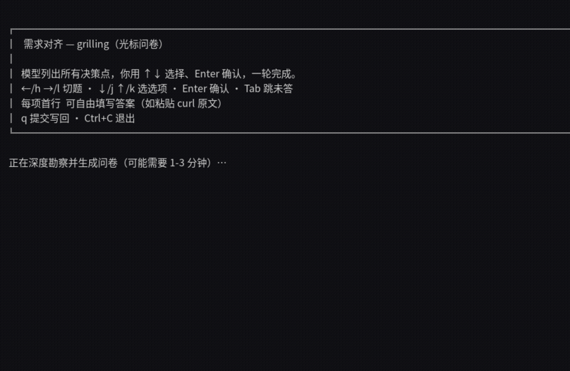

# Obsidian Task Runner

> **你的第二大脑会写代码了。** 在 Obsidian 写需求，AI Agent 在真实 Git 仓库里
> 规划、实现、测试、开 PR、合并——你只做两件事：**定方向，验收产品**。

<p align="center">
  
  
</p>

Obsidian Task Runner（命令 `otg`）把 Obsidian Vault 当作需求入口，把代码仓库
当作执行目标。一条流水线，全自动：

```text
REQ（需求文档）
  │  保存即拾取
  ▼
TASK ── 优先级评估 ──► refining ──► grilling（有争议才需要你）
                                    │
                                    ▼
                            planning ──► [① 计划批准]
                                    │        （auto_approve 可全自动）
                                    ▼
                            implementing ──► review ──► [② 产品验收]
                                    │              │      （独立审计 + 合并）
                                    └── 踩坑自动沉淀回知识库 ◄─┘
```

## 为什么是 Obsidian？

大多数 AI 编程工具把会话记录留在自己的格式里。这里反过来：**需求、计划、
实现记录、验收结果、决策、踩坑全部落在你的第二大脑里**——

- 需求变更天然可追踪（保存即触发重排，变更分级 routing）
- 架构决策 ADR 化，自动维护索引与覆盖报告
- 每次试错自动沉淀为知识库条目，下一个任务先查再动手
- 全流程可检索：`otg kb search` 随时找回任何历史决策

## 只有两扇人门

| 门 | 默认 | 说明 |
| --- | --- | --- |
| ① 计划批准 | 自动（可关） | 计划产出后可设人工审阅 |
| ② 产品验收 | 自动 | 合并前由**独立只读审计**逐条 AC 复核证据——实现者不能自证完成 |

中间所有环节——需求细化、追问对齐（Kitty tab 里一问一答）、实现（逐条 AC 红绿重构）、
测试、PR、冲突处理、合并——全部自动。你只需在 grilling 弹出来时回答问题。

## 功能矩阵

| 能力 | 说明 |
| --- | --- |
| 需求即任务 | REQ 保存即建 TASK；需求变更自动分级（breaking/additive/cosmetic）路由重排 |
| 独立完成审计 | 合并前只读会话逐条 AC 复核原始证据，实现与验证分离 |
| 决策 ADR 化 | 架构决策沉淀 + ADR ↔ 需求 ↔ 任务三向索引 + 覆盖报告 |
| 踩坑知识化 | 试错换方案自动提取进知识库；系统级失败自动沉淀模式；检索即命中 |
| KB-first | 所有自动化与交互会话先查本地知识库，命中即引用来源，不命中才推理 |
| Agent Town | 960×540 像素小镇实时看并发会话：四季昼夜、A* 寻路、点击问答 |
| 模型路由可配置 | 无内置路由：models 完全由操作者配置；配额耗尽指数退避；fallback 链随 vault-map 下发 |
| 阶段化交付 | 大型项目按阶段交付，每阶段可演示、可评审 |
| 双模型兜底 | 会话内 API 错误秒级换模型；进程级失败 daemon 层重启兜底 |
| 依赖自动恢复 | blocked_by 上游恢复自动续跑，预算封顶不空转 |

## 5 分钟上手

```bash
git clone https://github.com/ndzuki/obsidian-task-runner.git
cd obsidian-task-runner && make build && make install
otg install --vault "$HOME/Documents/Obsidian/MainVault" --new-project-root "$HOME/src"
```

然后在 Obsidian 里新建 `REQ-001-hello.md` 写三行需求，保存——看任务自动出现、
自动进入流水线。完整步骤（含配置、状态表、常用命令）见
**[`docs/quickstart.md`](docs/quickstart.md)**。

## 与替代方案对比

| | Obsidian Task Runner | CLI 编程助手 + hooks | 纯 CI 流水线 |
| --- | --- | --- | --- |
| 需求入口 | Obsidian（可追溯、可检索） | 终端会话（易丢） | YAML（无上下文） |
| 需求变更 | 自动分级重排 | 手动 | 无 |
| 人工节点 | 2 个（可减为 0） | N 个 | 0（不可干预） |
| 知识沉淀 | 自动回灌第二大脑 | 无 | 无 |
| 交付审计 | 独立只读会话逐 AC 复核 | 自证 | 只跑测试 |

## 文档地图

| 文档 | 内容 |
| --- | --- |
| [`docs/quickstart.md`](docs/quickstart.md) | 安装、配置、第一个需求、状态表 |
| [`docs/ops-manual.md`](docs/ops-manual.md) | 运维调优：并发、知识库、门禁、故障排查 |
| [`docs/architecture.md`](docs/architecture.md) | 架构总览（数据流、状态机、插件生态、迁移史） |
| [`docs/workflow.md`](docs/workflow.md) | 规范性工作流：状态机、双门禁、阶段模型、知识流 |
| [`docs/config-reference.md`](docs/config-reference.md) | vault-map.json 配置单一事实源 |
| [`docs/agent-town-design-spec.md`](docs/agent-town-design-spec.md) | Agent Town 监控面板视觉规范 |
| [`docs/adr/`](docs/adr/) | 架构决策记录（13 篇） |
| [`obsidian-task-runner/SKILL.md`](obsidian-task-runner/SKILL.md) | Agent 执行规则（含知识库格式规范） |
| [`obsidian-task-runner/reference.md`](obsidian-task-runner/reference.md) | 状态、字段（含全量字段附录）、故障排查 |
| [`templates/`](templates/) | REQ / TASK / ADR 模板 |
| [`CHANGELOG.md`](CHANGELOG.md) | 版本变更 |
| [`CONTRIBUTING.md`](CONTRIBUTING.md) | 贡献指南 |

## Roadmap 与贡献

路线见 [`ROADMAP.md`](ROADMAP.md)；贡献方式（开发环境、测试门禁、Skill 约定）见
[`CONTRIBUTING.md`](CONTRIBUTING.md)。欢迎 issue / PR / 讨论。

## License

MIT © ndzuki and contributors
