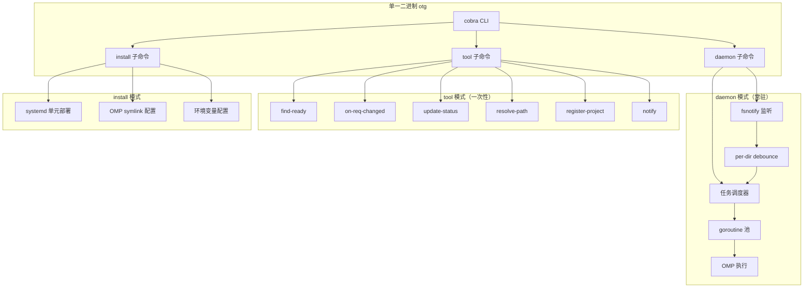

# Go 重写方案

## 目标

将 ~1600 行 Bash + Python 重写为单一 Go 二进制，提升稳定性、资源效率、可测试性。

## 架构



## 项目结构

```
obsidian-task-runner/
├── cmd/
│   └── otg/
│       └── main.go              # 入口
├── internal/
│   ├── cli/
│   │   ├── root.go              # cobra root command
│   │   ├── daemon.go            # daemon 子命令
│   │   ├── tool.go              # tool 子命令组
│   │   └── install.go           # install 子命令
│   ├── daemon/
│   │   ├── daemon.go            # 常驻循环
│   │   ├── scheduler.go         # 任务调度
│   │   ├── executor.go          # OMP 调用
│   │   └── scanner.go           # 扫描循环
│   ├── watch/
│   │   ├── watcher.go           # fsnotify 封装
│   │   └── debounce.go          # per-dir 独立 debounce
│   ├── task/
│   │   ├── frontmatter.go       # YAML frontmatter 解析
│   │   ├── status.go            # 状态机
│   │   ├── find_ready.go        # 发现可处理任务
│   │   └── on_req_changed.go    # 需求变更处理
│   ├── project/
│   │   ├── vault_map.go         # vault-map.json 读写
│   │   ├── resolve.go           # 项目路径解析
│   │   └── register.go          # 项目注册
│   ├── notify/
│   │   └── notify.go            # 桌面通知 (D-Bus / notify-send fallback)
│   └── config/
│       └── config.go            # 配置加载
├── pkg/
│   └── yamlfrontmatter/
│       └── frontmatter.go       # 可复用的 frontmatter 解析器
├── scripts/
│   └── e2e_test.sh              # E2E 测试脚本
├── go.mod
├── go.sum
├── Makefile
├── .github/
│   └── workflows/
│       ├── ci.yml               # 单元测试 + lint + build
│       └── e2e.yml              # E2E 测试（手动触发）
└── docs/
    └── go-rewrite-plan.md       # 本文档
```

## 核心模块设计

### 1. YAML Frontmatter 解析 (`pkg/yamlfrontmatter/`)

```go
type Frontmatter struct {
    ID             string   `yaml:"id"`
    Title          string   `yaml:"title"`
    Project        string   `yaml:"project"`
    Status         string   `yaml:"status"`
    PlanApproved   bool     `yaml:"plan_approved"`
    MergeApproved  bool     `yaml:"merge_approved"`
    PlanVersion    int      `yaml:"plan_version"`
    Assignee       string   `yaml:"assignee"`
    ReqDoc         string   `yaml:"req_doc"`
    TargetBranch   string   `yaml:"target_branch"`
    PendingReq     bool     `yaml:"pending_req"`
    // ... 完整映射所有 frontmatter 字段
}

func Parse(data []byte) (*Frontmatter, error)
func Update(path string, updates map[string]any) error  // 原子写入
```

用 `gopkg.in/yaml.v3` 替代当前 hand-rolled parser，支持：
- 带引号的值
- 多层嵌套
- 列表（tags, blocked_by）
- 布尔、数字自动类型转换
- YAML 语法错误检测

### 2. 常驻 Daemon (`internal/daemon/`)

```go
// Daemon 生命周期
func Run(ctx context.Context, cfg *config.Config) error {
    // 1. 获取文件锁 (flock 或 filelock)
    // 2. 启动 fsnotify watcher
    // 3. 启动调度器 goroutine
    // 4. 监听 OS signal (SIGTERM/SIGINT)
    // 5. 定期扫描 (timer goroutine)
    // 6. 优雅关闭
}
```

**相对当前 Bash 的改进**：
- `sync.Mutex` 替代 `flock`：进程内锁，不依赖文件系统
- `context.Context` 传递取消信号，替代 `kill %1`
- 每个目录独立 debounce timer（当前两个目录共享一个导致丢事件）
- `singleflight` 防止同一任务的并发执行

### 3. 文件监听 (`internal/watch/`)

```go
type Watcher struct {
    fsnotify *fsnotify.Watcher
    debounce map[string]*Debouncer  // per-directory
}

func (w *Watcher) Start(ctx context.Context, events chan<- Event)
```

**改进**：
- `github.com/fsnotify/fsnotify` 替代 `inotifywait` 管道
- 每目录独立 debounce：Tasks/ 和 Requirements/ 互不影响
- 临时文件过滤：使用文件扩展名 + 编辑器模式，不再依赖 `sed??????` hack
- 事件合并：同文件多次修改在 debounce 窗口内合并为一次

### 4. OMP 执行器 (`internal/daemon/executor.go`)

```go
func (e *Executor) RunRound1(ctx context.Context, task *task.Task) error
func (e *Executor) RunRound2(ctx context.Context, task *task.Task) error
func (e *Executor) RunMerge(ctx context.Context, task *task.Task) error
```

- 直接 `os/exec` 调 `omp` 命令，不再经过 Bash 管道
- `io.Pipe` 捕获 stdout/stderr 结构化日志
- 超时控制：`context.WithTimeout`
- 返回码 + 日志提取 → 精确判断执行结果

### 5. 桌面通知 (`internal/notify/`)

```go
func Send(notification Notification) error {
    // 优先 D-Bus (github.com/esiqveland/notify)
    // fallback notify-send
}
```

### 6. 配置管理 (`internal/config/`)

```go
type Config struct {
    ObsidianVault  string   `mapstructure:"obsidian_vault"`
    NewProjectRoot string   `mapstructure:"new_project_root"`
    Projects       []Project `mapstructure:"projects"`
    Notifications  NotifConfig `mapstructure:"notifications"`
    PollInterval   time.Duration `mapstructure:"poll_interval_minutes"`
    OMPModelDeepseek string `mapstructure:"omp_model_deepseek"`
    OMPModelGPT      string `mapstructure:"omp_model_gpt"`
    OMPModelFlash    string `mapstructure:"omp_model_flash"`
    OMPCmd           string `mapstructure:"omp_cmd"`
}
```

## CLI 接口

```bash
# 常驻模式
otg daemon                          # 启动常驻进程
otg daemon --once                   # 跑一轮就退出（兼容 systemd oneshot）

# 工具模式（兼容旧调用方式）
otg find-ready <vault>              # → NDJSON
otg on-req-changed <vault> <path>   # → JSON
otg update-status <task> key=val    # → 更新 frontmatter
otg resolve-path <map> <project>    # → JSON
otg register-project <map> <name> <dir>
otg notify <task>                   # → 桌面通知

# 安装
otg install                         # 替代 install.sh
otg install --dry-run               # 预览变更

# 版本
otg version
```

## GitHub Actions

### CI (`ci.yml`)

```yaml
on: [push, pull_request]
jobs:
  lint:
    runs-on: ubuntu-latest
    steps:
      - uses: actions/checkout@v4
      - uses: actions/setup-go@v5
      - run: make lint        # golangci-lint

  test:
    runs-on: ubuntu-latest
    steps:
      - uses: actions/checkout@v4
      - uses: actions/setup-go@v5
      - run: make test        # go test -race -cover ./...

  build:
    runs-on: ubuntu-latest
    steps:
      - uses: actions/checkout@v4
      - uses: actions/setup-go@v5
      - run: make build       # go build ./cmd/otg
```

### E2E (`e2e.yml`)

```yaml
on:
  workflow_dispatch:
  schedule:
    - cron: '0 6 * * 1'  # 每周一

jobs:
  e2e:
    runs-on: ubuntu-latest
    steps:
      - uses: actions/checkout@v4
      - uses: actions/setup-go@v5
      - run: make build
      - run: |
          # 创建临时 vault
          VAULT=$(mktemp -d)
          mkdir -p $VAULT/Tasks $VAULT/Requirements

          # 创建需求文档
          cat > $VAULT/Requirements/REQ-001-test.md << 'EOF'
          ---
          id: "001"
          title: E2E Test
          ---
          ## 要做什么
          E2E validation.
          ## 完成标准
          - [ ] Works
          EOF

          # 测试 on-req-changed
          otg on-req-changed $VAULT $VAULT/Requirements/REQ-001-test.md

          # 验证 TASK 创建
          test -f $VAULT/Tasks/TASK-001-test.md || exit 1

          # 测试 find-ready
          otg find-ready $VAULT | grep -q '"id":"001"' || exit 1

          # 测试 update-status
          otg update-status $VAULT/Tasks/TASK-001-test.md assignee=deepseek
          otg update-status $VAULT/Tasks/TASK-001-test.md status=ready
          otg find-ready $VAULT | grep -q '"id":"001"' || exit 1

          # 测试 resolve-path / register-project
          MAP=$(mktemp)
          echo '{"projects":[],"new_project_root":"/tmp"}' > $MAP
          otg register-project $MAP e2e-test /tmp/e2e-test
          otg resolve-path $MAP e2e-test | grep -q '"path":"/tmp/e2e-test"' || exit 1

          echo "E2E PASS"
```

## 增量迁移策略

为避免 "重写后才发现不兼容"，分阶段替换：

| 阶段 | 内容 | 产出 | 可独立验证 |
|------|------|------|-----------|
| **Phase 1** | Go 项目骨架 + CLI 框架 + frontmatter 解析 | `otg version`, `otg update-status` 可用 | 替换 `update_task_status.py` |
| **Phase 2** | find-ready + on-req-changed + resolve-path + register-project | `otg find-ready`, `otg on-req-changed` 等 | 替换 4 个 Python 脚本 |
| **Phase 3** | daemon + watcher + notify | `otg daemon` 常驻模式 | 替换 daemon.sh + watcher.sh + notify.sh |
| **Phase 4** | install 子命令 | `otg install` | 替换 install.sh |
| **Phase 5** | 旧代码清理 + 文档 + E2E CI | 全部 CI 通过 | 删除所有 `.sh` `.py` |

## 关键质量目标

| 指标 | 当前 (Bash+Python) | Go 目标 |
|------|-------------------|---------|
| 二进制体积 | — | < 15MB (静态编译) |
| 常驻内存 | ~10MB (Bash + inotifywait + python3 缓存) | < 5MB |
| 轮询启动时间 | ~3.6s (9× Python) | < 100ms |
| 单次 tool 调用 | ~50ms (Python 启动) | < 5ms |
| 单元测试覆盖 | ~16 个测试 | > 80% 行覆盖率 |
| E2E 测试 | 无自动 | CI 每周执行 |
| 跨平台 | Linux only | Linux (macOS 编译可行) |
