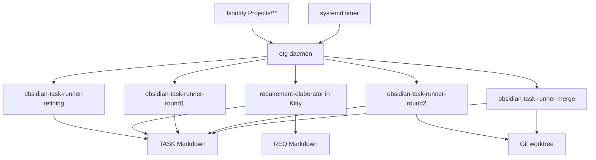
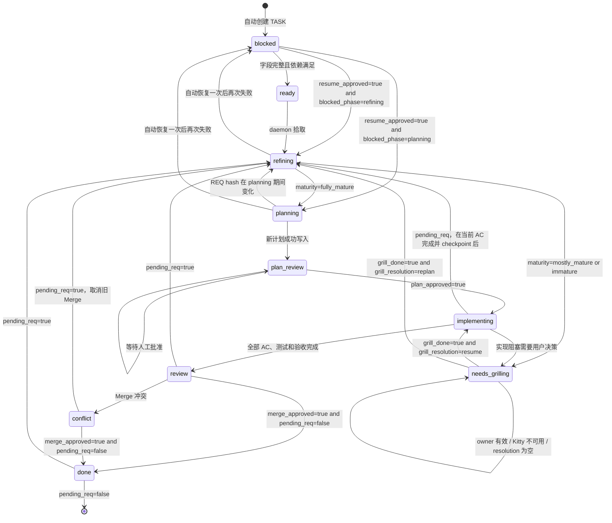
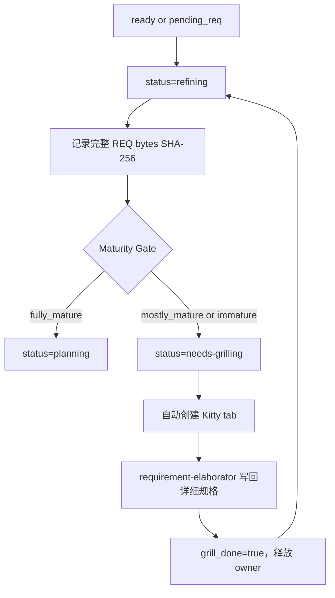

# Obsidian Task Runner — 目标业务流程

> 本文是规范性设计。Go 实现必须满足本文状态不变量和验收标准。
>
> 当前实现与目标设计的差距见「实现验收清单」。在清单全部通过前，不应把系统标记为设计已完成。

## 1. 架构边界

系统由四层组成：

1. **触发层**：`fsnotify` 监听 Vault，systemd timer 定时兜底。
2. **调度层**：`otg daemon` 扫描任务、持有状态机、并发和恢复控制。
3. **阶段执行层**：daemon 按阶段直接调用独立 Skill。
4. **持久化层**：TASK/REQ Markdown frontmatter、Git worktree、日志和 PID 文件。



### 1.1 Skill 调度

Daemon 直接调用阶段 Skill，不通过核心 Skill 二次路由：

| 阶段 | Skill | 模型 | 权限 |
|------|-------|------|------|
| `refining` | `/obsidian-task-runner-refining <task>` | `models.default` | `--auto-approve` |
| `planning` | `/obsidian-task-runner-round1 <task>` | TASK `assignee` | `--auto-approve` |
| `implementing` | `/obsidian-task-runner-round2 <task>` | TASK `assignee` | `--auto-approve` |
| Merge | `/obsidian-task-runner-merge <task>` | TASK `assignee` | `--approval-mode yolo` |

`obsidian-task-runner` 核心 Skill 是人工入口和流程参考，不是 daemon 的阶段执行入口。

### 1.2 Skill 安装

`otg install` 必须把以下五个 Skill 安装为 `~/.omp/skills/` 下的顶层独立 Skill，并创建对应的 agent skill symlink：

- `obsidian-task-runner`
- `obsidian-task-runner-refining`
- `obsidian-task-runner-round1`
- `obsidian-task-runner-round2`
- `obsidian-task-runner-merge`

外部依赖 Skill：

- `requirement-elaborator`
- `grilling`
- `domain-modeling`
- `diagnosing-bugs`
- `test-quality`

安装器必须 fail-fast 检查外部依赖。缺失时安装失败，并输出明确的 `skill-doctor install <name>` 指令，不允许警告后继续。

## 2. 状态机



## 3. 状态语义

| 状态 | 不变量 | 执行主体 | 成功出口 |
|------|--------|----------|----------|
| `blocked` | 缺字段、依赖未完成，或阶段连续失败 | daemon / 人工 | `ready`、`refining` 或 `planning` |
| `ready` | 可以开始规格成熟度检查 | daemon | `refining` |
| `refining` | 正在执行 headless maturity gate | default model | `planning` 或 `needs-grilling` |
| `needs-grilling` | 等待用户交互补充规格或解决实现阻塞 | Kitty + requirement-elaborator/用户 | `refining` 或恢复 `grill_prev_status` |
| `planning` | 规格已成熟，正在生成版本化实现计划 | Round 1 Skill | `plan-review` |
| `plan-review` | 具体 `plan_version` 已存在，等待或已获得批准 | 人工 Gate | `implementing` |
| `implementing` | 在任务 worktree 执行已批准计划 | Round 2 Skill | `review`、`refining` 或 `needs-grilling` |
| `review` | 本地实现已提交，等待 Merge 授权 | 人工 Gate | `done`、`conflict` 或 `refining` |
| `conflict` | Merge 冲突且旧授权已失效 | 人工 + Merge Skill | `done` 或 `refining` |
| `done` | 已合并并推送；仅 `pending_req=false` 时终态 | — | `refining` 或终止 |

### 3.1 提前审批

`plan_approved=true` 仅在 `status=plan-review` 时有效。

若 daemon 在 `ready`、`refining`、`needs-grilling` 或 `planning` 发现提前设置的 `plan_approved=true`：

1. 自动重置为 `false`。
2. 在 TASK 变更记录追加 warning。
3. 不允许绕过 maturity gate、Grilling 或 planning。

## 4. 统一规格成熟度流程

初次任务和需求变更使用同一流程：



### 4.1 Maturity Gate

`refining` 使用 `models.default`，检查：

1. 详细规格存在。
2. 十章节齐全。
3. 无占位符。
4. AC 覆盖成功、边界、错误、幂等/并发场景。
5. 数据模型或类型定义具体。
6. 无已知矛盾，依赖契约一致。

输出必须同时写入：

- 结构化 frontmatter。
- TASK 的 `## 需求成熟度评估` 审计 section。

核心字段：

```yaml
maturity: fully_mature # fully_mature | mostly_mature | immature
refine_version: 1
refine_req_hash: "sha256:..."
refine_retry_count: 0
refine_error: ""
```

### 4.2 REQ 一致性

Hash 算法：REQ 完整原始 bytes 的 SHA-256，包括 frontmatter 和正文。

- refining 开始记录 `refine_req_hash`。
- planning 开始记录 `plan_req_hash`。
- planning 写入计划前重新计算 REQ hash。
- 若当前 hash 与 `plan_req_hash` 不一致：丢弃本轮计划输出，不递增 `plan_version`，不清 `pending_req`，转回 `refining`。

### 4.3 refining 失败恢复

- live PID：跳过重复执行。
- 第一次进程死亡/失败：`refine_retry_count=1`，自动恢复一次。
- 再次失败：转 `blocked`，写：

```yaml
blocked_phase: refining
phase_error: "..."
phase_log: "..."
resume_approved: false
```

用户修复后设置 `resume_approved=true`。Daemon 恢复 `refining`，清 `resume_approved`、错误和 retry count。

## 5. Grilling 所有权与通知

### 5.1 双重检查

- daemon：发送通知、重复提醒和状态迁移前检查 owner/timeout。
- requirement-elaborator：获取、持有和释放 owner。

TASK frontmatter：

```yaml
grill_owner: ""
grill_started_at: ""
grill_timeout_minutes: 30
grill_done: false
```

默认超时 30 分钟，可按 TASK 配置。

### 5.2 本机原子性

修改 owner 前必须获取 task-path hash 对应的文件锁：

```text
${TMPDIR}/otg-grill-<task-path-sha256>.lock
```

锁内执行 read → check timeout → write frontmatter，避免本机两个进程同时获得 owner。

### 5.3 通知语义

`notifications.desktop` 只控制 `notify-send` 系统桌面通知。

- `desktop=false`：不发送系统桌面通知，包括最终状态通知。
- Kitty Grilling tab 是核心交互入口，始终尝试创建，不受 `desktop` 控制。
- Kitty 不可用：保持 `needs-grilling`，记录日志，后续扫描按 debounce 周期重试 Kitty；不得转 `blocked`，不得调用普通终端 fallback。

需求细化型 Grilling 完成后必须回到 `refining` 复验；实现阻塞型 Grilling 按 `grill_resolution=resume|replan` 分流。

### 5.4 实现阻塞的 Grilling 回流

Round 2 阻塞进入 Grilling 时，requirement-elaborator/用户必须写结构化结果：

```yaml
grill_resolution: resume # resume | replan | ""
```

- `resume`：纯代码逻辑错误、环境问题或无需修改 REQ/计划的问题。Daemon 恢复 `grill_prev_status`（通常 implementing），不经过 refining/planning。
- `replan`：需求缺口、计划外设计决策或架构假设变化。设置 `pending_req=true`，转 refining。
- 空值：daemon 不猜测，保持 needs-grilling 并记录 warning。

需求细化型 Grilling 固定使用 `replan` 语义：完成后回 refining。

Daemon 消费完成结果时，优先级为：

1. `pending_req=true` → 强制按 `replan` 处理；即使 grill_resolution=resume 也不能恢复旧计划实现。
2. 否则 `grill_resolution=resume` → 恢复 grill_prev_status。
3. 否则 `grill_resolution=replan` → 转 refining。
4. 否则保持 needs-grilling。

成功路由后必须原子清理：`grill_done=false`、`grill_resolution=""`、`grill_context=""`、`grill_prev_status=""`；owner/started_at 已由 requirement-elaborator 释放。

### 5.5 Grilling 期间 REQ WRITE

`needs-grilling` 且 `grill_owner` 有效时，REQ WRITE 只设置 `pending_req=true` 并记录最新事件/hash：

- 不清 owner。
- 不修改 status。
- 不重开 Kitty tab。
- 当前 Grilling 完成后按 `grill_resolution` 路由。

这样 requirement-elaborator 自己写回 REQ 不会被 watcher 当成外部取消事件。

### 5.6 refining/planning 期间 REQ WRITE

只设置 `pending_req=true`，不修改 status、不取消 live phase。Refining 使用最新 REQ；planning 由提交前 hash 复核决定是否返回 refining。

## 6. Planning / Round 1

`planning` 使用 TASK `assignee`，daemon 直接调用 `/obsidian-task-runner-round1`。

### 6.1 计划生成

- 每次 planning 成功，`plan_version` 增加 1。
- 初次成功生成 v1；重规划成功生成 vN+1。
- refining/Grilling 不修改 `plan_version`。
- `plan-review` 必须保证对应版本的具体计划内容已经写入。

### 6.2 pending_req 生命周期

`pending_req` 从 REQ 变更开始保持 `true`，直到新计划成功写入。

Planning 成功时原子更新：

```yaml
status: plan-review
pending_req: false
merge_approved: false
plan_approved: false # 仅 auto_approve 合格时为 true
plan_version: <old + 1>
```

### 6.3 auto_approve

`auto_approve=true` 只跳过 Plan Review，且必须同时满足：

1. 首次计划。
2. 既有项目，`new_project=false`。
3. 非 pending_req/replan。

它不跳过 maturity gate、Grilling 或 Merge Gate。

新项目和任何重规划必须停在 `plan-review`，`plan_approved=false`。

### 6.4 Checkpoint 复用

Pending requirement 导致 Round 2 停止时，planning 必须读取 `checkpoint_commit`，并在新计划中逐项标记旧实现：

- `保留`
- `修改`
- `废弃`

用户批准新计划即同时批准 checkpoint 复用策略。

### 6.5 新项目

`new_project=true` 的 refining/planning 只读需求、模板和项目规范：

- 不创建项目目录。
- 不执行 `git init`。
- 不创建脚手架文件。

用户批准后，Round 2 才创建项目、初始化 Git 并执行 `register-project`。

### 6.6 planning 失败恢复

与 refining 相同：自动恢复一次，再失败转 `blocked`：

```yaml
blocked_phase: planning
planning_retry_count: 1
phase_error: "..."
phase_log: "..."
resume_approved: false
```

人工 resume 后 retry count 清零，重新获得一次自动恢复机会。

## 6.7 OnReqChanged 状态语义

| 当前状态 | REQ WRITE 行为 |
|----------|----------------|
| `blocked` | 保持 blocked，设置 pending_req=true；不能绕过字段/依赖门禁 |
| `ready` | 保持 ready，设置 pending_req=true；下一轮统一进入 refining |
| `refining` / `planning` | 只设 pending_req=true，不改 status、不取消 live phase |
| `needs-grilling` + active owner | 只设 pending_req=true，不中断当前 Grilling |
| `plan-review` | 清 plan_approved，设 pending_req=true，转 refining；旧计划立即失效 |
| `implementing` | 设 pending_req=true；Round 2 在当前 AC 完成后 checkpoint → refining |
| `review` / `conflict` / `done` | 设 pending_req=true，清 merge_approved，转 refining |

新建 REQ 自动创建的新 TASK 使用 `pending_req=false`：初始 REQ 是基线，不是“待并入变更”。

## 7. Round 2 与需求变更

Round 2 使用任务专属 worktree，逐 AC 执行完整 Tracer Bullet。

每条 AC 的 Red → Green → Refactor 完成后，Round 2 Skill 必须重新读取 TASK frontmatter。

若 `pending_req=true`：

1. 不开始下一条 AC。
2. 提交 WIP checkpoint：

```text
chore(task): checkpoint before requirement replan
```

3. 写入：

```yaml
checkpoint_commit: "<commit sha>"
status: refining
merge_approved: false
```

4. 保持 `pending_req=true`。
5. 正常退出，让 daemon 下一轮启动 refining。

当前 AC 之前已经完成的代码留在原 task branch，后续在同一分支按新计划继续。

实现中其他需要用户决策的阻塞可进入 `needs-grilling`。Grilling 完成后同样回 `refining` 复验。

## 8. Review、Conflict 与 Merge

### 8.1 pending_req 绝对门禁

`review`、`conflict` 或 `done` 出现 `pending_req=true`：

- 清 `merge_approved`。
- 禁止任何 push、PR 创建或 merge。
- 直接转 `refining`。

用户重新把 `merge_approved=true` 也不能绕过该门禁。

Conflict 期间 REQ 变更时，取消旧 Merge，保留 PR、分支和冲突审计记录，但不继续解决旧需求版本的冲突。

### 8.2 Merge 前置条件

Merge Skill 必须在任何远程操作前确认：

1. `status` 为 `review` 或 `conflict`。
2. `merge_approved=true`。
3. `pending_req=false`。
4. 当前 REQ hash 等于已批准计划的 `plan_req_hash`。
5. `target_branch` 存在。

任一失败时不得执行远程操作。

## 9. ID 与依赖作用域

TASK/REQ 数字 ID 在项目内唯一，不要求 Vault 全局唯一。

### 9.1 同项目依赖

```yaml
blocked_by:
  - TASK-010
```

只在当前 `Projects/<project>/Tasks/` 解析。

### 9.2 跨项目依赖

```yaml
blocked_by:
  - release-manager:TASK-010
```

`release-manager` 是 vault-map 的 `projects[].name`。解析时只访问该项目映射，禁止扫描全 Vault 后取任意同 ID 任务。

### 9.3 REQ 关联

`req_doc` 必须保存 Vault 相对规范路径：

```yaml
req_doc: Projects/001-demo/Requirements/REQ-010-feature.md
```

OnReqChanged 仅使用规范化后的完整路径精确匹配；禁止 basename fallback。

## 10. 并发与恢复

### 10.1 daemon 锁

锁按规范化 Vault 路径的 SHA-256 隔离：

```text
${TMPDIR}/otg-daemon-<vault-path-sha256>.lock
```

同一 Vault 的 watcher/timer 互斥；不同 Vault 可以并行运行。

### 10.2 仓库并发

- refining 不需要仓库。
- 既有项目 planning、Merge 使用主工作区独占锁。
- Round 2 使用任务专属 worktree。
- 新项目 planning 不创建仓库，因此不持有不存在的 repo 锁。
- 等待主工作区锁的任务不占 OMP 槽位。

### 10.3 Retry 生命周期

refining/planning 的 retry count 在以下时机清零：

- 阶段成功。
- 用户设置 `resume_approved=true`，daemon 执行人工恢复。

## 11. TASK 流程控制字段

新 TASK 和模板必须显式初始化全部流程字段，不依赖 missing key 的零值语义。

```yaml
status: blocked
maturity: ""
refine_version: 0
refine_req_hash: ""
refine_retry_count: 0
refine_error: ""
planning_retry_count: 0
phase_error: ""
phase_log: ""
blocked_phase: ""
resume_approved: false
plan_req_hash: ""
plan_version: 0
plan_approved: false
merge_approved: false
pending_req: false
checkpoint_commit: ""
grill_owner: ""
grill_started_at: ""
grill_timeout_minutes: 30
grill_done: false
grill_resolution: "" # resume | replan | ""
grill_prev_status: ""
```

## 12. 实现验收清单

以下项目全部通过后，才能认定实现符合本设计。

### AC-01 状态机

- [ ] 支持 `refining`、`planning` 状态。
- [ ] `ready → refining`，不是直接 `needs-grilling`。
- [ ] 需求细化 Grilling 的 `grill_done+replan → refining`；实现阻塞的 `resume → grill_prev_status`。
- [ ] `planning` 成功后才进入 `plan-review`。
- [ ] 非 `plan-review` 的提前 `plan_approved` 会被重置。

### AC-02 Maturity Gate

- [ ] refining 使用 `models.default`。
- [ ] maturity gate 六项检查可重复执行。
- [ ] 结构化字段和 `## 需求成熟度评估` 同时写入。
- [ ] fully_mature → planning；其他 → needs-grilling。
- [ ] 需求细化 Grilling 后必须重新 refining；纯实现阻塞 resume 不强制重新 planning。

### AC-03 Phase 恢复

- [ ] refining/planning live PID 不重复启动。
- [ ] 失败后自动恢复一次。
- [ ] 第二次失败转 blocked，并记录 phase、error、log。
- [ ] `resume_approved=true` 恢复正确阶段并清 retry count。

### AC-04 REQ 一致性

- [ ] 使用完整 REQ bytes SHA-256。
- [ ] planning 写计划前复核 hash。
- [ ] hash 变化时不增加 plan_version、不清 pending_req、回 refining。
- [ ] req_doc 只做项目内规范完整路径精确匹配。

### AC-05 Planning

- [ ] daemon 直接调用 Round 1 Skill。
- [ ] planning 每次成功 plan_version +1。
- [ ] plan-review 始终已有具体计划。
- [ ] pending_req 只在新计划成功后清零。
- [ ] checkpoint 复用策略写入新计划。
- [ ] 新项目 planning 无文件系统副作用。

### AC-06 auto_approve

- [ ] 只跳过 Plan Review。
- [ ] 仅首次计划、既有项目、非 replan 生效。
- [ ] 新项目和 replan 强制 `plan_approved=false`。
- [ ] 不绕过 Grilling、refining 或 Merge Gate。

### AC-07 Round 2 pending_req 与 REQ WRITE

- [ ] 每条 AC 完成后重新读取 TASK。
- [ ] pending_req 时停止下一 AC。
- [ ] 创建 WIP checkpoint commit。
- [ ] 写 checkpoint_commit 并转 refining。
- [ ] pending_req 保持 true。
- [ ] blocked/ready/refining/planning/needs-grilling/plan-review 的 REQ WRITE 按状态语义处理。
- [ ] active Grilling 的 REQ WRITE 不清 owner、不重开 Kitty。
- [ ] 新 TASK pending_req 初始为 false。
### AC-08 Merge 安全

- [ ] review/conflict/done + pending_req 自动转 refining。
- [ ] pending_req 时绝对禁止 Merge。
- [ ] Merge 前复核当前 REQ hash 与 plan_req_hash。
- [ ] conflict 需求变更取消旧 Merge。

### AC-09 依赖作用域

- [ ] 同项目 `TASK-010` 仅当前项目解析。
- [ ] 跨项目 `project-key:TASK-010` 精确解析。
- [ ] 不再扫描全 Vault 后接受任意同 ID done 任务。

### AC-10 Grilling 所有权与阻塞分流

- [ ] daemon 和 requirement-elaborator 双重检查 owner。
- [ ] 默认 timeout 30 分钟，可配置。
- [ ] task-path hash flock 保证本机 CAS。
- [ ] active owner 不重复通知、不迁移状态。
- [ ] expired owner 清理并写审计记录。
- [ ] grill_resolution=resume 直接恢复 grill_prev_status。
- [ ] grill_resolution=replan 设置 pending_req 并转 refining。
- [ ] grill_resolution 为空时 daemon 不猜测。
- [ ] pending_req 优先于 grill_resolution=resume。
- [ ] 成功路由后 grill_done/resolution/context/prev_status 被原子清理。

### AC-11 通知

- [ ] `notifications.desktop=false` 关闭所有 notify-send，包括 StatusNotify。
- [ ] Kitty tab 不受 desktop 配置控制。
- [ ] Kitty 不可用时保持 needs-grilling 并周期重试。

### AC-12 安装

- [ ] installer 安装 task-runner 五件套为顶层 Skill。
- [ ] 所有 `skill://obsidian-task-runner-*` 在隔离 HOME 可解析。
- [ ] 外部依赖缺失时 fail-fast。
- [ ] `skill-doctor check` 在完整安装后返回 0。

### AC-13 daemon 锁

- [ ] 同一 Vault 的 watcher/timer 互斥。
- [ ] 不同 Vault daemon 可同时运行。
- [ ] 锁名不暴露原始 Vault 路径。

### AC-14 E2E

- [ ] 初次成熟需求：ready → refining → planning → plan-review。
- [ ] 不成熟需求：ready → refining → needs-grilling → refining → planning。
- [ ] 真实 Round 2：implementing → review。
- [ ] 真实 Merge：review → done。
- [ ] pending_req 在 implementing/review/conflict/done 的四条路径。
- [ ] auto_approve 允许与禁止场景。
- [ ] phase retry/resume。
- [ ] 跨项目同 ID 和同 basename REQ 不串线。

## 13. 实施任务分解

实施必须按下列顺序推进。前一任务的验收标准未全部通过时，不进入依赖它的后续任务。

### T01 — TASK Schema 与状态常量

**目标文件**：

- `pkg/yamlfrontmatter/frontmatter.go`
- `TASK-000-template.md`
- `internal/task/on_req_changed.go` 的新任务模板
- 相关单元测试

**变更**：

1. 增加 `refining`、`planning` 状态和全部流程控制字段。
2. Frontmatter 强类型映射 maturity/hash/retry/error/resume/checkpoint/grill_resolution。
3. TASK 模板与自动创建内容完全同构，初始 `status=blocked`、`pending_req=false`。
4. 增加 schema round-trip、unknown field 保留和默认值测试。

**验收**：AC-01 schema 部分、AC-02 持久化、AC-03 字段、AC-14 新任务基线。

### T02 — ID、依赖与 REQ 精确关联

**依赖**：T01

**目标文件**：

- `internal/task/task.go`
- `internal/task/on_req_changed.go`
- `internal/project/project.go`
- 对应测试

**变更**：

1. 同项目 `TASK-010` 仅当前项目解析。
2. 跨项目 `project-key:TASK-010` 通过 vault-map 精确解析。
3. req_doc 规范化为 Vault 相对完整路径；删除 basename fallback。
4. OnReqChanged 按当前状态执行目标语义，不忽略 Update 错误。

**验收**：AC-04 路径、AC-07 REQ WRITE、AC-09、跨项目串线回归。

### T03 — Daemon 状态机与阶段直调

**依赖**：T01、T02

**目标文件**：

- `internal/task/task.go:IsReady`
- `internal/daemon/daemon.go`
- `internal/config/config.go`
- daemon/task 测试

**变更**：

1. ready → refining；支持 refining/planning 拾取。
2. daemon 直接构造阶段 prompt，而非始终 `/obsidian-task-runner`。
3. refining 使用 default model；其余阶段使用 assignee。
4. 非 plan-review 的 plan_approved 自动清 false。
5. review/conflict/done + pending_req 优先转 refining，Merge 绝对禁止。
6. Grilling 结果按 pending_req/resolution 优先级原子消费并清临时字段。

**验收**：AC-01、AC-06、AC-08 状态门禁、AC-10 路由。

### T04 — Refining 阶段执行器

**依赖**：T03

**目标文件**：

- `obsidian-task-runner/skills/refining/SKILL.md`
- daemon phase timeout/retry 配置
- 新增 refining 集成测试

**变更**：

1. 调用 refining Skill，使用 default model。
2. 写 maturity 结构化字段和审计 section。
3. fully_mature → planning，其他 → needs-grilling。
4. 实现 REQ 完整 bytes SHA-256。
5. 第一次失败自动恢复，第二次 blocked。

**验收**：AC-02、AC-03 refining 部分、AC-04 hash 生成。

### T05 — Grilling Lease 与 Kitty 行为

**依赖**：T03、T04

**目标文件**：

- `internal/daemon/daemon.go`
- `internal/notify/notify.go`
- `requirement-elaborator` Skill
- Grilling E2E

**变更**：

1. task-path hash flock acquire/check/release helper。
2. active owner 不重复通知、不迁移。
3. expired owner 清理并审计。
4. Kitty 永远尝试；desktop 仅控制 notify-send。
5. Kitty 不可用保持 needs-grilling 并周期重试。
6. REQ WRITE 在 active Grilling 中只设 pending_req。
7. requirement-elaborator 写 grill_resolution=replan 且不清 pending_req。

**验收**：AC-10、AC-11、AC-07 active Grilling 路径。

### T06 — Planning / Round 1

**依赖**：T04

**目标文件**：

- `obsidian-task-runner/skills/round1/SKILL.md`
- daemon phase dispatch/retry
- planning 集成测试

**变更**：

1. planning 前写 plan_req_hash，提交前复核。
2. Hash 变化时回 refining，不产生版本。
3. planning 成功 plan_version+1，并原子写 Gate。
4. 实现 auto_approve 合格条件。
5. 新项目 planning 零文件系统副作用。
6. Checkpoint commit 的保留/修改/废弃策略写入计划。
7. 第一次失败自动恢复，第二次 blocked。

**验收**：AC-03 planning、AC-04、AC-05、AC-06。

### T07 — Round 2 pending_req 安全边界

**依赖**：T03、T06

**目标文件**：

- `obsidian-task-runner/skills/round2/SKILL.md`
- Round 2 集成测试/假 OMP 场景

**变更**：

1. 每条 AC 后重读 TASK。
2. pending_req 时创建 checkpoint commit，写 SHA，转 refining。
3. 实现阻塞写 grill_resolution 路由契约。
4. resume 直接恢复；replan 转 refining。
5. 写 review 前再次检查 pending_req。

**验收**：AC-07、AC-10 resolution、真实 Round 2 E2E。

### T08 — Merge 安全门禁

**依赖**：T03、T06、T07

**目标文件**：

- `obsidian-task-runner/skills/merge/SKILL.md`
- daemon Merge dispatch
- Merge 集成测试

**变更**：

1. pending_req 或 REQ hash 不一致时禁止所有远程操作。
2. review/conflict pending_req 转 refining。
3. conflict 期间需求变更取消旧 Merge。
4. 成功后写 completed 和审计记录。

**验收**：AC-08、真实 Merge/conflict E2E。

### T09 — Phase 恢复与 Vault 级锁

**依赖**：T03、T04、T06

**目标文件**：

- `internal/daemon/daemon.go`
- phase PID/retry helper
- 锁与恢复测试

**变更**：

1. daemon 锁改为 Vault path SHA-256。
2. refining/planning 分阶段 PID、retry、日志。
3. resume_approved 按 blocked_phase 恢复并清错误/retry。
4. 不同 Vault 并行、同 Vault 互斥。

**验收**：AC-03、AC-13。

### T10 — Skill 安装与依赖 fail-fast

**依赖**：T04、T06、T07、T08

**目标文件**：

- `internal/install/install.go`
- `config/skill-registry.json`
- `scripts/skill-doctor`
- install 测试

**变更**：

1. 安装 core/refining/round1/round2/merge 为顶层 Skill。
2. 为五件套创建 agent skill symlink。
3. 外部依赖缺失时 `otg install` 返回非零并输出安装命令。
4. 隔离 HOME 下验证所有 skill:// 可解析。

**验收**：AC-12。

### T11 — 全链路 E2E 与文档回归

**依赖**：T01-T10

**目标文件**：

- `test/e2e/full-lifecycle.sh`
- `test/e2e/grilling-flow.sh`
- 新增 phase/merge/concurrency E2E
- `README.md`、`reference.md`、Dataview 查询

**变更**：

1. E2E 必须实际执行 refining、planning、Round 2、Merge，不只验证 find-ready。
2. 覆盖成熟/不成熟需求、auto_approve、pending_req 四状态、retry/resume、跨项目 ID/REQ 路径。
3. 覆盖 desktop=false + Kitty、不同 Vault daemon 并行。
4. 更新 README 状态表和操作说明。
5. 全量运行 `go test -race ./...` 和全部 E2E。

**验收**：AC-14；并重新逐条核对 AC-01 至 AC-13。

## 14. Definition of Done

仅当以下条件全部满足，任务实现阶段才可标记完成：

1. `go test -race ./...` 通过。
2. `go vet ./...` 和项目 lint 通过。
3. AC-01 至 AC-14 全部有自动化测试证据。
4. 隔离 HOME 执行 `otg install` 后 `skill-doctor check` 返回 0。
5. 完整 E2E 从 REQ 创建运行到 `done`，且真实 fake OMP 分阶段修改 TASK。
6. 不同 Vault 可同时运行；同 Vault watcher/timer 互斥。
7. README、workflow、reference、TASK template 与代码状态枚举完全一致。
8. 无依赖当前开发机手工 symlink、残留 daemon 或全局 `/tmp` 文件的测试。

