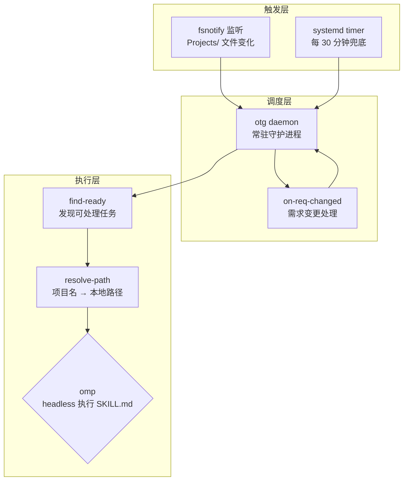
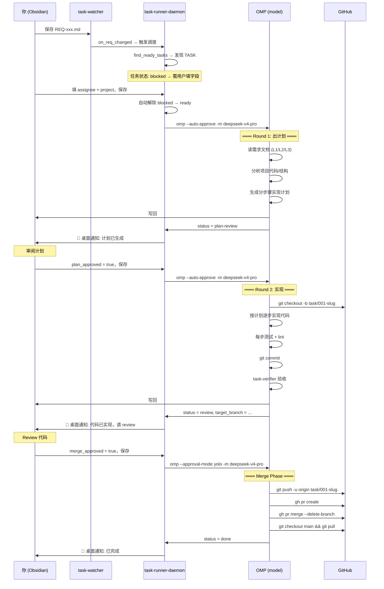
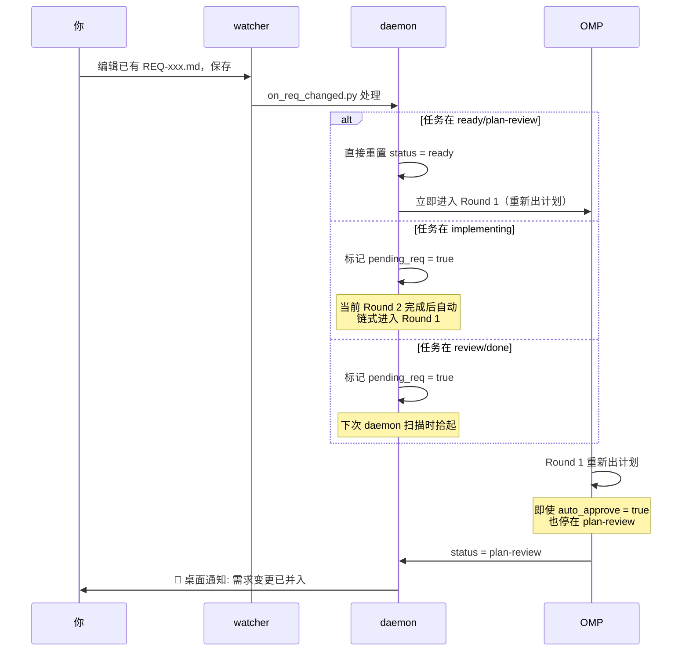
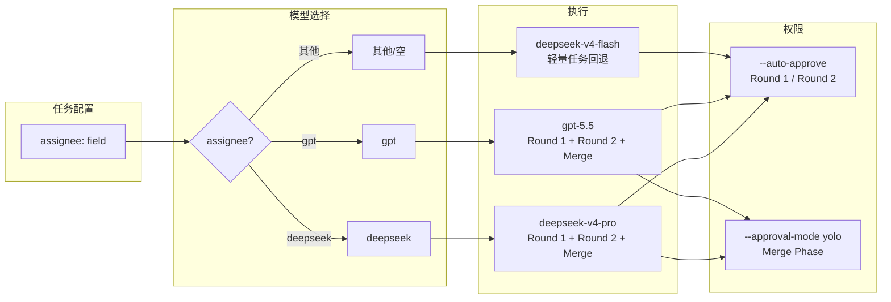

# Obsidian Task Runner — 业务流程

> 从 Obsidian 需求到代码交付的自动化流水线

## 1. 整体架构



## 2. 状态机

```mermaid
stateDiagram-v2
    blocked --> ready: 补齐 project + assignee<br/>且 blocked_by 为空
    ready --> plan-review: Round 1 出计划
    plan-review --> ready: 需求变更 pending_req

    state plan-review {
        [*] --> 等待人工审阅
        等待人工审阅 --> [*]: plan_approved=true
    }

    plan-review --> implementing: Round 2 实现代码
    implementing --> review: 测试/lint/验收通过<br/>git commit 到本地分支
    review --> ready: 需求变更 pending_req

    state review {
        [*] --> 等待人工Review
        等待人工Review --> [*]: merge_approved=true
    }

    review --> done: Merge Phase<br/>git push → PR → merge
    review --> conflict: 合并冲突
    conflict --> review: 人工解决冲突<br/>merge_approved=true
    conflict --> done: Merge Phase 重试成功

    note right of blocked
        自动创建的任务初始为 blocked
        用户填 assignee + project 后
        daemon 自动解除
    end note
```

## 3. 主流程：从需求到交付



## 4. 需求变更流程



## 5. 模型映射与权限



| assignee | Round 1 | Round 2 | Merge Phase | 轻量任务 |
|----------|---------|---------|-------------|----------|
| `deepseek` | deepseek-v4-pro | deepseek-v4-pro | deepseek-v4-pro | — |
| `gpt` | gpt-5.5 | gpt-5.5 | gpt-5.5 | — |
| — | — | — | — | deepseek-v4-flash |

| 阶段 | OMP 权限 | 允许的操作 |
|------|----------|-----------|
| Round 1: 出计划 | `--auto-approve` | 读/写文件、读代码、创建 git 分支 |
| Round 2: 实现 | `--auto-approve` | 文件操作、运行测试/lint、git commit |
| Merge Phase | `--approval-mode yolo` | git push、gh pr create/merge、分支清理 |


## 6. 实现说明

现已用 Go 重写成单一二进制（详见 [`go-rewrite-plan.md`](go-rewrite-plan.md)）。以下功能均封装在 `otg` 子命令中：

| 子命令 | 替代原名 | 作用 |
|--------|---------|------|
| `otg daemon` | `task-runner-daemon.sh` | 常驻守护进程（fsnotify + 定时兜底） |
| `otg daemon --once` | systemd oneshot | 单次扫描 |
| `otg find-ready` | `find_ready_tasks.py` | 列出就绪任务（NDJSON） |
| `otg on-req-changed` | `on_req_changed.py` | 需求变更处理 |
| `otg update-status` | `update_task_status.py` | 原子更新 frontmatter |
| `otg resolve-path` | `resolve_project_path.py` | 项目名 → 路径 |
| `otg register-project` | `register_project.py` | 注册新项目到 vault-map |
| `otg install` | `install.sh` | 一键安装（Skill + systemd + 看板） |

`otg daemon` 内置了通知和日志功能，无需额外的 shell 脚本。

## 7. 关键规则

### 安全边界

1. **Round 1 / Round 2 不推送**：只本地 git commit，不 push、不创建 PR、不 merge
2. **Merge Phase 才授权远程操作**：`merge_approved: true` 是人工明确授权信号
3. **新项目永远停在 Round 1**：只出脚手架方案，人工确认后才创建文件
4. **重新出计划停在 plan-review**：需求变更后即使 `auto_approve` 也需人工确认

### auto_approve 规则

- `auto_approve: true` + 非新项目 → Round 1 后无缝进 Round 2
- **例外**：`## 实现记录` 有内容（重新出计划）→ 停在 plan-review

### 低峰执行

- `off_peak_only: true` → Round 2 仅北京低峰（00-09, 12-14, 18-24）
- Round 1 和 Merge Phase 不受影响

### 并发控制

- daemon 内置锁：同一时间只允许一个实例运行
- 最多重扫 3 轮：当前批次完成后自动检查新任务
- watcher 触发的新 daemon 遇到锁退出，但不丢任务（当前 daemon 完成本轮后重扫）
