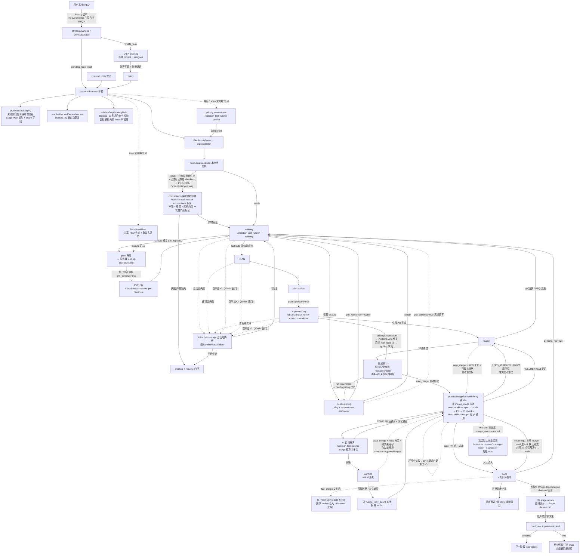
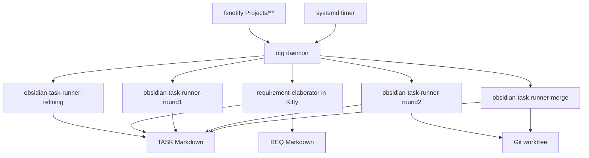
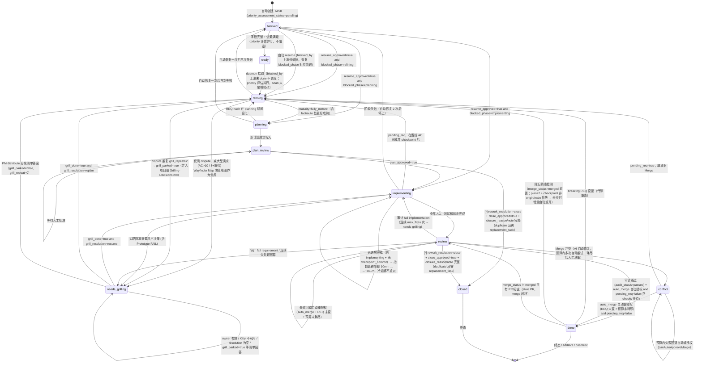
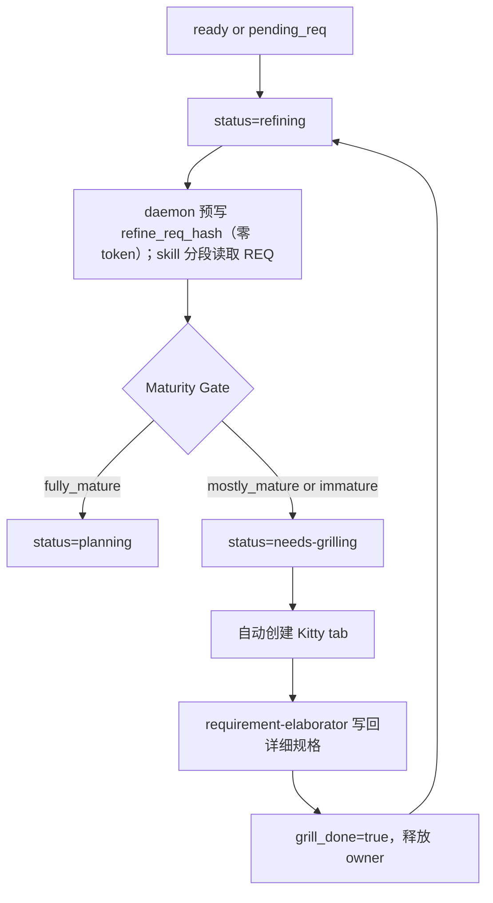
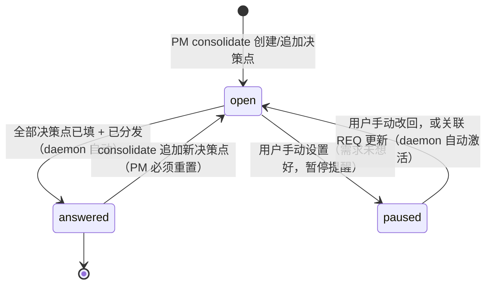
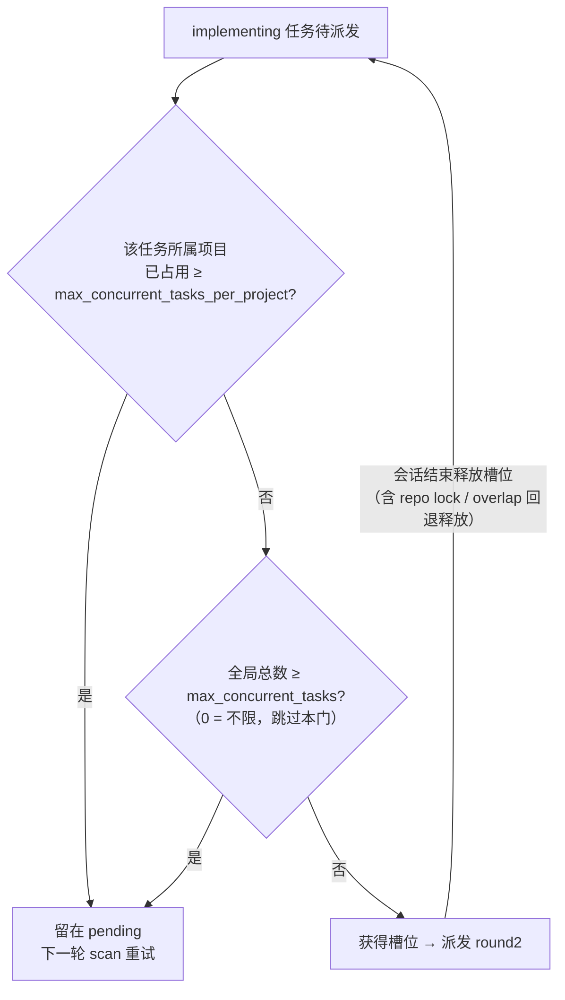
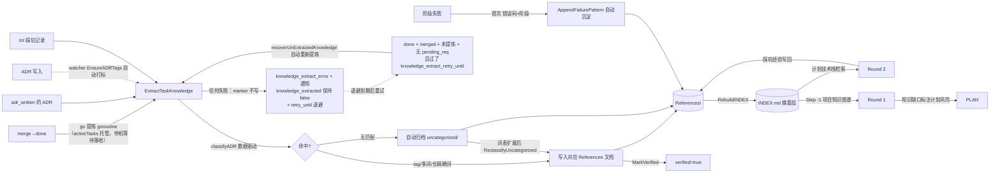

# Obsidian Task Runner — 目标业务流程

> **架构现状**：当前实现以 DSH 为执行后端（agent-server + 免费优先模型路由），
> 见 [docs/architecture.md](architecture.md)。本文为规范性设计；文中早期执行器描述为历史
> 规划残留，执行器相关以 architecture.md 为准。
>
> 本文是规范性设计。Go 实现必须满足本文状态不变量和验收标准。
>
> 当前实现与目标设计的差距见「实现验收清单」。在清单全部通过前，不应把系统标记为设计已完成。

> 本文是**规范性**文档：状态机、门禁、阶段模型与知识流的口径以本文为准。
> 实现验收清单与逐条 AC 在 [`docs/archive/workflow-full-v49.md`](archive/workflow-full-v49.md)（历史全量版）。

## 0. 自动化任务完整链路（学习入口）

> 本节是一条 REQ 从写入到产品交付的完整旅程总览。后续章节是各环节的细节规范。

### 0.1 完整链路图


```mermaid
flowchart TD
    W[用户写/改 REQ] -->|fsnotify 监听 Requirements/ 与项目根 REQ-*| ONREQ[OnReqChanged / OnReqDeleted]
    ONREQ -->|create_task| TASK[TASK blocked<br/>等待 project + assignee]
    ONREQ -->|pending_req / reset| SCAN
    TIMER[systemd timer 兜底] --> SCAN
    TASK -->|补齐字段 + 依赖满足| READY[ready]
    READY --> SCAN[scanAndProcess 每轮]
    SCAN --> STAGE[processAutoStaging<br/>未分阶段任务确定性分组<br/>Stage-Plan 追加 + stage 字段]
    SCAN --> DEP[resolveBlockedDependencies<br/>blocked_by 链自动恢复]
    SCAN --> VALIDATE[validateDependencyRefs<br/>blocked_by 引用存在性校验<br/>目标解析失败 defer 不误报]
    SCAN --> FR[FindReadyTasks → processBatch]
    FR --> SM[nextLocalTransition 本地状态机]
    SM -->|ready + 已有项目首任务<br/>（已注册且存在 checkout，无 PROJECT-CONVENTIONS.md）| CONV[conventions/架构基线审查<br/>/obsidian-task-runner-conventions 只读<br/>产物 = 规范 + 架构约束 一次性门禁标记]
    CONV -->|产物落盘| REFINE[refining<br/>/obsidian-task-runner-refining]
    CONV -->|失败/产物缺失| BLK
    SM -->|ready| REFINE[refining<br/>/obsidian-task-runner-refining]
    REFINE -->|fact/auto 采纳后成熟| PLAN
    REFINE -->|仅剩 dispute| GRILL[needs-grilling<br/>Kitty + requirement-elaborator]
    REFINE -->|dispute 重复 grill_repeat≥2| PARK[park 升级<br/>→ 项目级 Grilling-Decisions.md]
    GRILL -->|grill_resolution=resume| REFINE
    GRILL -->|replan| REFINE
    GRILL -.->|grill_continue=true 离线填答| REFINE
    PARK -.->|用户回答清单 grill_continue=true| PM[PM 分发<br/>/obsidian-task-runner-pm distribute]
    PM --> REFINE
    SCAN -.->|scan 末尾每轮 ≤1| PMC[PM consolidate<br/>共享 REQ 去重 + 争议入清单]
    PMC -->|dispute 汇总| PARK
    PLAN --> PR[plan-review]
    PR -->|plan_approved=true| R2[implementing<br/>/obsidian-task-runner-round2 + worktree]
    R2 -->|全部 AC 完成| RV[review]
    RV -->|审计通过| AUDIT[完成审计<br/>独立只读会话 read/grep/bash<br/>逐条 AC 复核原始证据]
    AUDIT -->|auto_merge 自动授权| MERGE[processMergeTaskWithRetry 纯 Go<br/>按 merge_mode 分流<br/>auto: worktree sync → push → PR → CI checks<br/>manual/fork-merge: 无 gh 通道]
    AUDIT -->|fail implementation<br/>→ implementing 修复<br/>连续 max_fixes 次 → grilling 决策| R2
    AUDIT -->|fail requirement<br/>→ needs-grilling 决策| GRILL
    MERGE -->|auto: PR 合并成功| DONE[done<br/>+ 知识库提取]
    MERGE -->|manual: 推分支 merge_status=pushed| PROBE[远端默认分支探测<br/>ls-remote --symref + merge-base --is-ancestor<br/>每轮 scan]
    PROBE -->|人工合入| DONE
    MERGE -->|fork-merge: 本地 merge --no-ff 进 fork 默认分支<br/>（冲突 AI 会话解决）→ push| DONE
    DONE -.->|fork-merge 交付后| PRM[用户手动向团队项目发 PR<br/>团队 review 合入（daemon 之外）]
    MERGE -.->|环境性失败：2min 退避自动重试 ×5| MERGE
    MERGE -->|REPO_MISMATCH 目标仓库不符<br/>硬失败不重试| RV
    MERGE -->|CONFLICTING| AI[AI 自动解决<br/>/obsidian-task-runner-merge 预算内多次]
    AI -->|本地解决 + 测试通过| MERGE
    AI -->|失败| CF[conflict<br/>critical 通知]
    CF -.->|auto_merge + REQ 未变 + 预算未耗尽<br/>自动重授权（canAutoApproveMerge）| MERGE
    CF -->|预算耗尽 / 永久缺陷| 人工[清 merge_retry_count 重授权 或 replan]
    人工 --> MERGE
    MERGE -->|FAILURE / head 变更| RV
    RV -.->|auto_merge + REQ 未变 + 预算未耗尽<br/>自动重授权| MERGE
    RV -->|gh 缺失 / REQ 变更| REFINE
    DONE -->|pending_req=true| REFINE
    DONE -->|最终验收产品| ACCEPT[验收通过 / 改 REQ 重新规划]
    DONE -->|阶段任务全部 done+merged<br/>daemon 检测| STAGER[PM stage-review<br/>四维评分 → Stage-Review.md]
    STAGER -->|用户填评审决策| SDEC[continue / supplement / end]
    SDEC -->|continue| NEXT[下一阶段 in-progress]
    SDEC -->|end| CLOSESTAGE[后续阶段任务 close<br/>功能满足即结束]
    SCAN -.->|并行：scan 末尾每轮 ≤2| PA[priority assessment<br/>/obsidian-task-runner-priority]
    PA -->|completed| FR
    REFINE -.->|会话级失败| FB[DSH fallback.mjs 会话内降级<br/>或 handlePhaseFailure]
    PLAN -.->|进程级失败| FB
    R2 -.->|进程级失败| FB
    REFINE -.->|空响应×2（10min 窗口）| FB
    PLAN -.->|空响应×2（10min 窗口）| FB
    R2 -.->|空响应×2（10min 窗口）| FB
    FB -->|可恢复| REFINE
    FB -->|不可恢复| BLK[blocked + resume 门禁]
```

### 0.2 逐环节动作明细

| # | 环节 | 触发 | daemon 动作 | 调用的 skill | 写回 TASK 字段 | 出口 |
| --- | ------ | ------ | ------------- | --------------- | ---------------- | ------ |
| 1 | 需求变更 | fsnotify 监听 `Requirements/` 目录与项目根 `REQ-*` 文件 | `OnReqChanged` / `OnReqDeleted` 解析受影响任务；按 action（create_task / pending_req / reset_to_ready / req_missing…）发通知；新增/修改事件下未注册项目自动写入 vault-map.json（`ensureProjectRegistered`） | 无（纯 Go） | 新任务 `status=blocked`；既有任务按状态设 `pending_req` | 3s 后触发 scan |
| 1.5 | 默认委派 | vault-map 顶层 `default_assignee`（如 `"default"`）非空 | `createTaskForReq` 将 TASK `assignee` 预写为对应 models key（`models` 映射到具体模型 ID）——新任务直接可调度，跳过人工补 assignee；**空值恢复旧行为**（blocked 等人工填 assignee） | 无（纯 Go） | TASK `assignee=<default_assignee>`、状态提醒显示已委派 | 创建即生效 |
| 3 | 依赖链恢复 | scan 开始 | `resolveBlockedDependencies`：blocked_by 上游是阶段失败（MODEL_FAILED/PHASE_TIMEOUT/PHASE_INTERRUPTED 等）→ 自动 `resume_approved=true`（上限 2 次、防循环） | 无 | `resume_approved=true, auto_resume_pending=true` | 下一轮 scan |
| 4 | priority 评估 | scan 末尾（与 refining 并行） | `FindPriorityTasks`（Priority 为空 + pending）；running 超 10min 接管；每轮 ≤2 个；API key 不可用则跳过 | `/obsidian-task-runner-priority <req_doc>`（models.default，5min 超时，2 次尝试后 fallback） | `priority_assessment_status=pending→running→completed/failed`，`priority/impact/urgency/…` | 结果用于 dashboard 排序 |
| 5 | refining | `status=ready` 被拾取（**`blocked_by` 上游未 done 不调度——依赖门禁前置**） | `nextLocalTransition` 转 refining；**REQ hash 由 daemon 预写 `refine_req_hash`（零 token）**；DSH 阶段会话（models.default，thinking low）；**会话成功后 daemon 按当前 REQ bytes 兜底重写 `refine_req_hash`** | `/obsidian-task-runner-refining <task>`：六项成熟度检查 + ADR/CONTEXT 一致性；**REQ 分段读取（章节 grep + selector，禁止全文加载 >20KB）**；**细化后增量重关联（新术语 → CONTEXT 回写 + 知识库检索注入 grill_context）**；failed 项三分类：fact（自修正 REQ）/ auto（采纳建议写 REQ + `auto_accepted` 审计）/ dispute（进 grilling） | `maturity`、`refine_req_hash`、`refine_version`、`auto_accepted`、`grill_repeat` | fully_mature 且 hash 未变 → 直接 planning（early-out）；fact/auto 处置后成熟 → planning；仅剩 dispute → needs-grilling；dispute 重复（grill_repeat≥2）→ park 升级 |
| 6 | grilling | `status=needs-grilling` | 检查 owner/超时；创建 Kitty tab（+ 桌面通知兜底）；`grill_continue=true`（用户离线填答）→ 自动重置 refining 复验（异步 Grilling）；`grill_done` 后按 resolution 恢复；`grill_parked=true` → 静默等待项目级清单 | Kitty 内 requirement-elaborator / grilling；parked 由 PM 统筹 | `grill_done/grill_resolution/grill_context`，原子清理（含 `grill_continue`） | resume → 恢复 prev status；replan → refining+pending_req；grill_continue → refining 复验；parked → `Notes/Grilling-Decisions.md` 回答后 PM distribute 回 refining |
| 6.5 | PM 统筹 | scan 末尾（`processGrillingConsolidation`，每轮 ≤1 个） | 同步 DSH 阶段会话（models.default，refining 超时） | consolidate：共享 REQ 组去重 + fact/auto 处置 + dispute 写入 `Notes/Grilling-Decisions.md` + 任务 `grill_parked=true`；**单任务触发扩展：`grill_repeat≥2` 或 `plan_version≥3`（反复 replan）也进统筹**；**新项目/大 REQ 附加拆分建议（split skill）与技术栈建议**；distribute：清单答案写回 REQ + 拆分落地（子 REQ 创建）+ 任务重置 refining | `grill_parked/grill_repeat/plan_version`、清单 `grill_continue` | 用户一次性回答全部争议点；分发后任务各自重跑 maturity gate |
| 6.6 | 自动阶段化 | scan 开始（每轮，PM 统筹前） | `processAutoStaging`：未分阶段（stage 空）的进行中任务按 `blocked_by` 拓扑确定性分层 → 合并为阶段（`stage_min_per_phase`/`stage_max_phases`）→ Stage-Plan.md 追加 + 批量写 `stage` 字段。秒级幂等，编号接续，零 LLM 会话 | 无（纯 Go） | `stage: "P{N}"`、`Notes/Stage-Plan.md` | 已分阶段任务从 PM 输入中消失，PM 只剩真争议 |
| 7 | planning | maturity 成熟 | DSH 阶段会话（重型阶段模型 v4-pro，thinking max/xhigh）；**REQ hash 由 daemon 预写（`refine_req_hash`）** | `/obsidian-task-runner-round1 <task>`：Step -1 知识图谱 → 版本化计划 + Prototype 建议；**命中的知识文档写入 `knowledge_refs`（引用链）**；**成功完成后 daemon 自动折叠 `## 实现计划` 历史（keep=3，防文档膨胀）** | `plan_version`、`status=plan-review`、`plan_approved=false`（批准由 daemon 按 auto_approve 决定）、`adr_proposed`、`knowledge_refs` | plan-review；auto_approve（默认 true）时 daemon 同轮直接转 implementing |

> **auto_approve（默认开启，全自动）**：`auto_approve` 缺失或为 true 时（frontmatter 解析默认 true、模板已写入），plan-review 任务由 daemon scan 自动批准——`plan_approved=true` 并直接转 implementing，**Grilling 是唯一人工关卡**（全自动链路：ready → refining → planning → implementing → review → 自动合并 → done）。显式 `auto_approve: false` 恢复人工审计划。**ADR 护栏**：`adr_proposed` 非空时 `adr_approved=false` 保持（架构决策由人工批准），不阻断实现自动进入。
| 8 | plan-review | auto_approve（默认 true）或 `plan_approved=true`（人工） | `nextLocalTransition` → implementing；auto_approve 路径自动 `plan_approved=true`、`adr_approved=<adr_proposed 为空>`；预热 worktree | 无 | `status=implementing` | Round 2 |
| 9 | 实现 | `status=implementing` | worktree 准备（`task/<id>-<slug>` 分支）；DSH 阶段会话（assignee 模型，thinking max，60min 超时）；**无进展完成（仍 implementing + 无 `checkpoint_commit`）→ 指数退避冷却（10m→…→~10.7h）不重派** | `/obsidian-task-runner-round2 <task>`：Prototype Gate（高风险 Step 先验证）→ Tracer Bullet 逐 AC → Scope Hammering → test-quality/code-review/task-verifier → ADR 写入 → Review Bundle | 实现记录、AC 证据、`status=review`、`target_branch` | review；阻塞 → needs-grilling；pending_req → checkpoint+refining；无进展 → implementing（冷却中） |
| 10 | 完成审计与自动合并 | `status=review` + auto_merge（默认 true） | **① 完成审计**（§7.4）：`merge_approved=false` + `audit_status!=passed` 时先跑独立只读审计会话（受限工具面 read/grep/bash，无写工具；assignee 模型 / `audit.model` 覆盖；任务 worktree 内逐条 AC 复核原始证据）——pass 写 `audit_status=passed` 继续；fail implementation → `AUDIT_FAILED` 转 implementing（round2 自动修复，连续 `audit.max_fixes` 次升级 grilling 决策）；fail requirement → 直接 needs-grilling 决策；会话失败保持 review 待重试。**② 合并授权**：审计通过或人工已授权后 daemon 自动设 `merge_approved=true`；**merge 失败回退自动重授权**（`canAutoApproveMerge`：REQ 未变 + `merge_retry_count < max_auto_merge_fixes` + 非 `GITHUB_UNAVAILABLE`/`REPO_MISMATCH` 永久缺陷，conflict 同样适用；失败回退保持 `audit_status=passed`，不重复审计）；`processMergeTaskWithRetry` 纯 Go：校验（pending_req/REQ hash/target_branch/**origin==git_remote 目标仓库守卫，REPO_MISMATCH 硬失败**）→ 在任务 worktree 上 sync（祖先关系分流：fast-forward / 三路 merge / 文件级覆盖确认后 `--force-with-lease`）→ push（git 侧快速失败：connectTimeout 15s + lowSpeed 20s，命令 60s 上限兜底代理链路）→ PR 创建/复用 → CI checks 轮询；环境性失败 2min 退避自动重试 ×5；`pr_url` ...
| 11 | 交付 | merge 成功（或团队模式交付完成） | 写 done；异步 `ExtractTaskKnowledge`（按任务提取 adr_written 的 ADR → 分类写入/未分类归档 → verified 翻转 → 重分类 → INDEX 重建） | 无（Go） | `status=done, completed, merge_status=merged` | 终态（breaking 需求变更则回 refining 新一轮交付）。**团队模式差异**：manual = 远端探测到人工合入后 done（无 PR URL）；fork-merge = 本地 merge 进 fork 默认分支并推送后 done，通知用户手动向团队项目发 PR |
| 12 | 失败与恢复 | DSH 会话非零退出 / 阶段超时 / key 缺失 / 网关 5xx（MODEL_FAILED）/ quota | DSH fallback.mjs 会话内跨模型降级 → `handlePhaseFailure` 按阶段策略：refining/planning 重试一次再 block、round2 fallback→block、merge conflict/review；quota 指数退避；**24h 老化兜底自动恢复**（`autoResumeAgedBlocks` + `blocked_at`）；`AppendFailurePattern` 知识库沉淀 | 无 | `phase_error_code/phase_error/blocked_at/blocked_phase/auto_resume_count` | 见 [architecture.md §5](architecture.md) 与 §10 |
| 13 | 阶段评审 | 某阶段全部任务 done+merged（`merge_status=merged`）或剩余全 blocked/closed | `processStageReviews` 检测（每轮 ≤1）→ PM stage-review 四维评分写 `Notes/Stage-Review.md`；用户填「评审决策:」后 **daemon 先确定性翻转 Stage-Plan 状态机**（`flipStageReviewDecision`：continue→delivered+下阶段 in-progress/completed；supplement→+补充行；end→后续阶段 ended+任务 close）→ PM distribute 只做 REQ 标注/知识沉淀并写 answered | `/obsidian-task-runner-pm stage-review` / distribute | `Notes/Stage-Review.md`、Stage-Plan 阶段状态（delivered/ended/completed/in-progress） | continue → 下一阶段 in-progress；supplement:{建议} → 追加下一阶段；end → 后续阶段 ended + 任务 close（不维护积压） |

## 1. 架构边界

系统由四层组成：

1. **触发层**：`fsnotify` 监听 Vault，systemd timer 定时兜底。
2. **调度层**：`otg daemon` 扫描任务、持有状态机、并发和恢复控制。
3. **阶段执行层**：daemon 按阶段直接调用独立 Skill。
4. **持久化层**：TASK/REQ Markdown frontmatter、Git worktree、日志和 PID 文件。


```mermaid
flowchart TD
    Watch[fsnotify Projects/**] --> Daemon[otg daemon]
    Timer[systemd timer] --> Daemon
    Daemon --> Refine[obsidian-task-runner-refining]
    Daemon --> Grill[requirement-elaborator in Kitty]
    Daemon --> Plan[obsidian-task-runner-round1]
    Daemon --> Implement[obsidian-task-runner-round2]
    Daemon --> Merge[obsidian-task-runner-merge]
    Refine --> Task[TASK Markdown]
    Grill --> Req[REQ Markdown]
    Grill --> Task
    Plan --> Task
    Implement --> Repo[Git worktree]
    Implement --> Task
    Merge --> Repo
    Merge --> Task
```

### 1.1 Skill 调度

Daemon 直接调用阶段 Skill，不通过核心 Skill 二次路由：

| 阶段 | Skill | 模型 | 权限 |
| ------ | ------- | ------ | ------ |
| `refining` | `/obsidian-task-runner-refining <task>` | `models.default` | `--auto-approve` |
| `planning` | `/obsidian-task-runner-round1 <task>` | TASK `assignee` | `--auto-approve` |
| `implementing` | `/obsidian-task-runner-round2 <task>` | TASK `assignee` | `--auto-approve` |
| Merge（含冲突自动解决） | `/obsidian-task-runner-merge <task>` | TASK `assignee` | `--auto-approve` |
| priority 评估 | `/obsidian-task-runner-priority <req_doc>`（scan 末尾并行，每轮 ≤2） | `models.default` | `--auto-approve` |
| PM 统筹 / 分发 / 阶段评审 | `/obsidian-task-runner-pm <consolidate | distribute | stage-review>`（scan 末尾，每轮 ≤1） | `models.default` | `--auto-approve` |
| 新项目/大 REQ 拆分建议 | `/obsidian-task-runner-split <req>`（并入 PM consolidate） | `models.default` | `--auto-approve` |

`obsidian-task-runner` 核心 Skill 是人工入口和流程参考，不是 daemon 的阶段执行入口。

### 1.2 Skill 安装

`otg install` 必须把以下 Skill 安装为 `~/.dsh/skills/` 下的顶层独立 Skill（真实文件，非 symlink）：

- `obsidian-task-runner`
- `obsidian-task-runner-refining`
- `obsidian-task-runner-round1`
- `obsidian-task-runner-round2`
- `obsidian-task-runner-merge`
- `obsidian-task-runner-conventions`
- `obsidian-task-runner-priority`
- `obsidian-task-runner-pm`
- `obsidian-task-runner-split`
- `obsidian-task-runner-design`

子 Skill 同时安装到 `~/.dsh/skills/obsidian-task-runner/skills/` 作为 daemon 直读副本。两个位置的内容必须一致。`--force` 安装时 `installSkill` 在 `os.RemoveAll(dest)` 前备份 `config/vault-map.json`，`copyDir` 后恢复原文件。`generateVaultMap` 对已有配置文件只 merge 新默认字段，不覆盖 `projects`、`models` 等用户值。

外部依赖 Skill：

- `requirement-elaborator`
- `grilling`
- `domain-modeling`
- `diagnosing-bugs`
- `test-quality`

安装器必须 fail-fast 检查外部依赖。缺失时安装失败，并输出明确的 `skill-doctor install <name>` 指令，不允许警告后继续。

## 2. 状态机


```mermaid
stateDiagram-v2
    [*] --> blocked: 自动创建 TASK (priority_assessment_status=pending)
    blocked --> ready: 字段完整 + 依赖满足（priority 评估并行，不阻塞）
    blocked --> refining: resume_approved=true and blocked_phase=refining
    blocked --> planning: resume_approved=true and blocked_phase=planning
    blocked --> implementing: resume_approved=true and blocked_phase=implementing
    blocked --> refining: 自动 resume (blocked_by 上游依赖链，恢复 blocked_phase 对应阶段)

    ready --> refining: daemon 拾取（blocked_by 上游未 done 不调度；priority 评估并行，scan 末尾每轮≤2）

    refining --> planning: maturity=fully_mature（含 fact/auto 处置后成熟）
    refining --> needs_grilling: 仅剩 dispute，或大型需求 (AC>10 / 3+服务) → Wayfinder Map 决策地图作为焦点
    refining --> needs_grilling: dispute 重复 grill_repeat≥2 → grill_parked=true（并入项目级 Grilling-Decisions.md）
    refining --> blocked: 自动恢复一次后再次失败

    needs_grilling --> needs_grilling: owner 有效 / Kitty 不可用 / resolution 为空 / grill_parked=true 等清单回答
    needs_grilling --> implementing: grill_done=true and grill_resolution=resume
    needs_grilling --> refining: grill_done=true and grill_resolution=replan
    needs_grilling --> refining: PM distribute 分发清单答案（grill_parked=false, grill_repeat=0）

    planning --> refining: REQ hash 在 planning 期间变化
    planning --> plan_review: 新计划成功写入
    planning --> blocked: 自动恢复一次后再次失败

    plan_review --> implementing: plan_approved=true
    plan_review --> plan_review: 等待人工批准
    plan_review --> closed: [*] rework_resolution=close + close_approved=true + closure_reason/note 完整（duplicate 还需 replacement_task）

    implementing --> needs_grilling: 实现阻塞需要用户决策 (含 Prototype FAIL)
    implementing --> refining: pending_req，在当前 AC 完成并 checkpoint 后
    implementing --> blocked: 阶段失败（自动恢复 2 次后停止）
    implementing --> review: 全部 AC、测试和验收完成
    implementing --> implementing: 无进展完成（仍 implementing + 无 checkpoint_commit）→ 指数退避冷却 10m→…→~10.7h，冷却期不重派

    review --> review: 独立完成审计（audit_status=pending，会话失败重试）
    review --> implementing: 审计 fail implementation（连续 max_fixes 次 → needs-grilling）
    review --> needs_grilling: 审计 fail requirement / 连续失败超预算
    review --> done: 审计通过 (audit_status=passed) + auto_merge 自动授权 and pending_req=false (含 checks 等待)
    review --> conflict: Merge 冲突（AI 自动修复，预算内多次自动重试，耗尽后人工决策）
    review --> review: 失败回退自动重授权（auto_merge + REQ 未变 + 预算未耗尽）
    review --> closed: [*] rework_resolution=close + close_approved=true + closure_reason/note 完整（duplicate 还需 replacement_task）

    conflict --> refining: pending_req=true，取消旧 Merge
    conflict --> done: auto_merge 自动重授权（REQ 未变 + 预算未耗尽）and pending_req=false
    conflict --> conflict: 预算内失败回退自动重授权（canAutoApproveMerge）

    done --> refining: breaking REQ 变更（代际重置）
    done --> refining: 陈旧终态检测（merge_status=merged 前置；plan≥2 + checkpoint 非 origin/main 祖先 → 未交付增量自动重开）
    done --> review: merge_status != merged 且有 PR/分支（stale PR，merge 闭环）
    done --> [*]: 终态 / additive / cosmetic

    closed --> [*]: 终态
```

## 3. 状态语义

| 状态 | 不变量 | 执行主体 | 成功出口 |
| ------ | -------- | ---------- | ---------- |
| `blocked` | 缺字段、依赖未完成，或阶段连续失败，或 API key 不可用，或人工暂停 | daemon / 人工 | `ready`、`refining`、`planning` 或 `implementing` |
| `ready` | 可以开始规格成熟度检查 | daemon | `refining` |
| `refining` | 正在执行 headless maturity gate | default model | `planning` 或 `needs-grilling` |
| `needs-grilling` | 等待用户交互补充规格或解决实现阻塞 | Kitty + requirement-elaborator/用户 | `refining` 或恢复 `grill_prev_status` |
| `planning` | 规格已成熟，正在生成版本化实现计划 | Round 1 Skill | `plan-review` |
| `plan-review` | 具体 `plan_version` 已存在，等待或已获得批准 | 人工 Gate | `implementing` 或 `closed` |
| `implementing` | 在任务 worktree 执行已批准计划（含 Prototype Gate） | Round 2 Skill | `review`、`refining` 或 `needs-grilling` |
| `review` | 本地实现已提交；auto_merge=true 时先过**独立完成审计**（§7.4：只读会话逐条 AC 复核原始证据），通过后 daemon 自动授权合并；人工 `merge_approved=true` 跳过审计直接授权；审计 fail 按类型转 implementing 修复或 needs-grilling 决策 | daemon 自动 / 人工 Gate | `done`、`conflict`、`refining`、`implementing`、`needs-grilling` 或 `closed` |
| `conflict` | Merge 冲突；AI 预算内自动修复并重授权，预算耗尽（conflict-resolve-attempted）交还人工 | daemon（AI 预算内）+ 人工 | `done` 或 `refining` |
| `done` | 已合并并推送；breaking 需求变更（含未标注）重开并代际重置，additive/cosmetic 保持终态；**陈旧终态检测**（done + plan_version≥2 + checkpoint 非 origin/main 祖先）自动重开 refining；`merge_status != merged` 且有 PR/分支 → 自动重开 `review` 走 merge 闭环 | daemon（自动收口/检测）/ 人工 Gate | `refining`（breaking / 陈旧终态）、`review`（stale PR）或终止 |
| `closed` | 无需交付（已实现/重复/取消/不予处理） | 人工 Gate | 终态，不可恢复 |

### 3.1 提前审批

`plan_approved=true` 仅在 `status=plan-review` 时有效。

提前批准的兜底清理是 `nextLocalTransition` 末尾的 **catch-all**（`state_machine.go:189`）：`PlanApproved && status != "plan-review" && status != "implementing"` → 自动重置为 `false`（reason: premature plan approval reset）。

经 switch 各 case 提前 return 的状态不经过 catch-all——`ready` 经 ready→refining 转换、`needs-refining` 经迁移、`needs-grilling` 的 parked/未完成/已裁决分支、`plan-review` 已批准/auto_approve、`done` 重开 merge；其中 `ready` 带着 `plan_approved=true` 转入 refining，下一轮 scan 由 catch-all 清 false。落在 catch-all 的状态：`refining`/`planning`/`blocked`/`review`/`conflict`/`done`（未重开）/`needs-grilling`（grill_done 且 resolution 空）。

### 3.2 daemon 重启与中断恢复

daemon 停机（SIGTERM：`systemctl stop`、`make deploy`、系统重启）时，执行中的 DSH 阶段会话不受影响——agent-server 常驻，会话经 `executor_session_id` 持久恢复；dsh-embed 会话由 agent-server 保管，daemon 重启后 resume 或 fresh start。

被中断的 phase **不转 blocked**：

1. 任务保持原状态（`refining`/`planning`/`implementing`），写入 `phase_error_code=PHASE_INTERRUPTED`、`phase_error="daemon 重启中断，等待自动恢复"`、`phase_log`。
2. pid 文件随进程退出删除；重启后下一轮 scan 通过 `procAlive` 检查自动重新调度。
3. 阶段成功后 `clearPhaseError` 清除中断标记；后续真失败覆盖。
4. 依赖链自动恢复将 `PHASE_INTERRUPTED` 视为可恢复错误码（同 `MODEL_FAILED`）。
5. fallback 执行中被中断同样保持状态（主失败原因记入日志）。
6. **Merge 冲突自动解决会话被中断**：daemon 停机中止 AI 冲突解决时，任务**不写 conflict**——保持 `review + merge_approved=true`，重启后下一轮 scan 自动恢复合并流程（与 phase 中断同语义）。

`make deploy` 内部 `otg install` 的 stopDaemon 阻塞等待 systemd 优雅停机完成后再安装，并与后续 `enable --now` 串行化，避免新旧实例竞态。

## 4. 统一规格成熟度流程

初次任务和需求变更使用同一流程：


```mermaid
flowchart TD
    Start[ready or pending_req] --> Refining[status=refining]
    Refining --> Hash[daemon 预写 refine_req_hash（零 token）；skill 分段读取 REQ]
    Hash --> Gate{Maturity Gate}
    Gate -->|fully_mature| Planning[status=planning]
    Gate -->|mostly_mature or immature| Grilling[status=needs-grilling]
    Grilling --> Kitty[自动创建 Kitty tab]
    Kitty --> Spec[requirement-elaborator 写回详细规格]
    Spec --> Done[grill_done=true，释放 owner]
    Done --> Refining
```

### 4.1 Maturity Gate

`refining` 使用 `models.default`，检查：

1. 详细规格存在。
2. 十章节齐全。
3. 无占位符。
4. AC 覆盖成功、边界、错误、幂等/并发场景。
5. 数据模型或类型定义具体。
6. 无已知矛盾，依赖契约一致。

输出必须同时写入：

- 结构化 frontmatter。
- TASK 的 `## 需求成熟度评估` 审计 section。

核心字段：

```yaml
maturity: fully_mature # fully_mature | mostly_mature | immature
refine_version: 1
refine_req_hash: "sha256:..."
refine_retry_count: 0
refine_error: ""
```

### 4.2 REQ 一致性

Hash 算法：REQ 完整原始 bytes 的 SHA-256，包括 frontmatter 和正文。

- refining 开始记录 `refine_req_hash`。
- planning 开始记录 `plan_req_hash`。
- planning 写入计划前重新计算 REQ hash。
- 若当前 hash 与 `plan_req_hash` 不一致：丢弃本轮计划输出，不递增 `plan_version`，不清 `pending_req`，转回 `refining`。

### 4.3 refining 失败恢复

- live PID：跳过重复执行。
- 第一次进程死亡/失败：`refine_retry_count=1`，自动恢复一次。
- 再次失败：转 `blocked`，写：

```yaml
blocked_phase: refining
phase_error: "..."
phase_log: "..."
resume_approved: false
```

用户修复后设置 `resume_approved=true`。Daemon 恢复 `refining`，清 `resume_approved`、错误和 retry count。

## 5. Grilling 所有权与通知

### 5.1 双重检查

- daemon：发送通知、重复提醒和状态迁移前检查 owner/timeout。
- requirement-elaborator：获取、持有和释放 owner。

TASK frontmatter：

```yaml
grill_owner: ""
grill_started_at: ""
grill_timeout_minutes: 30
grill_done: false
```

默认超时 30 分钟，可按 TASK 配置。

### 5.2 本机原子性

修改 owner 前必须获取 task-path hash 对应的文件锁：

```text
${TMPDIR}/otg-grill-<task-path-sha256>.lock
```

锁内执行 read → check timeout → write frontmatter，避免本机两个进程同时获得 owner。

### 5.3 通知语义

`notifications.desktop` 只控制 `notify-send` 系统桌面通知。

- `desktop=false`：不发送系统桌面通知，包括最终状态通知。
- Kitty Grilling tab 是核心交互入口，始终尝试创建，不受 `desktop` 控制。
- 同一 TASK 在全部 Kitty OS window 中最多保留一个活跃 Grilling tab。Daemon 在创建前解析 `kitty @ ls` JSON，并按稳定前缀 `Grilling <task-id>` 检查 tab title 与 window title；标题变化和 JSON Unicode 转义不得绕过去重。
- tab 检查和创建受 per-task 文件锁保护；每次尝试前写入 5 分钟 debounce 时间戳，避免并发扫描或 daemon 重启重复创建。
- `kitty @ ls` 不可执行时按本次尝试写入的 debounce 判断近期会话并停止创建；JSON 无法解析时 fail closed，不创建 tab，并保留 `notify-send` fallback。后续扫描继续重试 Kitty。
- Kitty 不可用：保持 `needs-grilling`，记录日志，后续扫描按 debounce 周期重试 Kitty；不得转 `blocked`，不得调用普通终端 fallback。

需求细化型 Grilling 完成后必须回到 `refining` 复验；实现阻塞型 Grilling 按 `grill_resolution=resume|replan` 分流。

### 5.4 实现阻塞的 Grilling 回流

Round 2 阻塞进入 Grilling 时，requirement-elaborator/用户必须写结构化结果：

```yaml
grill_resolution: resume # resume | replan | ""
```

- `resume`：纯代码逻辑错误、环境问题或无需修改 REQ/计划的问题。Daemon 恢复 `grill_prev_status`（通常 implementing），不经过 refining/planning。
- `replan`：需求缺口、计划外设计决策或架构假设变化。设置 `pending_req=true`，转 refining。
- 空值：daemon 不猜测，保持 needs-grilling 并记录 warning。

需求细化型 Grilling 固定使用 `replan` 语义：完成后回 refining。

Daemon 消费完成结果时，优先级为：

1. `pending_req=true` → 强制按 `replan` 处理；即使 grill_resolution=resume 也不能恢复旧计划实现。
2. 否则 `grill_resolution=resume` → 恢复 grill_prev_status。
3. 否则 `grill_resolution=replan` → 转 refining。
4. 否则保持 needs-grilling。

成功路由后必须原子清理：`grill_done=false`、`grill_resolution=""`、`grill_context=""`、`grill_prev_status=""`；owner/started_at 已由 requirement-elaborator 释放。

### 5.5 Grilling 期间 REQ WRITE

`needs-grilling` 且 `grill_owner` 有效时，REQ WRITE 只设置 `pending_req=true` 并记录最新事件/hash：

- 不清 owner。
- 不修改 status。
- 不重开 Kitty tab。
- 当前 Grilling 完成后按 `grill_resolution` 路由。

这样 requirement-elaborator 自己写回 REQ 不会被 watcher 当成外部取消事件。

### 5.6 refining/planning 期间 REQ WRITE

只设置 `pending_req=true`，不修改 status、不取消 live phase。Refining 使用最新 REQ；planning 由提交前 hash 复核决定是否返回 refining。

### 5.7 项目级 PM 统筹（重复争议收敛）

**问题**：多个任务共享同一 REQ 时各自 grilling，同一歧义被重复追问；单个任务的 dispute 无人回答时反复 refining→needs-grilling 空转。

**收敛机制**：

1. **refining 三分类**（`/obsidian-task-runner-refining`）：failed 项按 fact（环境事实可证，自修正 REQ）/ auto（有明确建议且低风险可逆，采纳写 REQ + `auto_accepted` 审计）/ dispute（真争议）分类。fact/auto 处置后成熟 → 直接 planning，不再问用户。
2. **重复检测**：dispute 与上一版 `## Grilling 待回答` 相同 → `grill_repeat+1`；`grill_repeat≥2` 且 REQ hash 未变 → **park 升级**（`grill_parked=true`），不再逐任务重复追问。
3. **PM consolidate**（`processGrillingConsolidation`，scan 末尾每轮 ≤1）：按 req_doc 分组去重 → fact/auto 处置同步到所有相关任务 → dispute 写入 `Notes/Grilling-Decisions.md` 决策点（含来源任务、冲突引用、建议方向、决策空位）→ 任务 `grill_parked=true`。
4. **一次性回答**：用户在清单中填「决策:」，置 frontmatter `grill_continue=true`。parked 任务不创建 Kitty、不提醒。
5. **PM distribute**：检测到清单 answered → 读答案写回各 REQ（标注 `[决策: <清单 D-n>]`）→ 任务重置 `grill_parked=false / grill_repeat=0 / status=refining` → 各自重跑 maturity gate。清单 `status=paused` 时 daemon **不派发 distribute**（填答案也不写回），见 5.8。

**审计与推翻**：`auto_accepted` 保留每次自动采纳记录（版本、时间、摘要）；用户可推翻自动采纳后重跑 refining，REQ 中的 `[采纳建议 auto]` 标注会被后续决策标注覆盖。

### 5.8 决策清单生命周期：暂停开关与分发控制

决策清单（`Notes/Grilling-Decisions.md`）的 frontmatter `status` 驱动提醒与分发：


```mermaid
stateDiagram-v2
    [*] --> open: PM consolidate 创建/追加决策点
    open --> answered: 全部决策点已填 + 已分发（daemon 自动）
    open --> paused: 用户手动设置（需求未想好，暂停提醒）
    paused --> open: 用户手动改回，或关联 REQ 更新（daemon 自动激活）
    answered --> open: consolidate 追加新决策点（PM 必须重置）
    answered --> [*]
```

- **`open`**：有待答决策点 → 每个 parked 任务创建/聚焦一个 Kitty 决策 tab（每项目一个、5 分钟 debounce）；`grill_continue=true` 或全部填完 → distribute 分发 → `status=answered`。
- **`paused`**（需求未想好，项目级暂停开关）：该项目的 grilling 流程任务**整体暂停**——不创建 Kitty tab、不提醒、grill_continue 不重置 refining、**PM 不分发/不 consolidate**（填答案也不写回任务）、parked 任务不解除。consolidate 不得再向 paused 清单追加决策点。
- **恢复**：① 用户手动把清单 frontmatter `status` 改为 `open`；② **关联 REQ 更新时 daemon 自动激活回 `open`**（用户/团队主动补充需求 = 恢复信号）并通知——随后 consolidate 重新整理新需求与既有争议点、Grilling 对齐，任务重新进入自动化流程。激活后下一轮 scan 起提醒/分发/派发全部恢复（已填答案的清单在 open 后自动分发）。
- **失败/切换通知按任务防抖**（`notifyFailure`）：主模型失败（⏰ 超时 / 💥 进程异常 / 💰 Token 不足）、🔄 模型切换、❌ 全部失败、🚫 阶段失败通知按任务 5 分钟窗口去重——**同级/低级别事件窗口内抑制**，**更高级别事件升级后再发**（失败原因 < 模型切换 < 全部失败/阶段阻塞），保证终态必达：主失败 + fallback 失败最多 2 条（🔄 切换 + ❌ 全部失败）、反复失败到阻塞最多 2 条（⏰/💥 + 🚫），同级反复 5 分钟最多 1 条。有 fallback 时失败原因与切换合并为单条通知。
- **通知风暴抑制**：API key 故障等批量失败场景，桌面提醒按 5 分钟窗口全局去重（`notifyKeyUnavailable`），不再每任务一条；调度前 `apiKeyAvailable()` 预检让任务保持状态等待（不启动 DSH 阶段会话、不消耗重试预算、无逐任务通知）。

## 6. Planning / Round 1

`planning` 使用 TASK `assignee`，daemon 直接调用 `/obsidian-task-runner-round1`。

### 6.1 计划生成

- 每次 planning 成功，`plan_version` 增加 1。
- 初次成功生成 v1；重规划成功生成 vN+1。
- refining/Grilling 不修改 `plan_version`。
- `plan-review` 必须保证对应版本的具体计划内容已经写入。

### 6.2 pending_req 生命周期

`pending_req` 从 REQ 变更开始保持 `true`，直到新计划成功写入。

Planning 成功时原子更新：

```yaml
status: plan-review
pending_req: false
merge_approved: false
plan_approved: false # 批准由 daemon 按 auto_approve（默认 true）决定；人工批准设为 true
plan_version: <old + 1>
```

`plan_approved` 在 `plan-review → implementing` 时**保留为 true**（v0.16.6 起）：它作为一次性审批门控被 daemon 消费后，Round 2 阶段会话仍需读取该字段确认计划已批准。`implementing` 状态下不会被「提前审批重置」清除。

### 6.3 auto_approve（默认开启）

`auto_approve` **默认 `true`**：frontmatter 缺失该字段时按 true 解析（与 `auto_merge` 对称），模板已显式写入 `auto_approve: true`。plan-review 任务在 daemon scan 时自动 `plan_approved=true` 并直接转 implementing——**Grilling 是唯一人工关卡**。

1. 显式 `auto_approve: false` 恢复人工审计划：任务停在 plan-review，等待 `plan_approved=true`（`otg update-status`）。
2. **ADR 护栏**：`adr_proposed` 非空时保持 `adr_approved=false`——架构决策由人工批准（`otg update-status adr_approved=true`），不阻断实现自动进入。
3. 不跳过 maturity gate、Grilling 或 Merge Gate；pending_req 仍优先回 refining。
4. 新项目与 replan 同样自动批准（`new_project` 仅影响目录创建时机，Round 2 才创建）。
5. 自动批准在 daemon 日志与桌面通知标注来源（`auto_approve 默认开启`），TASK 变更记录由 daemon 写入，区分自动/人工。

### 6.4 Checkpoint 复用

Pending requirement 导致 Round 2 停止时，planning 必须读取 `checkpoint_commit`，并在新计划中逐项标记旧实现：

- `保留`
- `修改`
- `废弃`

用户批准新计划即同时批准 checkpoint 复用策略。

### 6.5 新项目

`new_project=true` 的 refining/planning 只读需求、模板和项目规范（零文件系统副作用）：

- 不创建项目目录、不执行 `git init`、不创建脚手架文件。

Round 2 首次调度（`resolveRepo` new 分支）自动完成项目初始化：

- 创建项目目录（`new_project_root/<name>`）。
- **自动注册 vault-map.json**：`name`/`path` 按解析结果写入，`git_remote` 从既有项目推断 owner（`github.com/<owner>/<name>`），`project_id` 自动分配（既有最大值 +1，`%03d`）——后续扫描以 `existing` 解析，无需手动配置。
- **REQ 出现即注册**：目录已存在但 vault-map 未登记的项目（如手工创建的 `Projects/010-demo/`），首个 REQ 文件出现时由 `ensureProjectRegistered` 自动补登记（事件与每轮 scan 双通道；name 去数字前缀，path 优先 `new_project_root/<name>` 的约定 checkout，不存在则回退 vault 项目目录），随后正常建 TASK 走细化——新项目无需任何手工配置。
- **vault 回退项目自动提升（`ensureProjectCheckout`）**：已注册项目若 path 是 vault 项目目录（非 git 根）且配置了 `git_remote`，`resolveRepo` 自动创建 `new_project_root/<name>` 独立 checkout（README 初始提交，供 worktree 分支），vault-map `path` 更新指向 checkout，远端仓库缺失时自动 `gh repo create`（private，description 从 REQ 蒸馏）并补 origin。不提升的话 worktree 与 merge 会静默落入外层 Vault 仓库——错误仓库合并。提升对任意阶段生效（refining 扫描也可能触发，README-only 仓库无副作用）；提升失败仅记日志、回退原路径，由 merge 守卫兜底。
- **播种 `Notes/CONTEXT.md` 骨架**（`## Language` / `## Development Constraints` / `## Anti-patterns` / `## Reference Map`），由首轮 agent 填充。
- 新项目首个 REQ 由 PM 统筹触发 `skill://obsidian-task-runner-split` 拆分建议（并入 Grilling-Decisions 一次性对齐），确认后 distribute 创建子 REQ（`OnReqChanged` 自动生成 canonical TASK）。

### 6.5.1 团队已有项目（`project_type: team`）

对**已存在的组织仓库**（如私有 Gitea）不适用上述自动初始化——仓库归团队所有，
daemon 不得创建/移动/复制它。手动在 vault-map.json 注册即可，`git_remote`
指向你实际开发操作的仓库，`merge_mode` 按开发方式二选一：

```json
// 直接在团队仓库上开发（交付停在推分支，人工在仓库 UI 合并）
{"name": "team-app", "path": "/work/team-app",
 "git_remote": "git@gitea.internal.example.com:team/team-app.git",
 "project_type": "team", "merge_mode": "manual"}

// fork 开发（推荐：团队仓库只读，自动化 merge 进 fork 默认分支并推送，
// 由你手动向团队项目发 PR）
{"name": "team-app", "path": "/work/team-app-fork",
 "git_remote": "git@gitea.internal.example.com:yourname/team-app-fork.git",
 "project_type": "team", "merge_mode": "fork-merge"}
```

- **禁自动动作**：`ensureProjectRegistered` 跳过（防止推断 remote 覆盖真实配置）、`ensureProjectCheckout` 提升跳过、`gh repo create`/`remote_create` 拒绝（错误信息指引移除 remote_create）。`path` 必须是该团队仓库（或 fork）的本地 checkout（git 根）。
- **`merge_mode: manual`**：交付停在**推分支**（仓库自身 SSH/https 凭据，无 gh credential-helper 注入）→ `merge_status=pushed` + 保持 `review` + 通知「请到仓库 UI 合并」→ daemon 每轮探测远端默认分支（`ls-remote --symref` + fetch + `merge-base --is-ancestor`，不硬编码 main）→ 人工合入后自动 `done`。详见 §8.2 第 7 条。
- **`merge_mode: fork-merge`**：`git_remote` 必须指向**开发者自己的 fork**。自动化推进到本地 merge 完成——worktree 内 fetch fork 默认分支 → `checkout -B <default> origin/<default>` → `merge --no-ff <feature>`（冲突由 AI 会话解决，共享 `merge_retry_count` 预算；停机中断保持授权重启自动恢复）→ 仓库自身凭据 push fork 默认分支 → 自动 `done` + 通知「请手动向团队项目提交 PR」。团队侧 PR/review/合入完全在 daemon 之外。详见 §8.2 第 9 条。
- **规范审查门禁（强制，每项目一次；适用所有已有项目，非仅 team）**：首个任务在 refining 前先跑只读基线审查会话（`/obsidian-task-runner-conventions`，models.default，工作目录=项目 checkout）。审查汇总项目的设计/代码/注释语言/API 文档/文档/提交规范 **+ 架构约束**（技术栈、数据库分环境、schema/字段命名、迁移机制）到 `Notes/PROJECT-CONVENTIONS.md`（**产物文件即一次性门禁标记**；删除文件可人工重审）。**硬约束：零优化建议、零代码修改、每条规范/约束附项目内证据**。会话失败或成功退出但产物缺失 → 转 blocked（`CONVENTIONS_REVIEW_FAILED`），resume 重跑。
  - **为什么所有已有项目都要过门禁**：此前只有 `project_type: team` 触发审查，普通已有项目开发新功能时不审架构——dev 用 SQLite、test/prod 用 MySQL，字段名结尾（`_at`/`_id` 等）不一致导致上线 bug、返工。现在任何**已注册且存在 checkout** 的项目（`projectIsExisting`）首任务都先过门禁，且审查**必须**采集 `## 架构约束`（数据库分环境、schema/字段命名、迁移方言），环境间引擎不一致 = 最高优先级硬约束，进「需要人工确认」。
- **规范注入**：`PROJECT-CONVENTIONS.md` 随 `[Project Context]` 注入 refining/planning/round2/merge 修复会话（`BuildProjectContext`），优先级高于全局默认约定——注释语言、代码风格、commit 习惯、技术栈选择均按项目规范；**数据库/schema 决策以 `## 架构约束` 的 test/prod 引擎为准**；round1 Step 1.8 强制计划声明规范 + 架构约束对齐；round2 实现前强制读取。
- **防误重开**：`detectStaleDoneReopens` 与 done 重开 merge 对 team 项目跳过（squash 合入后 checkpoint 非 main 祖先但交付已发生，`merge_status=merged` 由远端探测/本地 merge 完成权威写入）。

### 6.6 planning 失败恢复

与 refining 相同：自动恢复一次，再失败转 `blocked`：

```yaml
blocked_phase: planning
planning_retry_count: 1
phase_error: "..."
phase_log: "..."
resume_approved: false
```

人工 resume 后 retry count 清零，重新获得一次自动恢复机会。

## 6.7 OnReqChanged 状态语义

| 当前状态 | REQ WRITE 行为 |
| ---------- | ---------------- |
| `blocked` | 保持 blocked，设置 pending_req=true；不能绕过字段/依赖门禁。**阶段失败子集（blocked_phase 非空 + 可恢复错误码）由 daemon 每轮 scan 自动转 refining（`recoverBlockedPendingReq`）**——不复用旧 phase（手动 resume 会拿旧需求重新实现）；排除 `PREREQUISITE_SMOKE_FAILED` 门禁、`REQ_MISSING` 等非瞬时码、空错误码 + `blocked_by` 非空的入口门禁形态 |
| `ready` | 保持 ready，设置 pending_req=true；下一轮统一进入 refining |
| `refining` / `planning` | 只设 pending_req=true，不改 status、不取消 live phase |
| `needs-grilling` + active owner | 只设 pending_req=true，不中断当前 Grilling |
| `plan-review` | 清 plan_approved，设 pending_req=true，转 refining；旧计划立即失效 |
| `implementing` | 设 pending_req=true；Round 2 在当前 AC 完成后 checkpoint → refining |
| `review` / `conflict` | 设 pending_req=true，清 merge_approved，转 refining（未合并交付必须吸收变更后合入） |
| `done` | 按 REQ 最新变更记录 `> 变更类型:` 路由：`breaking`/未标注 → 清 merge_approved 转 refining + 代际重置（reopen_count+1、清 target_branch/pr_url/merge_status/completed/knowledge_extracted，round2 完成后写新分支/新 PR）；`additive` → 保持终态，通知「建议新建 TASK 承接增量或手动重开」；`cosmetic` → 忽略 |

**已吸收去重**：任务 `refine_req_hash` 已等于 REQ 当前内容 hash 时跳过处理——refining/PM 写回自身审计记录不重复打回、不重复通知（watcher 事件级另有同内容 hash 去重）。**例外**：任务处于陈旧终态（done + `plan_version≥2` + `checkpoint_commit` 非空）时不跳过——吸收会锁死未交付增量，改走 done 分支按类型路由（breaking 重开 / additive 保持终态并提示 / cosmetic 忽略）。变更类型由修改者（用户/PM/refining 会话）在保存前写入 `> 变更类型:` 行（breaking/additive/cosmetic），未标注按 breaking 保守处理。

新建 REQ 自动创建的新 TASK 使用 `pending_req=false`：初始 REQ 是基线，不是“待并入变更”。

## 7. Round 2 与需求变更

Round 2 使用任务专属 worktree，逐 AC 执行完整 Tracer Bullet。

每条 AC 的 Red → Green → Refactor 完成后，Round 2 Skill 必须重新读取 TASK frontmatter。

若 `pending_req=true`：

1. 不开始下一条 AC。
2. 提交 WIP checkpoint：

```text
chore(task): checkpoint before requirement replan
```

1. 写入：

```yaml
checkpoint_commit: "<commit sha>"
status: refining
merge_approved: false
```

1. 保持 `pending_req=true`。
2. 正常退出，让 daemon 下一轮启动 refining。

当前 AC 之前已经完成的代码留在原 task branch，后续在同一分支按新计划继续。

实现中其他需要用户决策的阻塞可进入 `needs-grilling`。Grilling 完成后同样回 `refining` 复验。

### 7.1 ADR 写入

若 `adr_approved=true` 且 `adr_proposed` 非空，Round 2 在全部 AC 完成后写入 ADR（`adr_approved` 由 daemon 在 plan-review→implementing 时自动设置，无需人工干预）：

1. 幂等检查：`adr_written` 中已有的文件不重写。
2. 逐个调用 `otg write-adr` 原子写入 `Notes/adr/ADR-<id>-<slug>.md`。
3. 写入后 `otg validate-adr` 双重确认。
4. 全部成功后一次 `otg update-status` 更新 `adr_written`、清 `adr_proposed` 和 `adr_approved`。

### 7.2 CONTEXT.md 自动维护

项目的 `Notes/CONTEXT.md` 是领域词汇表，由两个阶段自动追加：

- **Round 1**：计划中引入新术语时追加（零额外读，已支付）
- **Round 2 + ADR**：ADR 引入新架构概念时追加（仅写 ADR 时触发，罕见）

appended-only，不覆盖已有条目。

Daemon 在调度 DSH 阶段会话前从 CONTEXT.md 提取精简上下文，以 `<project_context>` 标签块追加到 skill 命令**之后**的 prompt 尾部，包含 Constraints + Anti-patterns + Domain Terms + ADR 摘要，并提示配合 `skill://knowledge-base` 交叉引用 References。注入范围为 `refining`/`planning`/`implementing`/`plan-review` 阶段与 **merge 冲突/CI 修复会话**（AI 需按需求意图裁决，而非纯代码结构）。详见 `reference.md` §4.7。

### 7.3 阶段后文档完整性扫描

daemon 在阶段会话成功后调用 `validateChangedDocs`：

1. **仅独立 git 根项目执行**：`repoDir` 不是 git 根（项目无独立 checkout、路径回退 vault 目录）时跳过——git 会解析到外层 Vault 仓库，diff 路径相对仓库根，与 `repoDir` 拼接产生假"文档损坏"误报。
2. `git diff --name-only` 获取工作区变更文件列表。
3. 对每个 `.md` 文件调用 `ValidateDocument`（**frontmatter 块严格解析**，自动识别 TASK/REQ/ADR 类型；YAML 解析失败即视为损坏，不再降级通过）。
4. 校验失败先尝试 `Repair` 自动修复（丢弃泄漏进 YAML 块的非法行），修复后**重新校验**：
   - 修复成功 → 日志记录，不通知。
   - 无法自动修复（缺必填字段、frontmatter 未闭合等）→ 日志 + 桌面通知「文档损坏，需要人工处理」，不阻塞流水线。

### 7.4 完成审计（独立验证门禁）

`auto_merge: true` 的任务进入 `review` 后、合并授权前，daemon 会运行**独立只读审计会话**（受限工具面 `auditToolPolicy` = `read,grep,glob,bash,skill,todo_write,job_output,job_list,job_kill,read_image`，无 write/edit——实现者不能自证完成，也不能修改工作区"种植证据"）：

1. **触发**：`status=review` + `auto_merge=true` + `merge_approved=false` + `audit_status != passed`。人工已设 `merge_approved=true` 的任务跳过审计（人工门禁优先）。
2. **会话契约**：审计 prompt 要求逐条 AC 独立复核，输出 strict JSON `{"verdict":"pass|fail","failure_type":"implementation|requirement","summary":"...","ac_results":[...]}`，每条 AC 附原始证据（测试输出/命令输出/文件+行号）。模型取任务 assignee（可用 `audit.model` 覆盖），`--thinking off` 控成本，超时 `audit.timeout_minutes`（默认 15）。审计在**任务 worktree** 内运行（与 round2 同一分支状态——主 checkout 可能停在别的分支，验证错代码状态），worktree 不可用降级主 checkout 并告警。
3. **pass** → 写 `audit_status=passed`，清 `audit_fail_count`，继续正常合并授权流程（auto_approve/人工）。
4. **fail + `implementation`**（代码/测试缺陷，修复方向明确）→ 清合并授权，写 `phase_error_code=AUDIT_FAILED` + 审计摘要（`audit_log` 存完整会话），任务转 `implementing`——round2 会话加载 `skill://diagnosing-bugs` 按审计报告自动修复，修复后 re-review 再审计（自动修复循环）。连续失败达 `audit.max_fixes`（默认 2）→ **升级为 grilling 决策**（非 blocked）：`grill_context` 附审计报告，用户 resume → 回 implementing 继续修复并重置预算，replan → 回 refining。
5. **fail + `requirement`**（AC 歧义/矛盾/不可验证，实现与需求理解冲突）→ 直接转 `needs-grilling` 决策，`grill_context` 附审计报告与两个方向（resume 按审计修正 / replan 调整需求），**不消耗实现修复预算**。
6. **会话失败/中断**（模型崩溃、API key 不可用、daemon 重启）→ 保持 `review` + `audit_status=pending`，下一轮 scan 自动重试，不惩罚实现；进程级失败有 2 分钟冷却防烧 token。
7. **配置**：`audit.enabled/max_fixes/timeout_minutes/model`（vault-map.json，默认开启）；并发由 `phase_concurrency["audit"]`（默认 1）控制（`audit.concurrency` 已随 2026-09-04 字段清理移除）。

`audit_status` 取值：`""`（未审计 / 失败路由后清空待重审）、`pending`（审计中或会话失败待重试）、`passed`（已通过）。fail 路由时清空——实现修复后重新进入 review 会触发新一轮审计；merge 失败回退（CI 失败/冲突修复后）保持 `passed`，不重复审计。

Round 2 实现会话应保证验收记录可被独立复现（每条 AC 标注复现命令与预期输出）——审计以原始证据为准，实现记录"已实现"不构成证据。

## 8. Review、Conflict 与 Merge

### 8.1 pending_req 绝对门禁

`review`、`conflict` 出现 `pending_req=true`：

- 清 `merge_approved`。
- 禁止任何 push、PR 创建或 merge。
- 直接转 `refining`。

`done` 例外：REQ 变更按类型路由（§6.7）——`breaking`（含未标注）才设 `pending_req=true` 并转 refining（代际重置）；`additive`/`cosmetic` 保持终态，不设 `pending_req`。**陈旧终态另设例外**：done + `plan_version≥2` + checkpoint 非 origin/main 祖先时，`detectStaleDoneReopens` 每轮 scan 自动按 breaking 重开（§0.3 任务自动收口反向防锁），不受本门禁限制。

用户重新把 `merge_approved=true` 也不能绕过该门禁。

Conflict 期间 REQ 变更时，取消旧 Merge，保留 PR、分支和冲突审计记录，但不继续解决旧需求版本的冲突。

### 8.2 Merge 前置条件

Merge Skill 必须在任何远程操作前确认：

1. `status` 为 `review` 或 `conflict`。
2. `merge_approved=true`（auto_merge 任务由 daemon 在**完成审计 §7.4 通过后**自动写入；人工设 true 跳过审计——人工门禁优先）。
3. `pending_req=false`。
4. 当前 REQ hash 等于已批准计划的 `plan_req_hash`。
5. `target_branch` 存在。
6. **目标仓库守卫**：repoDir 的 `origin` 必须与 vault-map 配置的 `git_remote` 指向同一仓库（URL 归一化比较：`git@…:`/`https://`/`.git` 后缀/大小写等价）。不一致（vault 回退目录场景）→ **拒绝 push**，写 `status=review` + `merge_approved=false` + `phase_error_code=REPO_MISMATCH` + 通知，属永久配置缺陷，不自动重试。
7. **manual 交付模式（`merge_mode: manual`，团队项目）例外**：不适用 gh 通道——push 用仓库自身 SSH/https 凭据（无 gh credential-helper 注入）、跳过 `gh auth` 预检、不创建 PR、不轮询 CI、不自动合并。push 成功写 `merge_status=pushed` + `merge_approved=false` + 通知「请到仓库 UI 合并」，保持 `review`；**`canAutoApproveMerge` 对 pushed 状态返回 false**（防每轮重复 push 与重复通知）。daemon 每轮对 `review + pushed` 任务探测远端默认分支（`git ls-remote --symref origin HEAD` 解析默认分支名，不硬编码 main；fetch + `merge-base --is-ancestor approved_head origin/<default>`），人工合入后自动转 `done` + 知识提炼（等同 `completeMerge`，无 PR URL）。冲突修复（AI 会话）后 push 同样用仓库自身凭据。完成审计（§7.4）在首次 push 前照常执行，push 后 `audit_status=passed` 保持、不重复审计。
8. **`merge_status` 新值 `pushed`**：manual 模式推送完成标记；`detectStaleDoneReopens` 与 done 重开 merge（`DoneReopensMerge`）对 team 项目不适用（squash 合入后 checkpoint 非 main 祖先但交付已发生，`merge_status=merged` 由远端探测权威写入）。
9. **fork-merge 交付模式（`merge_mode: fork-merge`，fork 开发）**：`git_remote` 指向**开发者自己的 fork**。自动化推进到本地 merge 完成，不经 gh 通道、不接触团队仓库：
   - 在任务 worktree 中：fetch fork 默认分支（`ls-remote --symref` 解析，不硬编码 main）→ `checkout -B <default> origin/<default>` → `git merge --no-ff <feature>`；
   - **merge 冲突 → AI 冲突解决会话**（本地 commit 完成 merge commit，共享 `merge_retry_count` 预算；预算耗尽转 conflict 交还用户，与 PR 冲突同语义）；
   - merge 成功 → 仓库自身凭据 `push origin <default>` → 写 `status=done` + `merge_status=merged` + 通知「**请手动向团队项目提交 PR**」+ 知识提炼（等同 completeMerge，无 PR URL）。
   - 用户手动向团队仓库发 PR，团队 review 后合入——此环节完全在 daemon 之外。worktree 留在默认分支；任务 done 后不参与任何远端探测。

任一失败时不得执行远程操作。

### 8.3 自动合并与冲突处理

- `auto_merge: true`（默认）：Round 2 完成后进入 review，daemon 先跑独立完成审计（§7.4：只读会话逐条 AC 复核原始证据），通过后自动设 `merge_approved=true` 进入 Merge Phase（push → PR → CI checks → merge）；审计 fail 自动转 implementing 修复（连续 `audit.max_fixes` 次升级 grilling 决策）或 needs-grilling 决策。用户无需操作。
- `auto_merge: false`：保持人工 gate，用户确认后手动设 `merge_approved: true`。
- **失败回退自动重授权**：Merge 失败（CI 失败 / sync 冲突 / push 被拒）写 `status=review|conflict` + `merge_approved=false` + `phase_error`；下一轮 scan 若 REQ 未变（hash == plan_req_hash）且 `merge_retry_count < max_auto_merge_fixes` 且非永久缺陷（`GITHUB_UNAVAILABLE`/`REPO_MISMATCH`）→ daemon 自动恢复 `merge_approved=true` 重新进入 Merge Phase。预算耗尽 / REQ 变更 / gh 不可用 / 仓库目标不匹配才交还人工。可自动重授权的任务在 `prepareBatch` 走 lock-free 路径（与已授权 merge 同），避免 repo 写锁被长任务占用时在调度入口饿死（第三层死锁：锁判定只看 `merge_approved`，未授权任务拿写锁 → repo 忙 → 永不进批次 → gate 永不执行）。
- **Merge worktree 无法绑定时的人机边界**：daemon 不回退到主 checkout，也不自动删除外部 worktree；会把 `BRANCH_OWNERSHIP_CONFLICT` 与具体修复命令写入 TASK 的 `phase_error`，并设置 `merge_retry_not_before`（默认 30 分钟）抑制重复 dispatch/桌面提醒。主 checkout 被占用时只提示切换分支，禁止删除；外部 worktree 只有确认目录可丢弃后才提示 `git worktree remove --force`。修复后清空 `merge_retry_not_before`（任务文档中给出 `otg update-status <TASK-path> merge_retry_not_before=`）即可立即恢复。
- **push 凭据契约**：Merge Phase 的 `git push` 一律通过 **gh CLI 认证通道**执行——daemon 构造 push 命令时注入 `-c credential.helper='!gh auth git-credential'`，与 `gh pr create` / `gh pr merge` 使用同一 GitHub 身份（keyring token）。前置条件：`gh auth status` 已登录（`exec.LookPath("gh")` 检查与 PR 操作共用）。**禁止**裸 `git push`——仅配置 gh keyring/SSH 认证的机器没有 ambient https 凭据，裸 push 会以 `could not read Username` 烧光全部重试预算。
- **gh 未登录主动提醒**：merge 前 daemon 先做本地预检 `gh auth status`（读 config/keyring，无网络）。gh 缺失或未登录 → **不发起任何远程操作**，写 `status=review` + `merge_approved=false` + `phase_error_code=GITHUB_UNAVAILABLE`，`phase_error` 附精确补救指引（`gh auth login`），桌面通知提醒用户完成 GitHub CLI 认证；登录后重新设 `merge_approved=true` 即可继续。不烧重试预算（历史故障复盘：裸 push 的 credential prompt 在无 tty 环境下失败 5/5）。
- 环境性失败自动重试：push / 网络 / 瞬时 GitHub API 错误（`GITHUB_UNAVAILABLE` 类）**不写回** `merge_approved`，`processMergeTaskWithRetry` 以 2 分钟退避独立重试（最多 5 次，daemonCtx 感知），不依赖下一轮 scan 批次——避免被同批长任务（最长 1h 的 Round 2）拖死。重试用尽后保持 `merge_approved=true`，下一轮 scan 继续。
- **AI 修复预算**：PR 冲突与 CI checks 失败共享 `merge_retry_count` 预算（上限 `max_auto_merge_fixes`，vault-map 默认 3）。仅在 merge 成功或**新一轮 planning 完成**时清零——replan 不继承旧交付耗尽（历史故障复盘：v3 将 3 次预算耗在 18 文件大 rebase 上，v4 若继承则无 AI 修复能力）；同一计划内重复授权不重置（防无限循环）。
- **AI 修复会话**：daemon 以 Merge Skill 启动 DSH 会话（本地 commit，禁远程操作），注入 `[Project Context]`（约束/领域术语/ADR 摘要，同 refining/planning 会话）并强制**需求溯源**——先定位冲突代码对应的 REQ 契约章节/AC，语义冲突以需求契约为准裁决。会话成功 → push 新 head 并重新评估 checks；失败 → 消耗一次预算。会话运行于**任务 worktree**。
- **冲突规模熔断（`max_auto_fix_conflicts`，默认 40）**：AI 会话启动前统计 worktree 未合并文件数，超阈值直接写 `conflict + conflict-resolve-attempted` 交还用户，**不启动会话、不消耗预算**。仅 sync 冲突路径生效；PR 侧 DIRTY 不受影响。
- **mergeability 收敛等待**：push 后 checks SUCCESS 但 `mergeable != MERGEABLE` 时继续 poll，避免 `gh pr merge` 被服务端拒绝烧环境重试预算。`mergeable` 字段缺失保持旧行为。
- **人工合入自动收口（`autoCloseMergedConflictPRs`）**：预算耗尽/熔断交还用户的 conflict/review 任务，PR 被人工合并（MERGED）→ 每任务 5 分钟冷却探测 → 自动 `completeMerge` 转 done。`autoCloseStaleMergedTasks`（D4）只认 `merge_status=merged`，不覆盖 conflict 任务。
- **预算耗尽交还**（两条出路，均无需手动解冲突）：① 清 `merge_retry_count` 后重设 `merge_approved=true` 继续 AI 修复；② replan——`review` 状态设 `rework_resolution=replan`，`conflict` 状态在 REQ 文档追加歧义裁决并保存（建议含 `> 变更类型: breaking` 行）→ daemon 自动转 refining 重审需求后重新出计划（新一轮预算自动恢复）。`merge_status: conflict-resolve-attempted` 标记已尝试。**merge 路径失败通知走 `notifyFailure` per-task 5 分钟防抖**（预算耗尽/熔断用 `failNotifyBlocked` 最高级）——阶段失败早已防抖，merge 曾裸调 `SendTaskAction` 造成风暴。
- 错误仓库守卫：push 前校验 origin 与 `git_remote` 一致（§8.2 前置条件 6）。vault 回退项目经 §6.5 提升后走独立 checkout，正常情况下不会触发；守卫是配置错乱（如 vault-map `path` 手工改回 vault 目录）时的兜底，`REPO_MISMATCH` 硬失败并保留现场供人工修正。

## 9. ID 与依赖作用域

TASK/REQ 数字 ID 在项目内唯一，不要求 Vault 全局唯一。

### 9.1 同项目依赖

```yaml
blocked_by:
  - 历史任务
```

只在当前 `Projects/<project>/Tasks/` 解析。

### 9.2 跨项目依赖

```yaml
blocked_by:
  - release-manager:历史任务
```

`release-manager` 是 vault-map 的 `projects[].name`。解析时只访问该项目映射，禁止扫描全 Vault 后取任意同 ID 任务。

### 9.3 REQ 关联

`req_doc` 必须保存 Vault 相对规范路径：

```yaml
req_doc: Projects/001-demo/Requirements/REQ-010-feature.md
```

OnReqChanged 仅使用规范化后的完整路径精确匹配；禁止 basename fallback。

## 10. 并发与恢复

### 10.1 daemon 锁

锁按规范化 Vault 路径的 SHA-256 隔离：

```text
${TMPDIR}/otg-daemon-<vault-path-sha256>.lock
```

同一 Vault 的 watcher/timer 互斥；不同 Vault 可以并行运行。

### 10.2 仓库并发

- refining 不需要仓库（但 `resolveRepo` 会对 vault 回退且配置 `git_remote` 的项目做一次性的独立 checkout 提升与远端仓库补建，见 §6.5——README-only 仓库，无副作用）。
- 既有项目 planning、Merge 使用主工作区独占锁。
- Round 2 使用任务专属 worktree。
- 新项目 planning 不创建仓库，因此不持有不存在的 repo 锁。
- 等待主工作区锁的任务不占 DSH 会话槽位。

### 10.3 Retry 生命周期

refining/planning 的 retry count 在以下时机清零：

- 阶段成功。
- 用户设置 `resume_approved=true`，daemon 执行人工恢复。

### 10.4 blocked_by 依赖自动恢复

每次扫描 daemon 执行 `resolveBlockedDependencies`：遍历**任一非终态任务**（blocked/ready/refining/planning/implementing/review 等），解析其 `blocked_by` 上游引用，若上游处于**阶段失败阻塞**（`blocked_phase` 非空 + `MODEL_FAILED`/`PHASE_TIMEOUT`/`PHASE_INTERRUPTED`/`MODEL_QUOTA_EXHAUSTED`；空错误码仅当上游自身无 `blocked_by` 的 legacy 阶段失败）且未批准 resume，则自动设 `resume_approved=true` 并标记 `auto_resume_pending=true`。**空错误码 + 上游自身 `blocked_by` 非空的 blocked 是入口门禁形态（round2 写回丢码），不自动恢复**——scan 先由 `fixBlockedGateErrorCodes` 补记 `PREREQUISITE_SMOKE_FAILED` 归入门禁事实恢复分支。

重试预算（`auto_resume_count`）：

- 仅当 `auto_resume_pending=true`（本次失败由自动 resume 发起）时，`handlePhaseFailure` 递增计数；首次失败和人工 resume 后失败不消耗预算。
- 计数 ≥ 2 时停止自动恢复，并发桌面通知要求用户修复后手动设 `resume_approved=true`。
- 人工恢复（无 pending 标记）清零计数，重新获得完整预算。

安全边界：

- 未限定引用只在**下游项目内**解析；跨项目引用按 vault-map key 精确匹配（目录名 → 数字前缀后缀 → 任务 frontmatter `project` 字段）。
- 文件名前缀不能代表任务身份——必须校验 frontmatter `id` 与 `project`。
- 循环依赖（A↔B）双方都不自动恢复。
- `REQ_MISSING`、`VALIDATION_FAILED` 等非瞬时错误永不自动恢复。

**叶子场景兜底（`recoverBlockedPendingReq`）**：上述 `resolveBlockedDependencies` 只解「下游 `blocked_by` 引用上游阶段失败」的链，且跳过 done/closed 下游与门禁下游。阶段失败阻塞的**叶子任务**（无下游、或下游全终态/门禁）若 REQ 已变更（`pending_req=true`），没有任何路径会恢复它——daemon 每轮 scan 由 `recoverBlockedPendingReq` 自动转 `refining` 重细化（复用 `transitionToRefining` 基底原子清 grill/plan/merge/`round2_stall_until` 残留），不复用旧 phase；排除 `PREREQUISITE_SMOKE_FAILED` 门禁、`REQ_MISSING` 等非瞬时码、空错误码 + `blocked_by` 非空的入口门禁形态。

### 10.5 依赖引用存在性校验

每轮 scan 执行 `validateDependencyRefs`：把项目内所有 TASK 文件的 frontmatter `id` 收集为 ID 集合，逐任务检查 `blocked_by` 引用（跨项目 `project-key:TASK-xxx` 不在此检查，按 vault-map 解析）。引用目标不在 ID 集合时判为**悬空引用**——日志 + 一次性桌面通知（引用写错 = 依赖永不满足 = 下游永久等待且无信号）。

**解析失败区分**：目标文件存在但 frontmatter 暂解析失败（如 DSH 会话写回产生的重复 YAML 键瞬时窗口）不等同于不存在——此类文件按文件名前缀 id 收集入 `unparsable` 集合，命中时只记 `deferring` 日志并跳过本轮，下一轮 scan 自动重新校验；避免把短暂写回窗口误报为「引用不存在的任务」。


```mermaid
flowchart TD
    SCAN[每轮 scan validateDependencyRefs] --> COLLECT[收集任务 ID 集合<br/>+ 解析失败 unparsable 集合]
    COLLECT --> CHECK{引用目标在 ID 集合?}
    CHECK -->|是| OK[通过 —— 依赖可满足]
    CHECK -->|否| PARSE{目标文件解析失败?<br/>unparsable 命中}
    PARSE -->|是 DSH 会话写回瞬时窗口| DEFER[日志 deferring —— 跳过本轮<br/>下一轮 scan 重新校验]
    PARSE -->|否 真不存在| NOTIFY[日志 + 一次性通知<br/>依赖引用失效]
```

### 10.6 阶段并发上限

`max_concurrent_tasks`（可选全局总封顶，0=不限）与 `max_concurrent_tasks_per_project`（每项目上限，默认 2）只限制 implementing；其它启动 DSH 会话的阶段由 `phase_concurrency` 按阶段限并发（默认 `refining: 3 / planning: 2 / merge: 1 / priority: 1 / pm: 1 / audit: 1`）：

- **动机**：一轮 scan 可能同时拉起 20+ 个 DSH 会话（release-manager 实测），造成 token 快速消耗、API 限速、会话启动互相拖慢与 CPU/内存抢占。
- **机制**：调度循环对每个待调度任务按阶段 tryAcquire 非阻塞槽位（`phaseGate`）；满员任务留在 pending，等其它任务完成（runTask → requestScan）后下一轮自动调度，与 implementationGate 同语义。
- **范围（2026-08-25 全部接线）**：`refining`/`planning` 按任务状态映射；`priority` 映射到 ready+priority pending；`audit` 映射到 review + auto_merge + 未授权（`processReviewAudit` 并发审计会话上限，满员留待下一轮 scan）；`merge` 在 merge 分支（review/conflict + merge_approved 提前 `continue` 处）获取/释放；`pm` 在 `runGrillingPM`（distribute/consolidate/stage-review 唯一派发点）获取并跨会话生命周期持有，满时 `errPMGateFull` 下一轮 scan 重试。`needs-grilling`（Kitty 交互）不限。
- **配置**：key 置 `0` 或删除 = 该阶段不限并发；`round2` 由 `max_concurrent_tasks_per_project`（每项目上限，缺失/0 回落默认 2）+ `max_concurrent_tasks`（可选全局总封顶，0 = 不限）控制；修改后重启 daemon 生效。


```mermaid
flowchart TD
    TASK[implementing 任务待派发] --> G1{该任务所属项目<br/>已占用 ≥ max_concurrent_tasks_per_project?}
    G1 -->|是| WAIT[留在 pending<br/>下一轮 scan 重试]
    G1 -->|否| G2{全局总数 ≥ max_concurrent_tasks?<br/>（0 = 不限，跳过本门）}
    G2 -->|是| WAIT
    G2 -->|否| RUN[获得槽位 → 派发 round2]
    RUN -->|会话结束释放槽位<br/>（含 repo lock / overlap 回退释放）| TASK
```

判定顺序：**先每项目门、后全局门**——`max_concurrent_tasks_per_project` 保证项目间公平（满负荷项目不占他人槽位），`max_concurrent_tasks` 兜底资源总量。

### 10.7 模型兜底与免费渠道不可用

（早期执行器时代的 `fallback_models` / `watchEmptyStops` 已随执行器迁移移除；当前机制见 [architecture.md](architecture.md)。）

| 层 | 失效形态 | 机制 | 归属 |
| --- | --- | --- | --- |
| 会话内 | API 错误/限流/超时/5xx（HTTP 层） | DSH `fallback.mjs` 插件：magic 免费 acme 失败/配额耗尽 → 自动切 magic 免费 beta beta-（`acme-pro → beta-terra` / `acme-mini → beta-luna`），失败码白名单触发。链由 daemon 经 **vault-map.json 的 `fallback` 字段**随 `/agent/run` 动态下发给 headless-agent-server（该 profile 只加载动态配置、无静态链） | DSH（daemon 动态下发，仅自动化阶段；**不在** `~/.dsh/cordis.patch.yml`） |
| 会话级 | 会话整体失败（网关 5xx → MODEL_FAILED） | daemon `handlePhaseFailure` 按阶段策略；blocked 后由**老化兜底**（`autoResumeAgedBlocks`，窗口 `auto_resume_aged_after_hours` 默认 24h，基线 `blocked_at`）自动重试，预算 `auto_resume_count < 2` | daemon |
| 配额级 | `MODEL_QUOTA_EXHAUSTED` | `quota_backoff_until` 指数退避（2m→4m→…→4h），重启不清零 | daemon |

关键边界：

- **免费优先是默认**：`default`/`acme`/`gpt`/`beta` 全走免费网关；`paid`（自费官方）永不自动选用，仅 assignee 显式指定。
- 免费渠道持续不可用时 daemon 不盲目重试：quota 有指数退避、MODEL_FAILED 阻断后按 `auto_resume_aged_after_hours`（默认 24h）节奏自动恢复，连续失败 2 次（预算耗尽）转人工 `resume_approved`。
- 交互会话（dsh web / dsh-tui）不循环切换免费渠道——失败即返回，且**不受 vault-map fallback 影响**（用户自选模型，失败不自动切换）；兜底仅对 headless-agent-server 的自动化阶段会话生效。

## 11. TASK 流程控制字段

完整字段表（key/类型/默认/说明）以 [`obsidian-task-runner/reference.md`](../obsidian-task-runner/reference.md) §4.9
为单一事实源——由 `taskFieldOrder` 驱动生成，漂移由对齐测试拦截。本文不重复列字段。

## 12. 知识库知识流（KB v2）


```mermaid
flowchart LR
    FAIL[阶段失败] -->|首次 错误码+阶段| SINK[AppendFailurePattern 自动沉淀]
    MERGE[merge→done] -->|"go 提炼 goroutine（activeTasks 托管，停机等待落地）"| EXTRACT[ExtractTaskKnowledge]
    ADR["adr_written 的 ADR"] --> EXTRACT
    ADRW[ADR 写入] -.->|watcher EnsureADRTags 自动打标| EXTRACT
    PIT["## 踩坑记录"] --> EXTRACT
    EXTRACT -->|classifyADR 数据驱动| CLS{命中?}
    CLS -->|tag/多词/长精确词| REF[写入对应 References 文档]
    CLS -->|无匹配| UNC[自动归档 uncategorized/]
    UNC -->|词表扩展后 ReclassifyUncategorized| REF
    REF -->|MarkVerified| V[verified=true]
    SINK --> KB[(References/)]
    REF --> KB
    UNC --> KB
    KB -->|RebuildINDEX| IDX[(INDEX.md 摘要层)]
    IDX -->|Step -1 项目知识图谱| R1[Round 1]
    IDX -->|计划技术栈检索| R2[Round 2]
    R1 -->|知识缺口标注计划风险| PLAN
    R2 -->|踩坑经验写回| KB
    EXTRACT -->|"任何失败：marker 不写"| ERR["knowledge_extract_error + 通知<br/>knowledge_extracted 保持 false<br/>+ retry_until 退避"]
    SWEEP["done + merged + 未提炼 + 无 pending_req<br/>且过了 knowledge_extract_retry_until"] -->|recoverUnExtractedKnowledge 自动重新提炼| EXTRACT
    ERR -.->|退避到期后重试| SWEEP
```

**触发点（代码实现）**：

1. `merge_runner.go` merge→done：`ExtractTaskKnowledge`（提取该任务 `adr_written` 引用的 ADR **和 TASK `## 踩坑记录`**，`knowledge_extracted` 幂等）→ ADR 走 `classifyADR`（知识库 topics/aliases/tags 数据驱动 + tag 优先 + 置信门槛）、踩坑走「相关文档」引用优先否则同样分类 → 命中写入对应 References 文件（ADR 追加实践经验、踩坑追加踩坑实践小节）、未命中自动归档 `References/uncategorized/` → `MarkVerified` → `ReclassifyUncategorized`（词表扩展后归档自动归位）→ `measureKnowledgeApplied`（Round 1 的 `knowledge_refs` 命中统计 → 写回 `knowledge_applied` hit/total）→ `RebuildINDEX`。
2. `daemon.go` watcher：ADR 写入 → `EnsureADRTags` 自动打标（additive，用户可审查）；References 变更 → 失效分类索引缓存。
3. `daemon.go` `handlePhaseFailure`：`AppendFailurePattern`（错误码映射表：API_KEY_UNAVAILABLE/PHASE_INTERRUPTED/MODEL_FAILED/PHASE_TIMEOUT/MODEL_QUOTA_EXHAUSTED；按 `错误码 — 阶段` 去重，知识库文件本身是去重存储）。
4. **失败记录与自动补救（不静默丢失，且不无限重试）**：
   - `knowledge_extracted` 标记**仅在提炼全成功时写入**；任何错误（ADR 引用解析/扫描/写入失败，或检索库 store 同步失败）保留 `false` 并写回 `knowledge_extract_error`（失败原因，用户可见）+ 桌面通知「知识提炼失败/部分失败（自动退避重试中）」。检索库同步（`SyncKnowledgeDB`）失败同样重置 marker 为 false——「提炼成功」= 文件落盘 **且** FTS/向量库同步成功，store 陈旧不允许挂着 true marker。
   - **退避重试（防无限重试风暴）**：提炼/同步失败写 `knowledge_extract_retry_count`（连续失败计数）与 `knowledge_extract_retry_until`（下次允许重试的 RFC3339 截止）——首次失败 10 分钟后重试、逐次加倍、上限 6 小时、持久化重启不清零。**只有完整成功（提取 + store 同步）才清零**；提取成功但同步失败不清零，连续同步失败同样加倍（发版时 store 同步失败曾每轮 scan 重跑整条提取管道，无退避 → 无限重试风暴）。
   - `adr_written` 的 Round 1 写回形态是单个逗号串且每项带 `Notes/adr/` 前缀（`Notes/adr/ADR-001-….md,Notes/adr/ADR-002-….md`）：`collectADRIDs` 按逗号拆分、剥路径前缀与 `.md` 后缀后再与 ADR 文件名匹配，否则扫描到 N 个 ADR 却提取 0 条（daemon 日志特征 `adrs=6 new=0 updated=0`）。
   - **自动补救扫描**（`recoverUnExtractedKnowledge`，每轮 scan 执行）：`status=done` + `merge_status=merged` + `knowledge_extracted=false` + `pending_req=false` 且**已过 `knowledge_extract_retry_until`** 的任务——即 PR 已合入但提炼未落地的交付——自动重新提炼。覆盖强杀场景（daemon 在 merge 写回与提炼 goroutine 之间被 SIGKILL/断电，此前静默永久丢失）、部分失败场景与 store 同步失败。幂等：marker 短路 + ADR 实践条目按来源链接去重 + 踩坑按标题/失败方案去重。
   - **优雅停机保障**：提炼 goroutine 计入 `activeTasks`，shutdown 等待其落地（`waitForScanExit` 窗口内），不再被停机截断。
5. `RebuildINDEX`：摘要列（H1 后 blockquote）、噪音检测（AI 聊天链接/文件清单/项目结构 → “含噪音待清理”标记）、缺失 ⚠️。
6. `otg kb absorb`（交互会话沉淀）：任务管道之外的日常会话经验（踩坑格式或 `--summary` 自由文本）→ 与 merge 相同的分类/归档/去重链路（`AbsorbKnowledge`），按「标题/失败方案」归一化去重，未命中归档 `References/uncategorized/`；重复遇到已记录经验时自动 bump 该文档 `hits`。
7. 经验热度与 core 升级：`AppendApplicationRecord`（merge 命中 `knowledge_refs`）与 `AbsorbKnowledge`（duplicate）与 `otg kb hit` 均 `IncrementHits`（字段保序改写 `hits`，不破坏 KB v2 `updated` 格式，并原地更新进程内 ref 索引缓存避免全扫）；merge 后 `PromoteToCore`（hits≥3 的 extended/ 文档移入 core/ 同子目录，目标占用则跳过，基于缓存 O(候选数) 判断）。检索 `rank` 对 hits 加 0.02/次排序加成。
8. 检索性能：`kb search` 走 SQLite 单库（`~/.local/share/otg/kb.sqlite`，vault 外；vault-map `kb_db` 可覆盖）——`SyncKnowledgeDB` 增量同步（文档 + FTS5 索引 + sqlite-vec 向量，按 content_hash 逐文档比对，增/改/删均行级事务，无全量重建、无指纹扫描；旧 `.kb-bm25.gob`/`.kb-vectors.gob`/`.kb-vectors.json` 首次同步自动清理）；**空扫描保护**：References/ 读为空（云同步间隙/错误 vault）时跳过删除，绝不批量清空索引；查询 `SearchKnowledgeDB`：FTS5 `bm25()`（取反恢复正分语义）与余弦相似度按历史公式融合（`cosine × weight + 归一化 BM25 × (1-weight)`，`weight` 默认 0.5）——余弦侧走**双路有界候选**：① BM25 命中 top-N 文档（`knn_candidates`，默认 100）的 chunk 在 Go 进程内余弦重排（vec0 MATCH 无过滤下推，候选集外扫描更省）；② vec0 全局 KNN 有界 top-K（`max(limit×3, 30)`）保留**纯向量召回**（BM25 零词面命中仍可浮现，如「状态机」→ state-machine）；并列余弦优先具名 section（信息量高于 preamble）；FTS5 中文检索靠预分词（`tokenize` bigram → 空格 join，unicode61 精确切分）；向量模型记录于 `kb_meta`，切换模型触发全量重建（`otg kb index`）；`archived/` 默认跳过（`--archived` 显式包含）；`IncrementHits` 同步更新 `kb_docs.hits`（排序 +0.02/次加成）；`openKB` 每次探测 FTS5——无 `-tags sqlite_fts5` 的构建在 kb 命令处立即报带构建提示的错误；`RebuildKnowledgeDB` 的 DROP 全部包在单事务内，失败回滚不留半状态库，且**绕过 schema 版本门禁**——`otg kb index` 同时是 v1→v2 等旧库迁移路径（派生数据重建即迁移）。
9. **知识库问答（RAG 生成）**：`otg kb ask "<问题>"`（vault-map 配 `kb_chat` 后）——`AskKnowledgeDB` 先走第 8 点混合检索取 top-k（默认 5），以 `[N]` 编号把标题/摘要/best chunk 正文（`kb_chunks.text`，索引时落库）拼进 prompt，再流式调用 chat 后端（ollama `/api/chat` 或 OpenAI 兼容 `/chat/completions`）生成回答；打印的「参考资料」列表是**确定性检索结果**（模型无法编造来源）；检索为空短路不调生成。**可选精排**：vault-map 配 `kb_rerank`（OpenAI 兼容 `/v1/rerank` 或 llama.cpp `/rerank`）后，`kb search` 与 `kb ask` 的混合 top-N（`top_n` 默认 20，ask 先扩候选再精排截断到 `--limit`）由 cross-encoder 重排——后端不可用静默降级保持混合序。schema v2：`kb_chunks` 增 `text` 列（chunk 正文落库），`chunk_chars`/`batch_size` 可调（正文截断 600 字符、批量 32，改后需 `otg kb index` 全量重建）。

**检索路径（skill 指令）**：

- Round 1：加载 `skill://knowledge-base` → Step -1 项目知识图谱（CONTEXT + ADR + References 三源交叉）→ 技术栈约束纳入计划。
- Round 2：加载 knowledge-base → 按计划技术栈检索 `core/` 文档 → 引用已验证最佳实践 → 新坑写回 References。
- 查询链路：问题 → `knowledge-base` 本地检索（INDEX topics/摘要）→ 未命中才 web_search/Context7 → 可靠结果自动入库。

**格式强制**：frontmatter 6 字段、H1 后摘要、>300 行目录、要点化表格化、噪音零容忍、verified 文件级语义（merge 交付翻转，段级实践标注保留）。

## 13. 实现验收清单

逐条 AC 清单见 [`docs/archive/workflow-full-v49.md`](archive/workflow-full-v49.md) §13（历史验收口径）。
