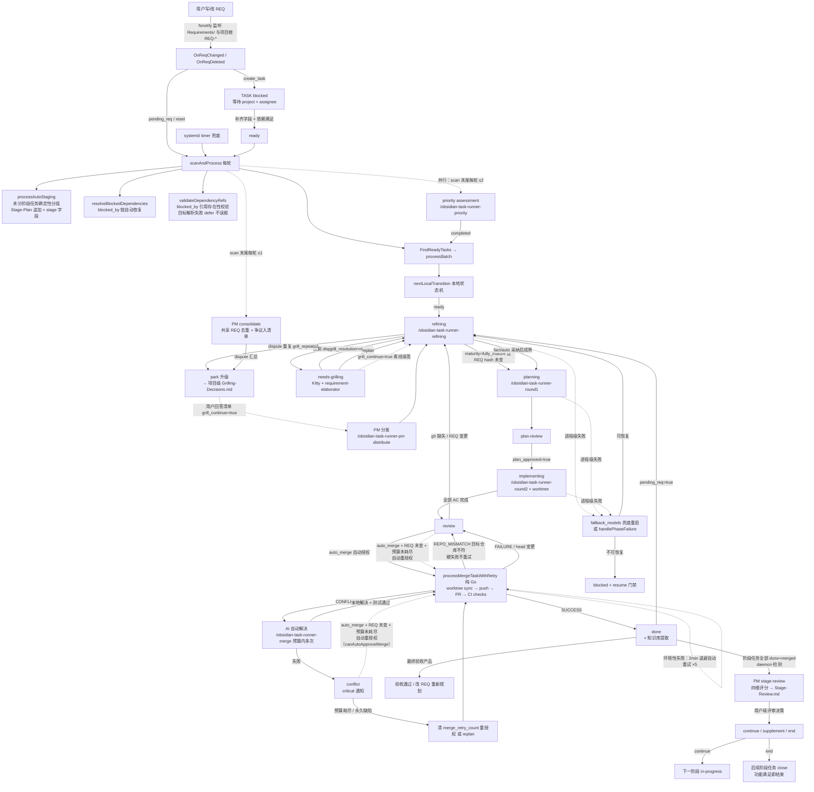
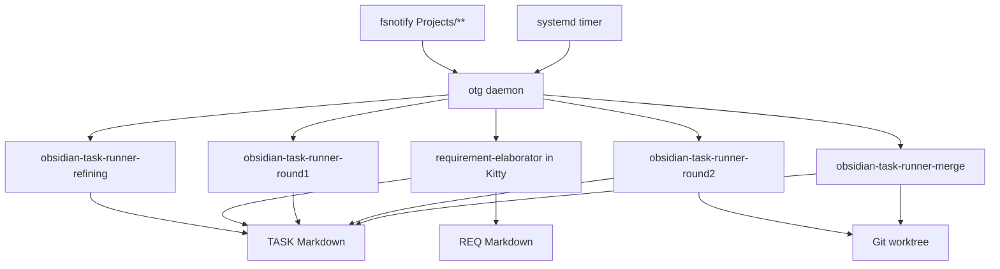
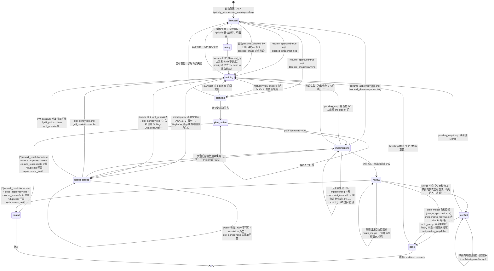
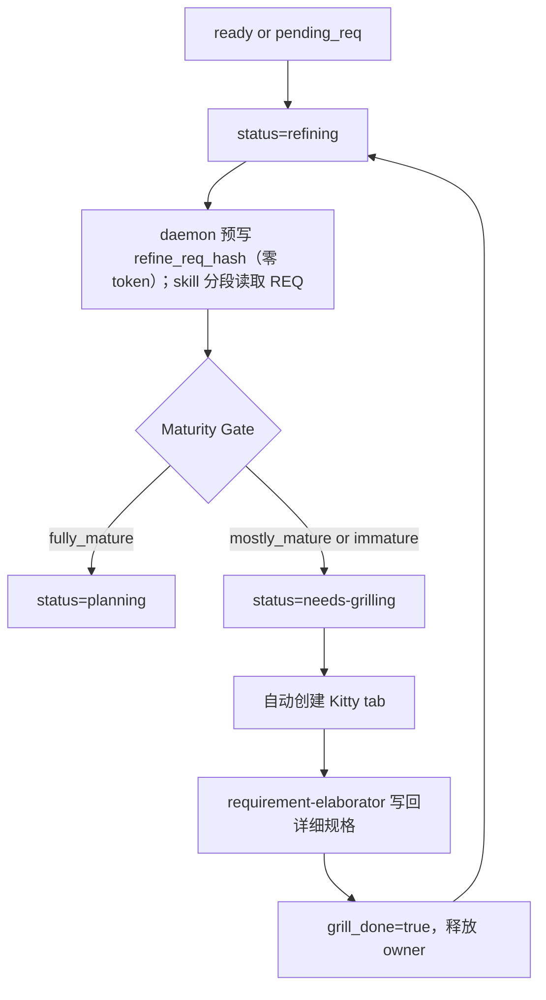
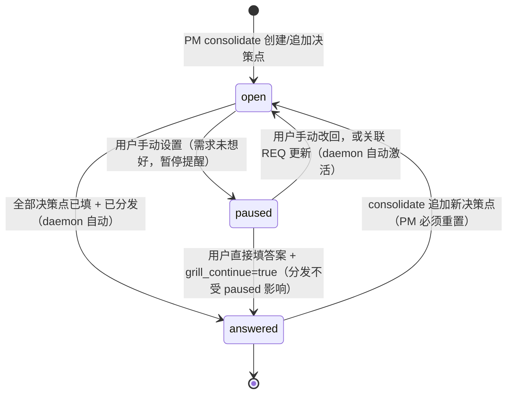
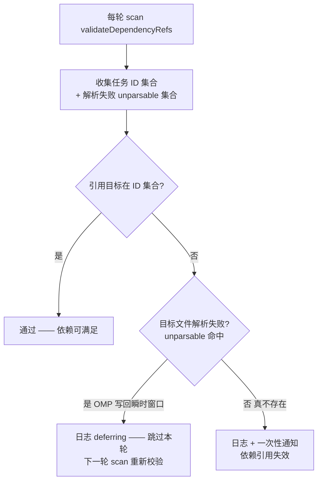
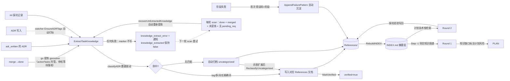

# Obsidian Task Runner — 目标业务流程

> 本文是规范性设计。Go 实现必须满足本文状态不变量和验收标准。
>
> 当前实现与目标设计的差距见「实现验收清单」。在清单全部通过前，不应把系统标记为设计已完成。

## 0. 自动化任务完整链路（学习入口）

> 本节是一条 REQ 从写入到产品交付的完整旅程总览。后续章节是各环节的细节规范。

### 0.1 完整链路图


```mermaid
flowchart TD
    W[用户写/改 REQ] -->|fsnotify 监听 Requirements/ 与项目根 REQ-*| ONREQ[OnReqChanged / OnReqDeleted]
    ONREQ -->|create_task| TASK[TASK blocked<br/>等待 project + assignee]
    ONREQ -->|pending_req / reset| SCAN
    TIMER[systemd timer 兜底] --> SCAN
    TASK -->|补齐字段 + 依赖满足| READY[ready]
    READY --> SCAN[scanAndProcess 每轮]
    SCAN --> STAGE[processAutoStaging<br/>未分阶段任务确定性分组<br/>Stage-Plan 追加 + stage 字段]
    SCAN --> DEP[resolveBlockedDependencies<br/>blocked_by 链自动恢复]
    SCAN --> VALIDATE[validateDependencyRefs<br/>blocked_by 引用存在性校验<br/>目标解析失败 defer 不误报]
    SCAN --> FR[FindReadyTasks → processBatch]
    FR --> SM[nextLocalTransition 本地状态机]
    SM -->|ready| REFINE[refining<br/>/obsidian-task-runner-refining]
    REFINE -->|maturity=fully_mature 且 REQ hash 未变| PLAN[planning<br/>/obsidian-task-runner-round1]
    REFINE -->|fact/auto 采纳后成熟| PLAN
    REFINE -->|仅剩 dispute| GRILL[needs-grilling<br/>Kitty + requirement-elaborator]
    REFINE -->|dispute 重复 grill_repeat≥2| PARK[park 升级<br/>→ 项目级 Grilling-Decisions.md]
    GRILL -->|grill_resolution=resume| REFINE
    GRILL -->|replan| REFINE
    GRILL -.->|grill_continue=true 离线填答| REFINE
    PARK -.->|用户回答清单 grill_continue=true| PM[PM 分发<br/>/obsidian-task-runner-pm distribute]
    PM --> REFINE
    SCAN -.->|scan 末尾每轮 ≤1| PMC[PM consolidate<br/>共享 REQ 去重 + 争议入清单]
    PMC -->|dispute 汇总| PARK
    PLAN --> PR[plan-review]
    PR -->|plan_approved=true| R2[implementing<br/>/obsidian-task-runner-round2 + worktree]
    R2 -->|全部 AC 完成| RV[review]
    RV -->|auto_merge 自动授权| MERGE[processMergeTaskWithRetry 纯 Go<br/>worktree sync → push → PR → CI checks]
    MERGE -->|SUCCESS| DONE[done<br/>+ 知识库提取]
    MERGE -.->|环境性失败：2min 退避自动重试 ×5| MERGE
    MERGE -->|REPO_MISMATCH 目标仓库不符<br/>硬失败不重试| RV
    MERGE -->|CONFLICTING| AI[AI 自动解决<br/>/obsidian-task-runner-merge 预算内多次]
    AI -->|本地解决 + 测试通过| MERGE
    AI -->|失败| CF[conflict<br/>critical 通知]
    CF -.->|auto_merge + REQ 未变 + 预算未耗尽<br/>自动重授权（canAutoApproveMerge）| MERGE
    CF -->|预算耗尽 / 永久缺陷| 人工[清 merge_retry_count 重授权 或 replan]
    人工 --> MERGE
    MERGE -->|FAILURE / head 变更| RV
    RV -.->|auto_merge + REQ 未变 + 预算未耗尽<br/>自动重授权| MERGE
    RV -->|gh 缺失 / REQ 变更| REFINE
    DONE -->|pending_req=true| REFINE
    DONE -->|最终验收产品| ACCEPT[验收通过 / 改 REQ 重新规划]
    DONE -->|阶段任务全部 done+merged<br/>daemon 检测| STAGER[PM stage-review<br/>四维评分 → Stage-Review.md]
    STAGER -->|用户填评审决策| SDEC[continue / supplement / end]
    SDEC -->|continue| NEXT[下一阶段 in-progress]
    SDEC -->|end| CLOSESTAGE[后续阶段任务 close<br/>功能满足即结束]
    SCAN -.->|并行：scan 末尾每轮 ≤2| PA[priority assessment<br/>/obsidian-task-runner-priority]
    PA -->|completed| FR
    REFINE -.->|进程级失败| FB[fallback_models 兜底重启<br/>或 handlePhaseFailure]
    PLAN -.->|进程级失败| FB
    R2 -.->|进程级失败| FB
    FB -->|可恢复| REFINE
    FB -->|不可恢复| BLK[blocked + resume 门禁]
```

### 0.2 逐环节动作明细

| # | 环节 | 触发 | daemon 动作 | 调用的 skill | 写回 TASK 字段 | 出口 |
|---|------|------|-------------|---------------|----------------|------|
| 1 | 需求变更 | fsnotify 监听 `Requirements/` 目录与项目根 `REQ-*` 文件 | `OnReqChanged` / `OnReqDeleted` 解析受影响任务；按 action（create_task / pending_req / reset_to_ready / req_missing…）发通知；新增/修改事件下未注册项目自动写入 vault-map.json（`ensureProjectRegistered`） | 无（纯 Go） | 新任务 `status=blocked`；既有任务按状态设 `pending_req` | 3s 后触发 scan |
| 1.5 | 默认委派 | vault-map 顶层 `default_assignee`（如 `"default"`）非空 | `createTaskForReq` 将 TASK `assignee` 预写为对应 models key（`models` 映射到具体模型 ID）——新任务直接可调度，跳过人工补 assignee；**空值恢复旧行为**（blocked 等人工填 assignee） | 无（纯 Go） | TASK `assignee=<default_assignee>`、状态提醒显示已委派 | 创建即生效 |
| 3 | 依赖链恢复 | scan 开始 | `resolveBlockedDependencies`：blocked_by 上游是阶段失败（MODEL_FAILED/PHASE_TIMEOUT/PHASE_INTERRUPTED 等）→ 自动 `resume_approved=true`（上限 2 次、防循环） | 无 | `resume_approved=true, auto_resume_pending=true` | 下一轮 scan |
| 4 | priority 评估 | scan 末尾（与 refining 并行） | `FindPriorityTasks`（Priority 为空 + pending）；running 超 10min 接管；每轮 ≤2 个；API key 不可用则跳过 | `/obsidian-task-runner-priority <req_doc>`（models.default，5min 超时，2 次尝试后 fallback） | `priority_assessment_status=pending→running→completed/failed`，`priority/impact/urgency/…` | 结果用于 dashboard 排序 |
| 5 | refining | `status=ready` 被拾取（**`blocked_by` 上游未 done 不调度——依赖门禁前置**） | `nextLocalTransition` 转 refining；**REQ hash 由 daemon 预写 `refine_req_hash`（零 token）**；OMP 子进程（models.default，thinking low） | `/obsidian-task-runner-refining <task>`：六项成熟度检查 + ADR/CONTEXT 一致性；**REQ 分段读取（章节 grep + selector，禁止全文加载 >20KB）**；**细化后增量重关联（新术语 → CONTEXT 回写 + 知识库检索注入 grill_context）**；failed 项三分类：fact（自修正 REQ）/ auto（采纳建议写 REQ + `auto_accepted` 审计）/ dispute（进 grilling） | `maturity`、`refine_req_hash`、`refine_version`、`auto_accepted`、`grill_repeat` | fully_mature 且 hash 未变 → 直接 planning（early-out）；fact/auto 处置后成熟 → planning；仅剩 dispute → needs-grilling；dispute 重复（grill_repeat≥2）→ park 升级 |
| 6 | grilling | `status=needs-grilling` | 检查 owner/超时；创建 Kitty tab（+ 桌面通知兜底）；`grill_continue=true`（用户离线填答）→ 自动重置 refining 复验（异步 Grilling）；`grill_done` 后按 resolution 恢复；`grill_parked=true` → 静默等待项目级清单 | Kitty 内 requirement-elaborator / grilling；parked 由 PM 统筹 | `grill_done/grill_resolution/grill_context`，原子清理（含 `grill_continue`） | resume → 恢复 prev status；replan → refining+pending_req；grill_continue → refining 复验；parked → `Notes/Grilling-Decisions.md` 回答后 PM distribute 回 refining |
| 6.5 | PM 统筹 | scan 末尾（`processGrillingConsolidation`，每轮 ≤1 个） | 同步 OMP 子进程（models.default，refining 超时） | consolidate：共享 REQ 组去重 + fact/auto 处置 + dispute 写入 `Notes/Grilling-Decisions.md` + 任务 `grill_parked=true`；**单任务触发扩展：`grill_repeat≥2` 或 `plan_version≥3`（反复 replan）也进统筹**；**新项目/大 REQ 附加拆分建议（split skill）与技术栈建议**；distribute：清单答案写回 REQ + 拆分落地（子 REQ 创建）+ 任务重置 refining | `grill_parked/grill_repeat/plan_version`、清单 `grill_continue` | 用户一次性回答全部争议点；分发后任务各自重跑 maturity gate |
| 6.6 | 自动阶段化 | scan 开始（每轮，PM 统筹前） | `processAutoStaging`：未分阶段（stage 空）的进行中任务按 `blocked_by` 拓扑确定性分层 → 合并为阶段（`stage_min_per_phase`/`stage_max_phases`）→ Stage-Plan.md 追加 + 批量写 `stage` 字段。秒级幂等，编号接续，零 LLM 会话 | 无（纯 Go） | `stage: "P{N}"`、`Notes/Stage-Plan.md` | 已分阶段任务从 PM 输入中消失，PM 只剩真争议 |
| 7 | planning | maturity 成熟 | OMP 子进程（assignee 模型，thinking high）；**REQ hash 由 daemon 预写（`refine_req_hash`）** | `/obsidian-task-runner-round1 <task>`：Step -1 知识图谱 → 版本化计划 + Prototype 建议；**命中的知识文档写入 `knowledge_refs`（引用链）**；**成功完成后 daemon 自动折叠 `## 实现计划` 历史（keep=3，防文档膨胀）** | `plan_version`、`status=plan-review`、`plan_approved=false`（批准由 daemon 按 auto_approve 决定）、`adr_proposed`、`knowledge_refs` | plan-review；auto_approve（默认 true）时 daemon 同轮直接转 implementing |

> **auto_approve（默认开启，全自动）**：`auto_approve` 缺失或为 true 时（frontmatter 解析默认 true、模板已写入），plan-review 任务由 daemon scan 自动批准——`plan_approved=true` 并直接转 implementing，**Grilling 是唯一人工关卡**（全自动链路：ready → refining → planning → implementing → review → 自动合并 → done）。显式 `auto_approve: false` 恢复人工审计划。**ADR 护栏**：`adr_proposed` 非空时 `adr_approved=false` 保持（架构决策由人工批准），不阻断实现自动进入。
| 8 | plan-review | auto_approve（默认 true）或 `plan_approved=true`（人工） | `nextLocalTransition` → implementing；auto_approve 路径自动 `plan_approved=true`、`adr_approved=<adr_proposed 为空>`；预热 worktree | 无 | `status=implementing` | Round 2 |
| 9 | 实现 | `status=implementing` | worktree 准备（`task/<id>-<slug>` 分支）；OMP 子进程（assignee 模型，thinking max，60min 超时）；**无进展完成（仍 implementing + 无 `checkpoint_commit`）→ 指数退避冷却（10m→…→~10.7h）不重派** | `/obsidian-task-runner-round2 <task>`：Prototype Gate（高风险 Step 先验证）→ Tracer Bullet 逐 AC → Scope Hammering → test-quality/code-review/task-verifier → ADR 写入 → Review Bundle | 实现记录、AC 证据、`status=review`、`target_branch` | review；阻塞 → needs-grilling；pending_req → checkpoint+refining；无进展 → implementing（冷却中） |
| 10 | 自动合并 | `status=review` + auto_merge（默认 true） | daemon 自动设 `merge_approved=true`；**merge 失败回退自动重授权**（`canAutoApproveMerge`：REQ 未变 + `merge_retry_count < max_auto_merge_fixes` + 非 `GITHUB_UNAVAILABLE`/`REPO_MISMATCH` 永久缺陷，conflict 同样适用）；`processMergeTaskWithRetry` 纯 Go：校验（pending_req/REQ hash/target_branch/**origin==git_remote 目标仓库守卫，REPO_MISMATCH 硬失败**）→ 在任务 worktree 上 sync（祖先关系分流：fast-forward / 三路 merge / 文件级覆盖确认后 `--force-with-lease`）→ push（git 侧快速失败：connectTimeout 15s + lowSpeed 20s，命令 60s 上限兜底代理链路）→ PR 创建/复用 → CI checks 轮询；环境性失败 2min 退避自动重试 ×5；`pr_url` ...
| 11 | 交付 | merge 成功 | 写 done；异步 `ExtractTaskKnowledge`（按任务提取 adr_written 的 ADR → 分类写入/未分类归档 → verified 翻转 → 重分类 → INDEX 重建） | 无（Go） | `status=done, completed, merge_status=merged` | 终态（breaking 需求变更则回 refining 新一轮交付） |
| 12 | 失败与恢复 | OMP 退出码非零 / 超时 / key 缺失 | fallback 模型重试 → `handlePhaseFailure` 按阶段策略：blocked（resume 门禁）/ conflict / review；`AppendFailurePattern` 知识库沉淀 | 无 | `phase_error_code/phase_error/blocked_phase/auto_resume_count` | 见 §10 并发与恢复 |
| 13 | 阶段评审 | 某阶段全部任务 done+merged（`merge_status=merged`）或剩余全 blocked/closed | `processStageReviews` 检测（每轮 ≤1）→ PM stage-review 四维评分写 `Notes/Stage-Review.md`；用户填「评审决策:」后 **daemon 先确定性翻转 Stage-Plan 状态机**（`flipStageReviewDecision`：continue→delivered+下阶段 in-progress/completed；supplement→+补充行；end→后续阶段 ended+任务 close）→ PM distribute 只做 REQ 标注/知识沉淀并写 answered | `/obsidian-task-runner-pm stage-review` / distribute | `Notes/Stage-Review.md`、Stage-Plan 阶段状态（delivered/ended/completed/in-progress） | continue → 下一阶段 in-progress；supplement:{建议} → 追加下一阶段；end → 后续阶段 ended + 任务 close（不维护积压） |

### 0.3 时序事实（与历史文档的差异说明）

- **旧版 `needs-refining` 状态自动迁移**：早期 daemon 使用 `needs-refining`，当前状态机已改名 `needs-grilling`。遗留任务文档中的 `needs-refining` 会被 scan 拾起（`IsReady` 视为可调度）并经 `nextLocalTransition` 同轮迁移为 `needs-grilling`——之后正常创建 Grilling tab、发送提醒并按 lease 语义处理。
- **阶段顺序调度**：`Index.Scan` 排序键 = 项目内 stage 升序（数字序，P10 在 P2 后）→ priority → created；跨项目回到 created 公平（stage 是项目级语义，不做全局比较）；stage 空的任务排最后（当轮 auto-staging 归组后次轮生效）。低阶段任务优先消耗 `max_concurrent_tasks` 容量，P1 未收敛前 P2+ 实现任务不抢容量（release-manager 教训：无依赖声明的并发实现产生 57/253 冲突合并与 11 次 v2/v3 返工）。
- **阶段评审防卡死放宽**：`stageTasksState` 三态——landed（全部 done+merged）/ reviewable（landed 或剩余全部 blocked/closed）/ unreviewable（存在可推进任务）。blocked-only 阶段触发 stage-review，PM 给「继续/收窄/拆出」建议；closed 任务不阻塞评审；无任务阶段不评审。
- **依赖卫生与健康诊断**（每轮 scan）：① blocked_by / REQ depends_on 引用存在性校验（坏引用日志 + 一次性通知；**目标文件存在但 frontmatter 暂解析失败——如 OMP 会话写回瞬时窗口——跳过本轮 defer，下一轮重查，不误报**）；② 同项目 implementing 任务 `plan_files` 重叠预警（合并冲突前置）；③ 项目健康摘要（in-flight / stage 空 / merged 未收口）超阈值每日一次通知（rebaseline / stage-plan init / 拆阶段提示）。
- **任务自动收口**（`autoCloseStaleMergedTasks`）：`merge_status=merged` 且非 done/closed 且无 `pending_req` → 自动 `status=done`（PR 合入 = 确定性证据；pending_req 增量任务受保护）+ 通知 + Roadmap 里程碑。
- **决策归档兜底**（`autoArchiveDecisions`）：主清单 >50KB 且未答 ≤3 → 已答 D-n 块移入 `Grilling-Decisions-archive.md`、主清单重写为 frontmatter+指针+未答、`distributed_answers_hash` 刷新防 changed 误分发；consolidation 前执行。
- **Roadmap 自动维护**（`updateRoadmap`）：阶段评审触发/阶段决策/任务收口/决策归档事件点确定性追加里程碑（幂等按日期+标题，自动建目录/模板）。
- **scan 单轮调度、任务事件驱动下一轮**：`processBatch` 只 dispatch 不等待——任务在独立 `runTask` goroutine 执行，完成后触发下一轮 scan（coalesce）。旧表述「批次同步等待 + 自适应轮询重查」已废弃：一个长 Round 2 不再冻结 scan 循环，plan-review transition / merge 重试 / REQ 变更实时响应；shutdown 等待在跑任务落盘后退出。
- **scan 首步 Normalize frontmatter**：每轮 scan 自动补齐任务文档缺失的 schema 字段（默认值，不覆盖已有值、必填字段不补），并按规范序维护字段顺序（用户关注在前、系统维护在后，未知字段保持相对顺序置尾）；写前/写后均做 Parse 校验，损坏文档拒绝改写；补齐后校验必填完整性并记录诊断。`otg migrate-tasks <path> --write` 手动执行同一逻辑。
- **priority assessment 与 refining 并行**：评估在 scan 末尾执行（每轮 ≤2 个），不阻塞 ready→refining。旧表述「首次调度前有界等待 priority_assessment」已废弃；unblock（blocked→ready）也不依赖 priority 完成。
- **冲突 AI 修复预算内可重复**：`merge_retry_count < max_auto_merge_fixes` 时失败回退自动重授权并再次触发 AI 修复；`merge_status=conflict-resolve-attempted` 标记预算耗尽，交还用户。
- **自动合并门禁**：`pending_req=true` 时任何路径禁止合并（绝对门禁）；失败回退在 REQ 未变 + 预算未耗尽时**自动重新授权**（TASK-051/059：旧版要求空 phase_error_code，导致 auto_merge 任务永久卡 conflict）。批次入口同步放宽：`IsReady` 对 review/conflict 的 auto_merge 任务仅粗筛永久缺陷（`GITHUB_UNAVAILABLE`/`REPO_MISMATCH`）——其余失败回退可进入批次，由 `canAutoApproveMerge` 做精确的 REQ-hash/预算判定。
- **Round 2 空转冷却**：`implementing` 任务的 Round 2 会话完成后若任务仍 `implementing` 且 `checkpoint_commit` 未写（入口门禁复验类空转——TASK-071：一天 20+ 轮相同 gate-check 会话），daemon 记录无进展完成并进入指数退避冷却（10m → 20m → … → 上限 ~10.7h），冷却期内不重新派发、无通知；`checkpoint_commit` 写入或状态离开 implementing 即重置冷却（重置点 = `recordRound2Completion`）。人工 `/obsidian-task-runner-round2` 不经 daemon 派发，不受冷却限制。
- **阶段化确定性分组取代 PM 手工分阶段**：早期阶段规划由 PM 会话完成（release-manager 首轮分阶段耗数小时 LLM 轮次且不可靠）；现由 daemon `processAutoStaging` 秒级确定性拓扑分组（幂等、增量追加），PM 只保留语义层（目标描述、边界调整、新需求归入/建议增阶段）与阶段评审。阶段归属以 `stage` 字段为权威（TASK 从 REQ 继承），不依赖 Stage-Plan 的 tasks 列表。
- **阶段完成=任务全部 done+merged**：done 但 `merge_status != merged`（stale PR）不计入；由 PR 闭环先收敛再评审。阶段评审产出 `Notes/Stage-Review.md`，用户填「评审决策:」后 PM distribute 分发（continue/supplement/end），end 路径后续阶段任务 close——功能满足即结束，不维护积压。

## 1. 架构边界

系统由四层组成：

1. **触发层**：`fsnotify` 监听 Vault，systemd timer 定时兜底。
2. **调度层**：`otg daemon` 扫描任务、持有状态机、并发和恢复控制。
3. **阶段执行层**：daemon 按阶段直接调用独立 Skill。
4. **持久化层**：TASK/REQ Markdown frontmatter、Git worktree、日志和 PID 文件。


```mermaid
flowchart TD
    Watch[fsnotify Projects/**] --> Daemon[otg daemon]
    Timer[systemd timer] --> Daemon
    Daemon --> Refine[obsidian-task-runner-refining]
    Daemon --> Grill[requirement-elaborator in Kitty]
    Daemon --> Plan[obsidian-task-runner-round1]
    Daemon --> Implement[obsidian-task-runner-round2]
    Daemon --> Merge[obsidian-task-runner-merge]
    Refine --> Task[TASK Markdown]
    Grill --> Req[REQ Markdown]
    Grill --> Task
    Plan --> Task
    Implement --> Repo[Git worktree]
    Implement --> Task
    Merge --> Repo
    Merge --> Task
```

### 1.1 Skill 调度

Daemon 直接调用阶段 Skill，不通过核心 Skill 二次路由：

| 阶段 | Skill | 模型 | 权限 |
|------|-------|------|------|
| `refining` | `/obsidian-task-runner-refining <task>` | `models.default` | `--auto-approve` |
| `planning` | `/obsidian-task-runner-round1 <task>` | TASK `assignee` | `--auto-approve` |
| `implementing` | `/obsidian-task-runner-round2 <task>` | TASK `assignee` | `--auto-approve` |
| Merge（含冲突自动解决） | `/obsidian-task-runner-merge <task>` | TASK `assignee` | `--auto-approve` |
| priority 评估 | `/obsidian-task-runner-priority <req_doc>`（scan 末尾并行，每轮 ≤2） | `models.default` | `--auto-approve` |
| PM 统筹 / 分发 / 阶段评审 | `/obsidian-task-runner-pm <consolidate|distribute|stage-review>`（scan 末尾，每轮 ≤1） | `models.default` | `--auto-approve` |
| 新项目/大 REQ 拆分建议 | `/obsidian-task-runner-split <req>`（并入 PM consolidate） | `models.default` | `--auto-approve` |

`obsidian-task-runner` 核心 Skill 是人工入口和流程参考，不是 daemon 的阶段执行入口。

### 1.2 Skill 安装

`otg install` 必须把以下 Skill 安装为 `~/.omp/skills/` 下的顶层独立 Skill（真实文件，非 symlink）：

- `obsidian-task-runner`
- `obsidian-task-runner-refining`
- `obsidian-task-runner-round1`
- `obsidian-task-runner-round2`
- `obsidian-task-runner-merge`
- `obsidian-task-runner-priority`

子 Skill 同时安装到 `~/.omp/skills/obsidian-task-runner/skills/` 作为 daemon 直读副本。两个位置的内容必须一致。`--force` 安装时 `installSkill` 在 `os.RemoveAll(dest)` 前备份 `config/vault-map.json`，`copyDir` 后恢复原文件。`generateVaultMap` 对已有配置文件只 merge 新默认字段，不覆盖 `projects`、`models` 等用户值。

外部依赖 Skill：

- `requirement-elaborator`
- `grilling`
- `domain-modeling`
- `diagnosing-bugs`
- `test-quality`

安装器必须 fail-fast 检查外部依赖。缺失时安装失败，并输出明确的 `skill-doctor install <name>` 指令，不允许警告后继续。

## 2. 状态机


```mermaid
stateDiagram-v2
    [*] --> blocked: 自动创建 TASK (priority_assessment_status=pending)
    blocked --> ready: 字段完整 + 依赖满足（priority 评估并行，不阻塞）
    blocked --> refining: resume_approved=true and blocked_phase=refining
    blocked --> planning: resume_approved=true and blocked_phase=planning
    blocked --> implementing: resume_approved=true and blocked_phase=implementing
    blocked --> refining: 自动 resume (blocked_by 上游依赖链，恢复 blocked_phase 对应阶段)

    ready --> refining: daemon 拾取（blocked_by 上游未 done 不调度；priority 评估并行，scan 末尾每轮≤2）

    refining --> planning: maturity=fully_mature（含 fact/auto 处置后成熟）
    refining --> needs_grilling: 仅剩 dispute，或大型需求 (AC>10 / 3+服务) → Wayfinder Map 决策地图作为焦点
    refining --> needs_grilling: dispute 重复 grill_repeat≥2 → grill_parked=true（并入项目级 Grilling-Decisions.md）
    refining --> blocked: 自动恢复一次后再次失败

    needs_grilling --> needs_grilling: owner 有效 / Kitty 不可用 / resolution 为空 / grill_parked=true 等清单回答
    needs_grilling --> implementing: grill_done=true and grill_resolution=resume
    needs_grilling --> refining: grill_done=true and grill_resolution=replan
    needs_grilling --> refining: PM distribute 分发清单答案（grill_parked=false, grill_repeat=0）

    planning --> refining: REQ hash 在 planning 期间变化
    planning --> plan_review: 新计划成功写入
    planning --> blocked: 自动恢复一次后再次失败

    plan_review --> implementing: plan_approved=true
    plan_review --> plan_review: 等待人工批准
    plan_review --> closed: [*] rework_resolution=close + close_approved=true + closure_reason/note 完整（duplicate 还需 replacement_task）

    implementing --> needs_grilling: 实现阻塞需要用户决策 (含 Prototype FAIL)
    implementing --> refining: pending_req，在当前 AC 完成并 checkpoint 后
    implementing --> blocked: 阶段失败（自动恢复 2 次后停止）
    implementing --> review: 全部 AC、测试和验收完成
    implementing --> implementing: 无进展完成（仍 implementing + 无 checkpoint_commit）→ 指数退避冷却 10m→…→~10.7h，冷却期不重派

    review --> done: auto_merge 自动授权 (merge_approved=true) and pending_req=false (含 checks 等待)
    review --> conflict: Merge 冲突（AI 自动修复，预算内多次自动重试，耗尽后人工决策）
    review --> review: 失败回退自动重授权（auto_merge + REQ 未变 + 预算未耗尽）
    review --> closed: [*] rework_resolution=close + close_approved=true + closure_reason/note 完整（duplicate 还需 replacement_task）

    conflict --> refining: pending_req=true，取消旧 Merge
    conflict --> done: auto_merge 自动重授权（REQ 未变 + 预算未耗尽）and pending_req=false
    conflict --> conflict: 预算内失败回退自动重授权（canAutoApproveMerge）

    done --> refining: breaking REQ 变更（代际重置）
    done --> [*]: 终态 / additive / cosmetic

    closed --> [*]: 终态
```

## 3. 状态语义

| 状态 | 不变量 | 执行主体 | 成功出口 |
|------|--------|----------|----------|
| `blocked` | 缺字段、依赖未完成，或阶段连续失败，或 API key 不可用，或人工暂停 | daemon / 人工 | `ready`、`refining`、`planning` 或 `implementing` |
| `ready` | 可以开始规格成熟度检查 | daemon | `refining` |
| `refining` | 正在执行 headless maturity gate | default model | `planning` 或 `needs-grilling` |
| `needs-grilling` | 等待用户交互补充规格或解决实现阻塞 | Kitty + requirement-elaborator/用户 | `refining` 或恢复 `grill_prev_status` |
| `planning` | 规格已成熟，正在生成版本化实现计划 | Round 1 Skill | `plan-review` |
| `plan-review` | 具体 `plan_version` 已存在，等待或已获得批准 | 人工 Gate | `implementing` 或 `closed` |
| `implementing` | 在任务 worktree 执行已批准计划（含 Prototype Gate） | Round 2 Skill | `review`、`refining` 或 `needs-grilling` |
| `review` | 本地实现已提交；auto_merge=true 时 daemon 自动授权合并，否则等待人工 | daemon 自动 / 人工 Gate | `done`、`conflict`、`refining`、`implementing` 或 `closed` |
| `conflict` | Merge 冲突；AI 预算内自动修复并重授权，预算耗尽（conflict-resolve-attempted）交还人工 | daemon（AI 预算内）+ 人工 | `done` 或 `refining` |
| `done` | 已合并并推送；breaking 需求变更（含未标注）重开并代际重置，additive/cosmetic 保持终态 | — | `refining`（breaking）或终止 |
| `closed` | 无需交付（已实现/重复/取消/不予处理） | 人工 Gate | 终态，不可恢复 |

### 3.1 提前审批

`plan_approved=true` 仅在 `status=plan-review` 时有效。

若 daemon 在 `ready`、`refining`、`needs-grilling` 或 `planning` 发现提前设置的 `plan_approved=true`：

1. 自动重置为 `false`。
2. 在 TASK 变更记录追加 warning。
3. 不允许绕过 maturity gate、Grilling 或 planning。

### 3.2 daemon 重启与中断恢复

daemon 停机（SIGTERM：`systemctl stop`、`otg install`、系统重启）时，执行中的 OMP 收 SIGTERM 保存 session（30 秒内未退出则强制终止），停机期间不启动 fallback。

被中断的 phase **不转 blocked**：

1. 任务保持原状态（`refining`/`planning`/`implementing`），写入 `phase_error_code=PHASE_INTERRUPTED`、`phase_error="daemon 重启中断，等待自动恢复"`、`phase_log`。
2. pid 文件随进程退出删除；重启后下一轮 scan 通过 `procAlive` 检查自动重新调度。
3. 阶段成功后 `clearPhaseError` 清除中断标记；后续真失败覆盖。
4. 依赖链自动恢复将 `PHASE_INTERRUPTED` 视为可恢复错误码（同 `MODEL_FAILED`）。
5. fallback 执行中被中断同样保持状态（主失败原因记入日志）。
6. **Merge 冲突自动解决会话被中断**：daemon 停机中止 AI 冲突解决时，任务**不写 conflict**——保持 `review + merge_approved=true`，重启后下一轮 scan 自动恢复合并流程（与 phase 中断同语义）。

`otg install` 的 stopDaemon 阻塞等待 systemd 优雅停机完成后再安装，并与后续 `enable --now` 串行化，避免新旧实例竞态。

## 4. 统一规格成熟度流程

初次任务和需求变更使用同一流程：


```mermaid
flowchart TD
    Start[ready or pending_req] --> Refining[status=refining]
    Refining --> Hash[daemon 预写 refine_req_hash（零 token）；skill 分段读取 REQ]
    Hash --> Gate{Maturity Gate}
    Gate -->|fully_mature| Planning[status=planning]
    Gate -->|mostly_mature or immature| Grilling[status=needs-grilling]
    Grilling --> Kitty[自动创建 Kitty tab]
    Kitty --> Spec[requirement-elaborator 写回详细规格]
    Spec --> Done[grill_done=true，释放 owner]
    Done --> Refining
```

### 4.1 Maturity Gate

`refining` 使用 `models.default`，检查：

1. 详细规格存在。
2. 十章节齐全。
3. 无占位符。
4. AC 覆盖成功、边界、错误、幂等/并发场景。
5. 数据模型或类型定义具体。
6. 无已知矛盾，依赖契约一致。

输出必须同时写入：

- 结构化 frontmatter。
- TASK 的 `## 需求成熟度评估` 审计 section。

核心字段：

```yaml
maturity: fully_mature # fully_mature | mostly_mature | immature
refine_version: 1
refine_req_hash: "sha256:..."
refine_retry_count: 0
refine_error: ""
```

### 4.2 REQ 一致性

Hash 算法：REQ 完整原始 bytes 的 SHA-256，包括 frontmatter 和正文。

- refining 开始记录 `refine_req_hash`。
- planning 开始记录 `plan_req_hash`。
- planning 写入计划前重新计算 REQ hash。
- 若当前 hash 与 `plan_req_hash` 不一致：丢弃本轮计划输出，不递增 `plan_version`，不清 `pending_req`，转回 `refining`。

### 4.3 refining 失败恢复

- live PID：跳过重复执行。
- 第一次进程死亡/失败：`refine_retry_count=1`，自动恢复一次。
- 再次失败：转 `blocked`，写：

```yaml
blocked_phase: refining
phase_error: "..."
phase_log: "..."
resume_approved: false
```

用户修复后设置 `resume_approved=true`。Daemon 恢复 `refining`，清 `resume_approved`、错误和 retry count。

## 5. Grilling 所有权与通知

### 5.1 双重检查

- daemon：发送通知、重复提醒和状态迁移前检查 owner/timeout。
- requirement-elaborator：获取、持有和释放 owner。

TASK frontmatter：

```yaml
grill_owner: ""
grill_started_at: ""
grill_timeout_minutes: 30
grill_done: false
```

默认超时 30 分钟，可按 TASK 配置。

### 5.2 本机原子性

修改 owner 前必须获取 task-path hash 对应的文件锁：

```text
${TMPDIR}/otg-grill-<task-path-sha256>.lock
```

锁内执行 read → check timeout → write frontmatter，避免本机两个进程同时获得 owner。

### 5.3 通知语义

`notifications.desktop` 只控制 `notify-send` 系统桌面通知。

- `desktop=false`：不发送系统桌面通知，包括最终状态通知。
- Kitty Grilling tab 是核心交互入口，始终尝试创建，不受 `desktop` 控制。
- 同一 TASK 在全部 Kitty OS window 中最多保留一个活跃 Grilling tab。Daemon 在创建前解析 `kitty @ ls` JSON，并按稳定前缀 `Grilling <task-id>` 检查 tab title 与 window title；标题变化和 JSON Unicode 转义不得绕过去重。
- tab 检查和创建受 per-task 文件锁保护；每次尝试前写入 5 分钟 debounce 时间戳，避免并发扫描或 daemon 重启重复创建。
- `kitty @ ls` 不可执行时按本次尝试写入的 debounce 判断近期会话并停止创建；JSON 无法解析时 fail closed，不创建 tab，并保留 `notify-send` fallback。后续扫描继续重试 Kitty。
- Kitty 不可用：保持 `needs-grilling`，记录日志，后续扫描按 debounce 周期重试 Kitty；不得转 `blocked`，不得调用普通终端 fallback。

需求细化型 Grilling 完成后必须回到 `refining` 复验；实现阻塞型 Grilling 按 `grill_resolution=resume|replan` 分流。

### 5.4 实现阻塞的 Grilling 回流

Round 2 阻塞进入 Grilling 时，requirement-elaborator/用户必须写结构化结果：

```yaml
grill_resolution: resume # resume | replan | ""
```

- `resume`：纯代码逻辑错误、环境问题或无需修改 REQ/计划的问题。Daemon 恢复 `grill_prev_status`（通常 implementing），不经过 refining/planning。
- `replan`：需求缺口、计划外设计决策或架构假设变化。设置 `pending_req=true`，转 refining。
- 空值：daemon 不猜测，保持 needs-grilling 并记录 warning。

需求细化型 Grilling 固定使用 `replan` 语义：完成后回 refining。

Daemon 消费完成结果时，优先级为：

1. `pending_req=true` → 强制按 `replan` 处理；即使 grill_resolution=resume 也不能恢复旧计划实现。
2. 否则 `grill_resolution=resume` → 恢复 grill_prev_status。
3. 否则 `grill_resolution=replan` → 转 refining。
4. 否则保持 needs-grilling。

成功路由后必须原子清理：`grill_done=false`、`grill_resolution=""`、`grill_context=""`、`grill_prev_status=""`；owner/started_at 已由 requirement-elaborator 释放。

### 5.5 Grilling 期间 REQ WRITE

`needs-grilling` 且 `grill_owner` 有效时，REQ WRITE 只设置 `pending_req=true` 并记录最新事件/hash：

- 不清 owner。
- 不修改 status。
- 不重开 Kitty tab。
- 当前 Grilling 完成后按 `grill_resolution` 路由。

这样 requirement-elaborator 自己写回 REQ 不会被 watcher 当成外部取消事件。

### 5.6 refining/planning 期间 REQ WRITE

只设置 `pending_req=true`，不修改 status、不取消 live phase。Refining 使用最新 REQ；planning 由提交前 hash 复核决定是否返回 refining。

### 5.7 项目级 PM 统筹（重复争议收敛）

**问题**：多个任务共享同一 REQ 时各自 grilling，同一歧义被重复追问；单个任务的 dispute 无人回答时反复 refining→needs-grilling 空转。

**收敛机制**：

1. **refining 三分类**（`/obsidian-task-runner-refining`）：failed 项按 fact（环境事实可证，自修正 REQ）/ auto（有明确建议且低风险可逆，采纳写 REQ + `auto_accepted` 审计）/ dispute（真争议）分类。fact/auto 处置后成熟 → 直接 planning，不再问用户。
2. **重复检测**：dispute 与上一版 `## Grilling 待回答` 相同 → `grill_repeat+1`；`grill_repeat≥2` 且 REQ hash 未变 → **park 升级**（`grill_parked=true`），不再逐任务重复追问。
3. **PM consolidate**（`processGrillingConsolidation`，scan 末尾每轮 ≤1）：按 req_doc 分组去重 → fact/auto 处置同步到所有相关任务 → dispute 写入 `Notes/Grilling-Decisions.md` 决策点（含来源任务、冲突引用、建议方向、决策空位）→ 任务 `grill_parked=true`。
4. **一次性回答**：用户在清单中填「决策:」，置 frontmatter `grill_continue=true`。parked 任务不创建 Kitty、不提醒。
5. **PM distribute**：检测到清单 answered → 读答案写回各 REQ（标注 `[决策: <清单 D-n>]`）→ 任务重置 `grill_parked=false / grill_repeat=0 / status=refining` → 各自重跑 maturity gate。

**审计与推翻**：`auto_accepted` 保留每次自动采纳记录（版本、时间、摘要）；用户可推翻自动采纳后重跑 refining，REQ 中的 `[采纳建议 auto]` 标注会被后续决策标注覆盖。

### 5.8 决策清单生命周期与提醒抑制

决策清单（`Notes/Grilling-Decisions.md`）的 frontmatter `status` 驱动提醒与分发：


```mermaid
stateDiagram-v2
    [*] --> open: PM consolidate 创建/追加决策点
    open --> answered: 全部决策点已填 + 已分发（daemon 自动）
    open --> paused: 用户手动设置（需求未想好，暂停提醒）
    paused --> open: 用户手动改回，或关联 REQ 更新（daemon 自动激活）
    paused --> answered: 用户直接填答案 + grill_continue=true（分发不受 paused 影响）
    answered --> open: consolidate 追加新决策点（PM 必须重置）
    answered --> [*]
```

- **`open`**：有待答决策点 → 每个 parked 任务创建/聚焦一个 Kitty 决策 tab（每项目一个、5 分钟 debounce）；`grill_continue=true` 或全部填完 → distribute 分发 → `status=answered`。
- **`paused`**（需求未想好）：**不创建 Kitty tab、不提醒**；任务保持 parked 静默等待。consolidate 向 paused 清单追加新决策点后**保持 paused**（用户仍未决定，不因新决策点恢复提醒）。
- **自动激活**：用户更新关联 REQ（`OnReqChanged` 路径）→ daemon 把该项目的 paused 清单翻回 `open` 并通知——重新思考需求 = 恢复信号，提醒回归且后续链路（pending_req → refining → maturity gate → consolidate/split 重新评估 → planning）自动衔接。按项目去重，一次 REQ 事件每项目激活一次。
- **通知风暴抑制**：API key 故障等批量失败场景，桌面提醒按 5 分钟窗口全局去重（`notifyKeyUnavailable`），不再每任务一条；调度前 `apiKeyAvailable()` 预检让任务保持状态等待（不启动 OMP、不消耗重试预算、无逐任务通知）。

## 6. Planning / Round 1

`planning` 使用 TASK `assignee`，daemon 直接调用 `/obsidian-task-runner-round1`。

### 6.1 计划生成

- 每次 planning 成功，`plan_version` 增加 1。
- 初次成功生成 v1；重规划成功生成 vN+1。
- refining/Grilling 不修改 `plan_version`。
- `plan-review` 必须保证对应版本的具体计划内容已经写入。

### 6.2 pending_req 生命周期

`pending_req` 从 REQ 变更开始保持 `true`，直到新计划成功写入。

Planning 成功时原子更新：

```yaml
status: plan-review
pending_req: false
merge_approved: false
plan_approved: false # 批准由 daemon 按 auto_approve（默认 true）决定；人工批准设为 true
plan_version: <old + 1>
```

`plan_approved` 在 `plan-review → implementing` 时**保留为 true**（v0.16.6 起）：它作为一次性审批门控被 daemon 消费后，Round 2 OMP 仍需读取该字段确认计划已批准。`implementing` 状态下不会被「提前审批重置」清除。

### 6.3 auto_approve（默认开启）

`auto_approve` **默认 `true`**：frontmatter 缺失该字段时按 true 解析（与 `auto_merge` 对称），模板已显式写入 `auto_approve: true`。plan-review 任务在 daemon scan 时自动 `plan_approved=true` 并直接转 implementing——**Grilling 是唯一人工关卡**。

1. 显式 `auto_approve: false` 恢复人工审计划：任务停在 plan-review，等待 `plan_approved=true`（`otg update-status`）。
2. **ADR 护栏**：`adr_proposed` 非空时保持 `adr_approved=false`——架构决策由人工批准（`otg update-status adr_approved=true`），不阻断实现自动进入。
3. 不跳过 maturity gate、Grilling 或 Merge Gate；pending_req 仍优先回 refining。
4. 新项目与 replan 同样自动批准（`new_project` 仅影响目录创建时机，Round 2 才创建）。
5. 自动批准在 daemon 日志与桌面通知标注来源（`auto_approve 默认开启`），TASK 变更记录由 daemon 写入，区分自动/人工。

### 6.4 Checkpoint 复用

Pending requirement 导致 Round 2 停止时，planning 必须读取 `checkpoint_commit`，并在新计划中逐项标记旧实现：

- `保留`
- `修改`
- `废弃`

用户批准新计划即同时批准 checkpoint 复用策略。

### 6.5 新项目

`new_project=true` 的 refining/planning 只读需求、模板和项目规范（零文件系统副作用）：

- 不创建项目目录、不执行 `git init`、不创建脚手架文件。

Round 2 首次调度（`resolveRepo` new 分支）自动完成项目初始化：

- 创建项目目录（`new_project_root/<name>`）。
- **自动注册 vault-map.json**：`name`/`path` 按解析结果写入，`git_remote` 从既有项目推断 owner（`github.com/<owner>/<name>`），`project_id` 自动分配（既有最大值 +1，`%03d`）——后续扫描以 `existing` 解析，无需手动配置。
- **REQ 出现即注册**：目录已存在但 vault-map 未登记的项目（如手工创建的 `Projects/010-demo/`），首个 REQ 文件出现时由 `ensureProjectRegistered` 自动补登记（事件与每轮 scan 双通道；name 去数字前缀，path 优先 `new_project_root/<name>` 的约定 checkout，不存在则回退 vault 项目目录），随后正常建 TASK 走细化——新项目无需任何手工配置。
- **vault 回退项目自动提升（`ensureProjectCheckout`）**：已注册项目若 path 是 vault 项目目录（非 git 根）且配置了 `git_remote`，`resolveRepo` 自动创建 `new_project_root/<name>` 独立 checkout（README 初始提交，供 worktree 分支），vault-map `path` 更新指向 checkout，远端仓库缺失时自动 `gh repo create`（private，description 从 REQ 蒸馏）并补 origin。不提升的话 worktree 与 merge 会静默落入外层 Vault 仓库——错误仓库合并（TASK-001-demo 教训：交付物被合入 myNote）。提升对任意阶段生效（refining 扫描也可能触发，README-only 仓库无副作用）；提升失败仅记日志、回退原路径，由 merge 守卫兜底。
- **播种 `Notes/CONTEXT.md` 骨架**（`## Language` / `## Development Constraints` / `## Anti-patterns` / `## Reference Map`），由首轮 agent 填充。
- 新项目首个 REQ 由 PM 统筹触发 `skill://obsidian-task-runner-split` 拆分建议（并入 Grilling-Decisions 一次性对齐），确认后 distribute 创建子 REQ（`OnReqChanged` 自动生成 canonical TASK）。

### 6.6 planning 失败恢复

与 refining 相同：自动恢复一次，再失败转 `blocked`：

```yaml
blocked_phase: planning
planning_retry_count: 1
phase_error: "..."
phase_log: "..."
resume_approved: false
```

人工 resume 后 retry count 清零，重新获得一次自动恢复机会。

## 6.7 OnReqChanged 状态语义

| 当前状态 | REQ WRITE 行为 |
|----------|----------------|
| `blocked` | 保持 blocked，设置 pending_req=true；不能绕过字段/依赖门禁 |
| `ready` | 保持 ready，设置 pending_req=true；下一轮统一进入 refining |
| `refining` / `planning` | 只设 pending_req=true，不改 status、不取消 live phase |
| `needs-grilling` + active owner | 只设 pending_req=true，不中断当前 Grilling |
| `plan-review` | 清 plan_approved，设 pending_req=true，转 refining；旧计划立即失效 |
| `implementing` | 设 pending_req=true；Round 2 在当前 AC 完成后 checkpoint → refining |
| `review` / `conflict` | 设 pending_req=true，清 merge_approved，转 refining（未合并交付必须吸收变更后合入） |
| `done` | 按 REQ 最新变更记录 `> 变更类型:` 路由：`breaking`/未标注 → 清 merge_approved 转 refining + 代际重置（reopen_count+1、清 target_branch/pr_url/merge_status/completed/knowledge_extracted，round2 完成后写新分支/新 PR）；`additive` → 保持终态，通知「建议新建 TASK 承接增量或手动重开」；`cosmetic` → 忽略 |

**已吸收去重**：任务 `refine_req_hash` 已等于 REQ 当前内容 hash 时跳过处理——refining/PM 写回自身审计记录不重复打回、不重复通知（watcher 事件级另有同内容 hash 去重）。变更类型由修改者（用户/PM/refining 会话）在保存前写入 `> 变更类型:` 行（breaking/additive/cosmetic），未标注按 breaking 保守处理。

新建 REQ 自动创建的新 TASK 使用 `pending_req=false`：初始 REQ 是基线，不是“待并入变更”。

## 7. Round 2 与需求变更

Round 2 使用任务专属 worktree，逐 AC 执行完整 Tracer Bullet。

每条 AC 的 Red → Green → Refactor 完成后，Round 2 Skill 必须重新读取 TASK frontmatter。

若 `pending_req=true`：

1. 不开始下一条 AC。
2. 提交 WIP checkpoint：

```text
chore(task): checkpoint before requirement replan
```

3. 写入：

```yaml
checkpoint_commit: "<commit sha>"
status: refining
merge_approved: false
```

4. 保持 `pending_req=true`。
5. 正常退出，让 daemon 下一轮启动 refining。

当前 AC 之前已经完成的代码留在原 task branch，后续在同一分支按新计划继续。

实现中其他需要用户决策的阻塞可进入 `needs-grilling`。Grilling 完成后同样回 `refining` 复验。

### 7.1 ADR 写入

若 `adr_approved=true` 且 `adr_proposed` 非空，Round 2 在全部 AC 完成后写入 ADR（`adr_approved` 由 daemon 在 plan-review→implementing 时自动设置，无需人工干预）：

1. 幂等检查：`adr_written` 中已有的文件不重写。
2. 逐个调用 `otg write-adr` 原子写入 `Notes/adr/ADR-<id>-<slug>.md`。
3. 写入后 `otg validate-adr` 双重确认。
4. 全部成功后一次 `otg update-status` 更新 `adr_written`、清 `adr_proposed` 和 `adr_approved`。

### 7.2 CONTEXT.md 自动维护

项目的 `Notes/CONTEXT.md` 是领域词汇表，由两个阶段自动追加：

- **Round 1**：计划中引入新术语时追加（零额外读，已支付）
- **Round 2 + ADR**：ADR 引入新架构概念时追加（仅写 ADR 时触发，罕见）

appended-only，不覆盖已有条目。

Daemon 在调度 OMP 前从 CONTEXT.md 提取精简上下文，以 `<project_context>` 标签块追加到 skill 命令**之后**的 prompt 尾部，包含 Constraints + Anti-patterns + Domain Terms + ADR 摘要，并提示配合 `skill://knowledge-base` 交叉引用 References。注入范围为 `refining`/`planning`/`implementing`/`plan-review` 阶段与 **merge 冲突/CI 修复会话**（AI 需按需求意图裁决，而非纯代码结构）。详见 `reference.md` §4.7。

### 7.3 阶段后文档完整性扫描

daemon 在 OMP 成功后调用 `validateChangedDocs`：

1. **仅独立 git 根项目执行**：`repoDir` 不是 git 根（项目无独立 checkout、路径回退 vault 目录）时跳过——git 会解析到外层 Vault 仓库，diff 路径相对仓库根，与 `repoDir` 拼接产生假"文档损坏"误报。
2. `git diff --name-only` 获取工作区变更文件列表。
3. 对每个 `.md` 文件调用 `ValidateDocument`（**frontmatter 块严格解析**，自动识别 TASK/REQ/ADR 类型；YAML 解析失败即视为损坏，不再降级通过）。
4. 校验失败先尝试 `Repair` 自动修复（丢弃泄漏进 YAML 块的非法行），修复后**重新校验**：
   - 修复成功 → 日志记录，不通知。
   - 无法自动修复（缺必填字段、frontmatter 未闭合等）→ 日志 + 桌面通知「文档损坏，需要人工处理」，不阻塞流水线。

## 8. Review、Conflict 与 Merge

### 8.1 pending_req 绝对门禁

`review`、`conflict` 出现 `pending_req=true`：

- 清 `merge_approved`。
- 禁止任何 push、PR 创建或 merge。
- 直接转 `refining`。

`done` 例外：REQ 变更按类型路由（§6.7）——`breaking`（含未标注）才设 `pending_req=true` 并转 refining（代际重置）；`additive`/`cosmetic` 保持终态，不设 `pending_req`。

用户重新把 `merge_approved=true` 也不能绕过该门禁。

Conflict 期间 REQ 变更时，取消旧 Merge，保留 PR、分支和冲突审计记录，但不继续解决旧需求版本的冲突。

### 8.2 Merge 前置条件

Merge Skill 必须在任何远程操作前确认：

1. `status` 为 `review` 或 `conflict`。
2. `merge_approved=true`。
3. `pending_req=false`。
4. 当前 REQ hash 等于已批准计划的 `plan_req_hash`。
5. `target_branch` 存在。
6. **目标仓库守卫**：repoDir 的 `origin` 必须与 vault-map 配置的 `git_remote` 指向同一仓库（URL 归一化比较：`git@…:`/`https://`/`.git` 后缀/大小写等价）。不一致（vault 回退目录场景）→ **拒绝 push**，写 `status=review` + `merge_approved=false` + `phase_error_code=REPO_MISMATCH` + 通知，属永久配置缺陷，不自动重试。

任一失败时不得执行远程操作。

### 8.3 自动合并与冲突处理

- `auto_merge: true`（默认）：Round 2 完成后 daemon 在下一轮 scan 自动设 `merge_approved=true`，直接进入 Merge Phase（push → PR → CI checks → merge）。用户无需操作。
- `auto_merge: false`：保持人工 gate，用户确认后手动设 `merge_approved: true`。
- **失败回退自动重授权**：Merge 失败（CI 失败 / sync 冲突 / push 被拒）写 `status=review|conflict` + `merge_approved=false` + `phase_error`；下一轮 scan 若 REQ 未变（hash == plan_req_hash）且 `merge_retry_count < max_auto_merge_fixes` 且非永久缺陷（`GITHUB_UNAVAILABLE`/`REPO_MISMATCH`）→ daemon 自动恢复 `merge_approved=true` 重新进入 Merge Phase（TASK-051/059：旧版要求空 phase_error_code 导致 auto_merge 任务永久卡 conflict）。预算耗尽 / REQ 变更 / gh 不可用 / 仓库目标不匹配才交还人工。可自动重授权的任务在 `prepareBatch` 走 lock-free 路径（与已授权 merge 同），避免 repo 写锁被长任务占用时在调度入口饿死（第三层死锁：锁判定只看 `merge_approved`，未授权任务拿写锁 → repo 忙 → 永不进批次 → gate 永不执行）。
- **push 凭据契约**：Merge Phase 的 `git push` 一律通过 **gh CLI 认证通道**执行——daemon 构造 push 命令时注入 `-c credential.helper='!gh auth git-credential'`，与 `gh pr create` / `gh pr merge` 使用同一 GitHub 身份（keyring token）。前置条件：`gh auth status` 已登录（`exec.LookPath("gh")` 检查与 PR 操作共用）。**禁止**裸 `git push`——仅配置 gh keyring/SSH 认证的机器没有 ambient https 凭据，裸 push 会以 `could not read Username` 烧光全部重试预算（TASK-004 教训：5/5 重试全部 push 认证失败，任务卡在 review）。
- **gh 未登录主动提醒**：merge 前 daemon 先做本地预检 `gh auth status`（读 config/keyring，无网络）。gh 缺失或未登录 → **不发起任何远程操作**，写 `status=review` + `merge_approved=false` + `phase_error_code=GITHUB_UNAVAILABLE`，`phase_error` 附精确补救指引（`gh auth login`），桌面通知提醒用户完成 GitHub CLI 认证；登录后重新设 `merge_approved=true` 即可继续。不烧重试预算（TASK-004 教训：裸 push 的 credential prompt 在无 tty 环境下失败 5/5）。
- 环境性失败自动重试：push / 网络 / 瞬时 GitHub API 错误（`GITHUB_UNAVAILABLE` 类）**不写回** `merge_approved`，`processMergeTaskWithRetry` 以 2 分钟退避独立重试（最多 5 次，daemonCtx 感知），不依赖下一轮 scan 批次——避免被同批长任务（最长 1h 的 Round 2）拖死。重试用尽后保持 `merge_approved=true`，下一轮 scan 继续。
- **AI 修复预算**：PR 冲突与 CI checks 失败共享 `merge_retry_count` 预算（上限 `max_auto_merge_fixes`，vault-map 默认 3）。仅在 merge 成功或**新一轮 planning 完成**时清零——replan 不继承旧交付耗尽（TASK-067 教训：v3 将 3 次预算耗在 18 文件大 rebase 上，v4 若继承则无 AI 修复能力）；同一计划内重复授权不重置（防无限循环）。
- **AI 修复会话**：daemon 以 Merge Skill 启动 OMP 会话（本地 commit，禁远程操作），注入 `[Project Context]`（约束/领域术语/ADR 摘要，同 refining/planning 会话）并强制**需求溯源**——先定位冲突代码对应的 REQ 契约章节/AC，语义冲突以需求契约为准裁决。会话成功 → push 新 head 并重新评估 checks；失败 → 消耗一次预算。
- **预算耗尽交还**（两条出路，均无需手动解冲突）：① 清 `merge_retry_count` 后重设 `merge_approved=true` 继续 AI 修复；② replan——`review` 状态设 `rework_resolution=replan`，`conflict` 状态在 REQ 文档追加歧义裁决并保存（建议含 `> 变更类型: breaking` 行）→ daemon 自动转 refining 重审需求后重新出计划（新一轮预算自动恢复）。`merge_status: conflict-resolve-attempted` 标记已尝试。
- 错误仓库守卫：push 前校验 origin 与 `git_remote` 一致（§8.2 前置条件 6）。vault 回退项目经 §6.5 提升后走独立 checkout，正常情况下不会触发；守卫是配置错乱（如 vault-map `path` 手工改回 vault 目录）时的兜底，`REPO_MISMATCH` 硬失败并保留现场供人工修正。

## 9. ID 与依赖作用域

TASK/REQ 数字 ID 在项目内唯一，不要求 Vault 全局唯一。

### 9.1 同项目依赖

```yaml
blocked_by:
  - TASK-010
```

只在当前 `Projects/<project>/Tasks/` 解析。

### 9.2 跨项目依赖

```yaml
blocked_by:
  - release-manager:TASK-010
```

`release-manager` 是 vault-map 的 `projects[].name`。解析时只访问该项目映射，禁止扫描全 Vault 后取任意同 ID 任务。

### 9.3 REQ 关联

`req_doc` 必须保存 Vault 相对规范路径：

```yaml
req_doc: Projects/001-demo/Requirements/REQ-010-feature.md
```

OnReqChanged 仅使用规范化后的完整路径精确匹配；禁止 basename fallback。

## 10. 并发与恢复

### 10.1 daemon 锁

锁按规范化 Vault 路径的 SHA-256 隔离：

```text
${TMPDIR}/otg-daemon-<vault-path-sha256>.lock
```

同一 Vault 的 watcher/timer 互斥；不同 Vault 可以并行运行。

### 10.2 仓库并发

- refining 不需要仓库（但 `resolveRepo` 会对 vault 回退且配置 `git_remote` 的项目做一次性的独立 checkout 提升与远端仓库补建，见 §6.5——README-only 仓库，无副作用）。
- 既有项目 planning、Merge 使用主工作区独占锁。
- Round 2 使用任务专属 worktree。
- 新项目 planning 不创建仓库，因此不持有不存在的 repo 锁。
- 等待主工作区锁的任务不占 OMP 槽位。

### 10.3 Retry 生命周期

refining/planning 的 retry count 在以下时机清零：

- 阶段成功。
- 用户设置 `resume_approved=true`，daemon 执行人工恢复。

### 10.4 blocked_by 依赖自动恢复

每次扫描 daemon 执行 `resolveBlockedDependencies`：遍历 `blocked` 任务，解析其 `blocked_by` 上游引用（同项目 `TASK-010` 或跨项目 `project-key:TASK-010`），若上游处于**阶段失败阻塞**（`blocked_phase` 非空 + `MODEL_FAILED`/`PHASE_TIMEOUT`/`PHASE_INTERRUPTED`/`MODEL_QUOTA_EXHAUSTED` 或空错误码）且未批准 resume，则自动设 `resume_approved=true` 并标记 `auto_resume_pending=true`。

重试预算（`auto_resume_count`）：

- 仅当 `auto_resume_pending=true`（本次失败由自动 resume 发起）时，`handlePhaseFailure` 递增计数；首次失败和人工 resume 后失败不消耗预算。
- 计数 ≥ 2 时停止自动恢复，并发桌面通知要求用户修复后手动设 `resume_approved=true`。
- 人工恢复（无 pending 标记）清零计数，重新获得完整预算。

安全边界：

- 未限定引用只在**下游项目内**解析；跨项目引用按 vault-map key 精确匹配（目录名 → 数字前缀后缀 → 任务 frontmatter `project` 字段）。
- 文件名前缀不能代表任务身份——必须校验 frontmatter `id` 与 `project`。
- 循环依赖（A↔B）双方都不自动恢复。
- `REQ_MISSING`、`VALIDATION_FAILED` 等非瞬时错误永不自动恢复。

### 10.5 依赖引用存在性校验

每轮 scan 执行 `validateDependencyRefs`：把项目内所有 TASK 文件的 frontmatter `id` 收集为 ID 集合，逐任务检查 `blocked_by` 引用（跨项目 `project-key:TASK-xxx` 不在此检查，按 vault-map 解析）。引用目标不在 ID 集合时判为**悬空引用**——日志 + 一次性桌面通知（引用写错 = 依赖永不满足 = 下游永久等待且无信号）。

**解析失败区分**：目标文件存在但 frontmatter 暂解析失败（如 OMP 会话写回产生的重复 YAML 键瞬时窗口）不等同于不存在——此类文件按文件名前缀 id 收集入 `unparsable` 集合，命中时只记 `deferring` 日志并跳过本轮，下一轮 scan 自动重新校验；避免把短暂写回窗口误报为「引用不存在的任务」。


```mermaid
flowchart TD
    SCAN[每轮 scan validateDependencyRefs] --> COLLECT[收集任务 ID 集合<br/>+ 解析失败 unparsable 集合]
    COLLECT --> CHECK{引用目标在 ID 集合?}
    CHECK -->|是| OK[通过 —— 依赖可满足]
    CHECK -->|否| PARSE{目标文件解析失败?<br/>unparsable 命中}
    PARSE -->|是 OMP 写回瞬时窗口| DEFER[日志 deferring —— 跳过本轮<br/>下一轮 scan 重新校验]
    PARSE -->|否 真不存在| NOTIFY[日志 + 一次性通知<br/>依赖引用失效]
```

### 10.6 阶段并发上限

`max_concurrent_tasks` 只限制 implementing；其它启动 OMP 会话的阶段由 `phase_concurrency` 按阶段限并发（默认 `refining: 3 / planning: 2 / merge: 1 / priority: 1 / pm: 1`）：

- **动机**：一轮 scan 可能同时拉起 20+ 个 OMP（release-manager 实测），造成 token 快速消耗、API 限速、OMP 启动互相拖慢（settings:init 20s+）与 CPU/内存抢占。
- **机制**：调度循环对每个待调度任务按阶段 tryAcquire 非阻塞槽位（`phaseGate`）；满员任务留在 pending，等其它任务完成（runTask → requestScan）后下一轮自动调度，与 implementationGate 同语义。
- **范围**：`refining`/`planning` 按任务状态映射；`merge` 映射到 review/conflict + merge_approved（同步执行的 merge 流程也占槽）；`priority` 映射到 ready+priority pending；`pm` 为 PM consolidate/stage-review（scan 末尾同步段，每轮 ≤1 已有预算，跨轮叠加也受限）。`needs-grilling`（Kitty 交互）不限。
- **配置**：key 置 `0` 或删除 = 该阶段不限并发；`round2` 由 `max_concurrent_tasks` 控制；修改后重启 daemon 生效。

## 11. TASK 流程控制字段

新 TASK 和模板必须显式初始化全部流程字段，不依赖 missing key 的零值语义。

```yaml
status: blocked
maturity: ""
refine_version: 0
refine_req_hash: ""
refine_retry_count: 0
refine_error: ""
planning_retry_count: 0
phase_error: ""
phase_log: ""
blocked_phase: ""
resume_approved: false
plan_req_hash: ""
plan_version: 0
plan_approved: false
merge_approved: false
pending_req: false
checkpoint_commit: ""
grill_owner: ""
grill_started_at: ""
grill_timeout_minutes: 30
grill_done: false
grill_resolution: "" # resume | replan | ""
grill_prev_status: ""
grill_parked: false # 争议已并入项目级 Grilling-Decisions.md
grill_repeat: 0 # 同一争议集连续未答轮次；≥2 → park 升级
auto_accepted: "" # refining 自动采纳建议审计记录
knowledge_extracted: false # 该任务 ADR 已提取到知识库（幂等）
knowledge_refs: [] # Round 1 计划引用的知识文档（Round 2 应用 / merge 度量 / verifier 校验）
knowledge_applied: "" # merge 时度量：命中/总数（如 2/3）
remote_create: false # 新项目 opt-in：implementing 时自动 gh repo create 远端仓库（仅 NewProject 任务）
github_owner: "" # 远端仓库 owner；为空时从 vault-map 既有 git_remote 推断
repository_name: "" # 仓库名；为空时取项目名去数字前缀（"001-release-manager" → "release-manager"）
repository_visibility: "" # 新仓库可见性；为空默认 private
repository_description: "" # 新仓库 --description 与 README 内容（Round 1 从 REQ 提炼）
repository_url: "" # 远端仓库地址；非空时 ensureRemoteRepository 短路（幂等）
```

## 12. 知识库知识流（KB v2）


```mermaid
flowchart LR
    FAIL[阶段失败] -->|首次 错误码+阶段| SINK[AppendFailurePattern 自动沉淀]
    MERGE[merge→done] -->|"go 提炼 goroutine（activeTasks 托管，停机等待落地）"| EXTRACT[ExtractTaskKnowledge]
    ADR["adr_written 的 ADR"] --> EXTRACT
    ADRW[ADR 写入] -.->|watcher EnsureADRTags 自动打标| EXTRACT
    PIT["## 踩坑记录"] --> EXTRACT
    EXTRACT -->|classifyADR 数据驱动| CLS{命中?}
    CLS -->|tag/多词/长精确词| REF[写入对应 References 文档]
    CLS -->|无匹配| UNC[自动归档 uncategorized/]
    UNC -->|词表扩展后 ReclassifyUncategorized| REF
    REF -->|MarkVerified| V[verified=true]
    SINK --> KB[(References/)]
    REF --> KB
    UNC --> KB
    KB -->|RebuildINDEX| IDX[(INDEX.md 摘要层)]
    IDX -->|Step -1 项目知识图谱| R1[Round 1]
    IDX -->|计划技术栈检索| R2[Round 2]
    R1 -->|知识缺口标注计划风险| PLAN
    R2 -->|踩坑经验写回| KB
    EXTRACT -->|"任何失败：marker 不写"| ERR["knowledge_extract_error + 通知<br/>knowledge_extracted 保持 false"]
    SWEEP["每轮 scan：done + merged + 未提炼 + 无 pending_req"] -->|recoverUnExtractedKnowledge 自动重新提炼| EXTRACT
    ERR -.->|下一轮 scan 重试| SWEEP
```

**触发点（代码实现）**：

1. `merge_runner.go` merge→done：`ExtractTaskKnowledge`（提取该任务 `adr_written` 引用的 ADR **和 TASK `## 踩坑记录`**，`knowledge_extracted` 幂等）→ ADR 走 `classifyADR`（知识库 topics/aliases/tags 数据驱动 + tag 优先 + 置信门槛）、踩坑走「相关文档」引用优先否则同样分类 → 命中写入对应 References 文件（ADR 追加实践经验、踩坑追加踩坑实践小节）、未命中自动归档 `References/uncategorized/` → `MarkVerified` → `ReclassifyUncategorized`（词表扩展后归档自动归位）→ `measureKnowledgeApplied`（Round 1 的 `knowledge_refs` 命中统计 → 写回 `knowledge_applied` hit/total）→ `RebuildINDEX`。
2. `daemon.go` watcher：ADR 写入 → `EnsureADRTags` 自动打标（additive，用户可审查）；References 变更 → 失效分类索引缓存。
3. `daemon.go` `handlePhaseFailure`：`AppendFailurePattern`（错误码映射表：API_KEY_UNAVAILABLE/PHASE_INTERRUPTED/MODEL_FAILED/PHASE_TIMEOUT/MODEL_QUOTA_EXHAUSTED；按 `错误码 — 阶段` 去重，知识库文件本身是去重存储）。
4. **失败记录与自动补救（不静默丢失）**：
   - `knowledge_extracted` 标记**仅在提炼全成功时写入**；任何错误（ADR 扫描/写入失败）保留 `false` 并写回 `knowledge_extract_error`（失败原因，用户可见）+ 桌面通知「知识提炼失败/部分失败（自动重试中）」。
   - **自动补救扫描**（`recoverUnExtractedKnowledge`，每轮 scan 执行）：`status=done` + `merge_status=merged` + `knowledge_extracted=false` + `pending_req=false` 的任务——即 PR 已合入但提炼未落地的交付——自动重新提炼。覆盖强杀场景（daemon 在 merge 写回与提炼 goroutine 之间被 SIGKILL/断电，此前静默永久丢失）与部分失败场景。幂等：marker 短路 + ADR/踩坑整文件覆盖写。
   - **优雅停机保障**：提炼 goroutine 计入 `activeTasks`，shutdown 等待其落地（`waitForScanExit` 窗口内），不再被停机截断。
5. `RebuildINDEX`：摘要列（H1 后 blockquote）、噪音检测（AI 聊天链接/文件清单/项目结构 → “含噪音待清理”标记）、缺失 ⚠️。
6. `otg kb absorb`（交互会话沉淀）：任务管道之外的日常会话经验（踩坑格式或 `--summary` 自由文本）→ 与 merge 相同的分类/归档/去重链路（`AbsorbKnowledge`），按「标题/失败方案」归一化去重，未命中归档 `References/uncategorized/`；重复遇到已记录教训时自动 bump 该文档 `hits`。
7. 经验热度与 core 升级：`AppendApplicationRecord`（merge 命中 `knowledge_refs`）与 `AbsorbKnowledge`（duplicate）与 `otg kb hit` 均 `IncrementHits`（字段保序改写 `hits`，不破坏 KB v2 `updated` 格式，并原地更新进程内 ref 索引缓存避免全扫）；merge 后 `PromoteToCore`（hits≥3 的 extended/ 文档移入 core/ 同子目录，目标占用则跳过，基于缓存 O(候选数) 判断）。检索 `rank` 对 hits 加 0.02/次排序加成。
8. 检索性能：`kb search` 走 SQLite 单库（`~/.local/share/otg/kb.sqlite`，vault 外；vault-map `kb_db` 可覆盖）——`SyncKnowledgeDB` 增量同步（文档 + FTS5 索引 + sqlite-vec 向量，按 content_hash 逐文档比对，增/改/删均行级事务，无全量重建、无指纹扫描；旧 `.kb-bm25.gob`/`.kb-vectors.gob`/`.kb-vectors.json` 首次同步自动清理）；**空扫描保护**：References/ 读为空（云同步间隙/错误 vault）时跳过删除，绝不批量清空索引；查询 `SearchKnowledgeDB`：FTS5 `bm25()`（取反恢复正分语义）+ vec0 余弦 KNN（`k = ?` 约束全量扫描，doc 级聚合）按历史公式融合；FTS5 中文检索靠预分词（`tokenize` bigram → 空格 join，unicode61 精确切分）；向量模型记录于 `kb_meta`，切换模型触发全量重建（`otg kb index`）；`archived/` 默认跳过（`--archived` 显式包含）；`IncrementHits` 同步更新 `kb_docs.hits`（排序 +0.02/次加成）；`openKB` 每次探测 FTS5——无 `-tags sqlite_fts5` 的构建在 kb 命令处立即报带构建提示的错误；`RebuildKnowledgeDB` 的 DROP 全部包在单事务内，失败回滚不留半状态库。

**检索路径（skill 指令）**：

- Round 1：加载 `skill://knowledge-base` → Step -1 项目知识图谱（CONTEXT + ADR + References 三源交叉）→ 技术栈约束纳入计划。
- Round 2：加载 knowledge-base → 按计划技术栈检索 `core/` 文档 → 引用已验证最佳实践 → 新坑写回 References。
- 查询链路：问题 → `knowledge-base` 本地检索（INDEX topics/摘要）→ 未命中才 web_search/Context7 → 可靠结果自动入库。

**格式强制**：frontmatter 6 字段、H1 后摘要、>300 行目录、要点化表格化、噪音零容忍、verified 文件级语义（merge 交付翻转，段级实践标注保留）。

## 13. 实现验收清单

以下项目全部通过后，才能认定实现符合本设计。

### AC-01 状态机

- [ ] 支持 `refining`、`planning` 状态。
- [ ] `ready → refining`，不是直接 `needs-grilling`。
- [ ] 需求细化 Grilling 的 `grill_done+replan → refining`；实现阻塞的 `resume → grill_prev_status`。
- [ ] `planning` 成功后才进入 `plan-review`。
- [ ] 非 `plan-review` 的提前 `plan_approved` 会被重置。

### AC-02 Maturity Gate

- [ ] refining 使用 `models.default`。
- [ ] maturity gate 六项检查可重复执行。
- [ ] 结构化字段和 `## 需求成熟度评估` 同时写入。
- [ ] fully_mature → planning；其他 → needs-grilling。
- [ ] 需求细化 Grilling 后必须重新 refining；纯实现阻塞 resume 不强制重新 planning。

### AC-03 Phase 恢复

- [ ] refining/planning live PID 不重复启动。
- [ ] 失败后自动恢复一次。
- [ ] 第二次失败转 blocked，并记录 phase、error、log。
- [ ] `resume_approved=true` 恢复正确阶段并清 retry count。

### AC-04 REQ 一致性

- [ ] 使用完整 REQ bytes SHA-256。
- [ ] planning 写计划前复核 hash。
- [ ] hash 变化时不增加 plan_version、不清 pending_req、回 refining。
- [ ] req_doc 只做项目内规范完整路径精确匹配。

### AC-05 Planning

- [ ] daemon 直接调用 Round 1 Skill。
- [ ] planning 每次成功 plan_version +1。
- [ ] plan-review 始终已有具体计划。
- [ ] pending_req 只在新计划成功后清零。
- [ ] checkpoint 复用策略写入新计划。
- [ ] 新项目 planning 无文件系统副作用。

### AC-06 auto_approve

- [ ] `auto_approve` 默认 true：frontmatter 缺失按 true 解析，模板显式写入 true。
- [ ] plan-review + auto_approve（默认）→ daemon scan 自动 `plan_approved=true` 转 implementing（跳过 Plan Review 人工关卡）。
- [ ] 显式 `auto_approve: false` 时任务停在 plan-review，仅 `plan_approved=true`（人工）放行。
- [ ] **ADR 护栏**：`adr_proposed` 非空时 `adr_approved=false` 保持（架构决策人工批准），不阻断自动转 implementing。
- [ ] 自动批准在 daemon 日志/通知标注来源（区分自动/人工）。
- [ ] 新项目与 replan 同样自动批准；`new_project` 仅影响目录创建时机。
- [ ] 不绕过 Grilling、refining 或 Merge Gate。

### AC-07 Round 2 pending_req 与 REQ WRITE

- [ ] 每条 AC 完成后重新读取 TASK。
- [ ] pending_req 时停止下一 AC。
- [ ] 创建 WIP checkpoint commit。
- [ ] 写 checkpoint_commit 并转 refining。
- [ ] pending_req 保持 true。
- [ ] blocked/ready/refining/planning/needs-grilling/plan-review 的 REQ WRITE 按状态语义处理。
- [ ] active Grilling 的 REQ WRITE 不清 owner、不重开 Kitty。
- [ ] 新 TASK pending_req 初始为 false。
### AC-08 Merge 安全

- [ ] review/conflict + pending_req 自动转 refining；done 按变更类型路由（breaking 重开 + 代际重置，additive/cosmetic 保持终态）。
- [ ] pending_req 时绝对禁止 Merge。
- [ ] Merge 前复核当前 REQ hash 与 plan_req_hash。
- [ ] conflict 需求变更取消旧 Merge。

### AC-09 依赖作用域

- [ ] 同项目 `TASK-010` 仅当前项目解析。
- [ ] 跨项目 `project-key:TASK-010` 精确解析。
- [ ] 不再扫描全 Vault 后接受任意同 ID done 任务。

### AC-10 Grilling 所有权与阻塞分流

- [ ] daemon 和 requirement-elaborator 双重检查 owner。
- [ ] 默认 timeout 30 分钟，可配置。
- [ ] task-path hash flock 保证本机 CAS。
- [ ] active owner 不重复通知、不迁移状态。
- [ ] expired owner 清理并写审计记录。
- [ ] grill_resolution=resume 直接恢复 grill_prev_status。
- [ ] grill_resolution=replan 设置 pending_req 并转 refining。
- [ ] grill_resolution 为空时 daemon 不猜测。
- [ ] pending_req 优先于 grill_resolution=resume。
- [ ] 成功路由后 grill_done/resolution/context/prev_status 被原子清理。

### AC-11 通知

- [ ] `notifications.desktop=false` 关闭所有 notify-send，包括 StatusNotify。
- [ ] Kitty tab 不受 desktop 配置控制。
- [ ] 同一 TASK 只允许一个活跃 Grilling tab；按 task ID 检查 tab/window title，支持 Unicode JSON 转义和标题变化。
- [ ] 并发扫描与 daemon 重启受 per-task flock + debounce 去重。
- [ ] Kitty JSON 无法解析时不创建 tab，并保留桌面通知 fallback。
- [ ] Kitty 不可用时保持 needs-grilling 并周期重试。

### AC-12 安装
- [ ] installer 安装 task-runner 全部顶层 Skill（共 7 个：core、refining、round1、round2、merge、priority、pm）。
- [ ] 所有 `skill://obsidian-task-runner-*` 在隔离 HOME 可解析。
- [ ] 外部依赖缺失时 fail-fast。
- [ ] `skill-doctor check` 在完整安装后返回 0。

### AC-13 daemon 锁

- [ ] 同一 Vault 的 watcher/timer 互斥。
- [ ] 不同 Vault daemon 可同时运行。
- [ ] 锁名不暴露原始 Vault 路径。

### AC-14 E2E

- [ ] 初次成熟需求：ready → refining → planning → plan-review。
- [ ] 不成熟需求：ready → refining → needs-grilling → refining → planning。
- [ ] 真实 Round 2：implementing → review。
- [ ] Round 2 无进展完成（仍 implementing + 无 checkpoint_commit）→ 指数退避冷却，冷却期不重派、无通知；checkpoint/status/plan 变化重置（TASK-071 回归）。
- [ ] 真实 Merge：review → done。
- [ ] auto_merge 默认 true：review 自动授权并进入 Merge Phase。
- [ ] auto_merge=false：review 保持人工 merge gate。
- [ ] merge 失败回退（REQ 未变 + 预算未耗尽）自动重授权；预算耗尽/REQ 变更/永久缺陷不自动授权（TASK-051/059 回归）。
- [ ] 冲突：AI 预算内自动修复（`merge_retry_count < max_auto_merge_fixes`），预算耗尽 → conflict + 人工（merge_status=conflict-resolve-attempted 不再自动重复）。
- [ ] pending_req 在 implementing/review/conflict 的三条路径 + done 的类型路由（breaking 重开清旧 PR/分支；additive/cosmetic 终态）。
- [ ] done 重开后 merge 走新 PR（旧 MERGED PR 不复用），reopen_count 递增。
- [ ] auto_approve 允许与禁止场景。
- [ ] phase retry/resume。
- [ ] 跨项目同 ID 和同 basename REQ 不串线。

### AC-15 阶段化交付

- [ ] 未分阶段（stage 空）的进行中任务被 `processAutoStaging` 确定性分组：拓扑分层 → 阶段合并（`stage_min_per_phase`/`stage_max_phases`）→ Stage-Plan.md 追加 + `stage` 字段批量写入；幂等（重跑无变化）、增量（编号接续、已分阶段不动）。
- [ ] TASK `stage` 从 REQ frontmatter 继承；PM 拆分落地时写子 REQ/TASK 的 `stage`。
- [ ] 阶段完成检测按 `stage` 字段聚合：全部任务 done 且 `merge_status=merged`（stale PR 不计）才触发 stage-review，每轮 ≤1。
- [ ] 阶段评审产出 `Notes/Stage-Review.md`（四维评分 + 评审决策行），daemon 检测后 PM distribute 分发：continue / supplement:{建议} / end。
- [ ] end 路径：仅关闭**尚未开始交付**的后续阶段任务（closure_reason=cancelled），不维护积压；若后续任务已有 plan/branch/PR/checkpoint/merge 状态或处于 planning/implementing/review/conflict，则整次 end 不翻转、不关闭，先处理活跃交付。
- [ ] 贯穿型需求（e2e/测试/环境/CI）按阶段拆场景包，只依赖同阶段或更早阶段（TASK-066 死锁回归）。
- [ ] Stage-Plan.md 只由 `stageplan` 包写入（daemon/命令），agent 手工追加阶段块会产生双阶段归属冲突（回归项）。

## 14. 实施任务分解

实施必须按下列顺序推进。前一任务的验收标准未全部通过时，不进入依赖它的后续任务。

### T01 — TASK Schema 与状态常量

**目标文件**：

- `pkg/yamlfrontmatter/frontmatter.go`
- `templates/TASK-000-template.md`
- `internal/task/on_req_changed.go` 的新任务模板
- 相关单元测试

**变更**：

1. 增加 `refining`、`planning` 状态和全部流程控制字段。
2. Frontmatter 强类型映射 maturity/hash/retry/error/resume/checkpoint/grill_resolution。
3. TASK 模板与自动创建内容完全同构，初始 `status=blocked`、`pending_req=false`。
4. 增加 schema round-trip、unknown field 保留和默认值测试。

**验收**：AC-01 schema 部分、AC-02 持久化、AC-03 字段、AC-14 新任务基线。

### T02 — ID、依赖与 REQ 精确关联

**依赖**：T01

**目标文件**：

- `internal/task/task.go`
- `internal/task/on_req_changed.go`
- `internal/project/project.go`
- 对应测试

**变更**：

1. 同项目 `TASK-010` 仅当前项目解析。
2. 跨项目 `project-key:TASK-010` 通过 vault-map 精确解析。
3. req_doc 规范化为 Vault 相对完整路径；删除 basename fallback。
4. OnReqChanged 按当前状态执行目标语义，不忽略 Update 错误。

**验收**：AC-04 路径、AC-07 REQ WRITE、AC-09、跨项目串线回归。

### T03 — Daemon 状态机与阶段直调

**依赖**：T01、T02

**目标文件**：

- `internal/task/task.go:IsReady`
- `internal/daemon/daemon.go`
- `internal/config/config.go`
- daemon/task 测试

**变更**：

1. ready → refining；支持 refining/planning 拾取。
2. daemon 直接构造阶段 prompt，而非始终 `/obsidian-task-runner`。
3. refining 使用 default model；其余阶段使用 assignee。
4. 非 plan-review 的 plan_approved 自动清 false。
5. review/conflict + pending_req 优先转 refining，Merge 绝对禁止；done 按变更类型路由（breaking 重开 + 代际重置，additive/cosmetic 保持终态）。
6. Grilling 结果按 pending_req/resolution 优先级原子消费并清临时字段。

**验收**：AC-01、AC-06、AC-08 状态门禁、AC-10 路由。

### T04 — Refining 阶段执行器

**依赖**：T03

**目标文件**：

- `obsidian-task-runner/skills/refining/SKILL.md`
- daemon phase timeout/retry 配置
- 新增 refining 集成测试

**变更**：

1. 调用 refining Skill，使用 default model。
2. 写 maturity 结构化字段和审计 section。
3. fully_mature → planning，其他 → needs-grilling。
4. 实现 REQ 完整 bytes SHA-256。
5. 第一次失败自动恢复，第二次 blocked。

**验收**：AC-02、AC-03 refining 部分、AC-04 hash 生成。

### T05 — Grilling Lease 与 Kitty 行为

**依赖**：T03、T04

**目标文件**：

- `internal/daemon/daemon.go`
- `internal/notify/notify.go`
- `requirement-elaborator` Skill
- Grilling E2E

**变更**：

1. task-path hash flock acquire/check/release helper。
2. active owner 不重复通知、不迁移。
3. expired owner 清理并审计。
4. Kitty 永远尝试；desktop 仅控制 notify-send。
5. Kitty 创建前解析 `kitty @ ls`，按 TASK ID 跨 tab/window 去重；per-task flock + debounce 防止并发与重启重复创建。
6. Kitty JSON 解析失败时 fail closed 且保留桌面通知 fallback；Kitty 不可用保持 needs-grilling 并周期重试。
7. REQ WRITE 在 active Grilling 中只设 pending_req。
8. requirement-elaborator 写 grill_resolution=replan 且不清 pending_req。

**验收**：AC-10、AC-11、AC-07 active Grilling 路径。

### T06 — Planning / Round 1

**依赖**：T04

**目标文件**：

- `obsidian-task-runner/skills/round1/SKILL.md`
- daemon phase dispatch/retry
- planning 集成测试

**变更**：

1. planning 前写 plan_req_hash，提交前复核。
2. Hash 变化时回 refining，不产生版本。
3. planning 成功 plan_version+1，并原子写 Gate。
4. 实现 auto_approve 默认开启（daemon 统一批准，Round 1 不计算资格）。
5. 新项目 planning 零文件系统副作用。
6. Checkpoint commit 的保留/修改/废弃策略写入计划。
7. 第一次失败自动恢复，第二次 blocked。

**验收**：AC-03 planning、AC-04、AC-05、AC-06。

### T07 — Round 2 pending_req 安全边界

**依赖**：T03、T06

**目标文件**：

- `obsidian-task-runner/skills/round2/SKILL.md`
- Round 2 集成测试/假 OMP 场景

**变更**：

1. 每条 AC 后重读 TASK。
2. pending_req 时创建 checkpoint commit，写 SHA，转 refining。
3. 实现阻塞写 grill_resolution 路由契约。
4. resume 直接恢复；replan 转 refining。
5. 写 review 前再次检查 pending_req。

**验收**：AC-07、AC-10 resolution、真实 Round 2 E2E。

### T08 — Merge 安全门禁

**依赖**：T03、T06、T07

**目标文件**：

- `obsidian-task-runner/skills/merge/SKILL.md`
- daemon Merge dispatch
- Merge 集成测试

**变更**：

1. pending_req 或 REQ hash 不一致时禁止所有远程操作。
2. review/conflict pending_req 转 refining。
3. conflict 期间需求变更取消旧 Merge。
4. 成功后写 completed 和审计记录。

**验收**：AC-08、真实 Merge/conflict E2E。

### T09 — Phase 恢复与 Vault 级锁

**依赖**：T03、T04、T06

**目标文件**：

- `internal/daemon/daemon.go`
- phase PID/retry helper
- 锁与恢复测试

**变更**：

1. daemon 锁改为 Vault path SHA-256。
2. refining/planning 分阶段 PID、retry、日志。
3. resume_approved 按 blocked_phase 恢复并清错误/retry。
4. 不同 Vault 并行、同 Vault 互斥。

**验收**：AC-03、AC-13。

### T10 — Skill 安装与依赖 fail-fast

**依赖**：T04、T06、T07、T08

**目标文件**：

- `internal/install/install.go`
- `config/skill-registry.json`
- `scripts/skill-doctor`
- install 测试

**变更**：
1. 安装 core/refining/round1/round2/merge/priority 为顶层 Skill（真实文件副本，非 symlink），同时写入 `skills/` 子目录供 daemon 直读。
2. 验证顶层与嵌套副本内容一致（`diff -r` 无差异）。
3. 外部依赖缺失时 `otg install` 返回非零并输出安装命令。
4. 隔离 HOME 下验证所有 skill:// 可解析。

**验收**：AC-12。

### T11 — 全链路 E2E 与文档回归

**依赖**：T01-T10

**目标文件**：

- `test/e2e/full-lifecycle.sh`
- `test/e2e/grilling-flow.sh`
- 新增 phase/merge/concurrency E2E
- `README.md`、`reference.md`、Dataview 查询

**变更**：

1. E2E 必须实际执行 refining、planning、Round 2、Merge，不只验证 find-ready。
2. 覆盖成熟/不成熟需求、auto_approve、pending_req 四状态、retry/resume、跨项目 ID/REQ 路径。
3. 覆盖 desktop=false + Kitty、不同 Vault daemon 并行。
4. 更新 README 状态表和操作说明。
5. 全量运行 `go test -race ./...` 和全部 E2E。

**验收**：AC-14；并重新逐条核对 AC-01 至 AC-13。

## 15. Definition of Done

仅当以下条件全部满足，任务实现阶段才可标记完成：

1. `go test -race ./...` 通过。
2. `go vet ./...` 和项目 lint 通过。
3. AC-01 至 AC-14 全部有自动化测试证据。
4. 隔离 HOME 执行 `otg install` 后 `skill-doctor check` 返回 0。
5. 完整 E2E 从 REQ 创建运行到 `done`，且真实 fake OMP 分阶段修改 TASK。
6. 不同 Vault 可同时运行；同 Vault watcher/timer 互斥。
7. README、workflow、reference、TASK template 与代码状态枚举完全一致。
8. 无依赖当前开发机手工 symlink、残留 daemon 或全局 `/tmp` 文件的测试。

