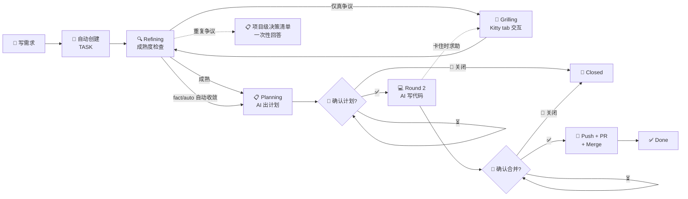

# Obsidian Task Runner — PPT 大纲 v2
> 标注 [10][15][30] = 适配的演讲时长。无标注 = 所有版本通用。
> 🎨 = 静态插图/图表 | 🎬 = 动画 GIF | 🎥 = 视频录制 | 🖥️ = 现场演示 | 🧑‍💻 = 技术向。
---

## Slide 1: 封面 [10][15][30]

```
Obsidian Task Runner
从想法到代码，只需三次确认

👤 ndzuki
📅 2026-07-xx
```

🎨 **视觉**：深色背景 + 单行白色大字标题。副标题用对比色。如果有项目 Logo 放左上角。
> 这张 Slide 在演讲开始前就投在屏幕上，暖场用。

---

## Slide 2: 你遇到过这种场景吗？ [10][15][30]

```
💬 "加个导出 CSV 的功能，周一要"
    — 周五 17:00，PM

然后你的周末：
  建分支 → 写代码 → 写测试 → 跑 lint
  → 提 PR → 等 review → 改 comments
  → merge → 部署

有多少是真正有价值的创造性工作？
```

🎨 **视觉**：左侧放一条垂直时间线（周五 17:00 → 周末 → 周一），每个节点一个图标。红区覆盖"写代码"之外的所有步骤。
> 演讲提示：停顿 2 秒。然后："如果这些流程性工作——不是 10%，是 60%——有人替你做了呢？"

---

## Slide 3: 我们真正花时间在做什么 [15][30]

```
写代码 ≠ 只有写代码

  ████████░░  写代码（创造性）         40%
  ██████░░░░  写测试 / 跑 lint         25%
  ████░░░░░░  建分支 / PR / rebase     15%
  ████░░░░░░  沟通 / 等 review         12%
  ██░░░░░░░░  写文档 / commit message   8%
```

🎨 **视觉**：横向堆叠条形图，创造性部分用绿色，其余用灰色。在 60% 的灰色区域上叠加一个 ❓ 或 🤖 图标。
> 演讲提示："这 60%——每一次都要做，每错一步都可能出问题，而且没有人觉得做这些有成就感。"

---

## Slide 4: Obsidian Task Runner 是什么 [10][15][30]

```
  你写需求                  AI 执行                   你确认
┌──────────┐           ┌──────────────┐        ┌──────────┐
│ Obsidian │  ────→   │  OTR Daemon  │ ────→ │ Git + PR │
│ Vault    │           │  + OMP Agent │        │          │
└──────────┘           └──────────────┘        └──────────┘
  写 REQ-xxx.md          自动出计划+写代码          审核+合并

你只需要三件事：
  💬 一次对话（Grilling：AI 追问，你确认方向）
  ✅ 确认计划（plan_approved: true）
  ✅ 确认合并（merge_approved: true）

---

## Slide 5: 完整的需求到交付之旅 [10][15][30]


🎬 **动画 GIF**：Mermaid 流程图节点逐个出现。Refining 闪烁表示自动执行。Grilling 气泡 pulsed 动画。两个菱形 🔑 + 关闭分支 脉冲高亮。5 秒循环。

## Slide 6: 三个 Gate，五个阶段 [10][15][30]

```
🔍 Refining（自动，headless）
  ├─ daemon 自动检查需求文档成熟度（6 项检查）
  ├─ 三分类：事实类自动修正 / 有建议的低风险项自动采纳（留审计标记）
  ├─ 成熟 → 自动进入 Planning（AI 出计划）
  ├─ 仅真争议 → 弹出 Kitty tab 进入 Grilling 交互
  └─ 重复争议问过 2 轮 → 并入项目级清单，一次性回答，不再重复弹窗

💬 Gate 0: Grilling 对齐（Kitty tab 自动弹出）
  ├─ 同一 TASK 最多一个活跃 Grilling tab，不会重复轰炸
  ├─ 双重保护：grill_owner 管"谁在对话"，Kitty 去重管"只开一个入口"
  ├─ AI 逐项追问模糊点，每次一个问题带推荐答案
  ├─ 自动采纳项记录在 auto_accepted，你可随时推翻重跑
  ├─ 共享同一需求的多个任务 → 问题去重合并（PM 统筹）
  └─ 完成后 requirement-elaborator 自动写回规格 → daemon 重新 Refining 验证

🔑 Gate 1: plan_approved = true
  ├─ Planning 出完版本化计划 → 等你审方案
  ├─ 你看：方向对不对？步骤合不合理？ADR 架构决策？
  ├─ 例外：auto_approve=true 的完全自主任务（无 ADR 提议）
  │   首规划自动通过，跳过人工审计划——声明式信任，随时可关
  └─ 确认后：AI 开始在独立 worktree 写代码

🔑 Gate 2: merge_approved = true
  ├─ AI 写完代码、通过测试 → 等你 review
  ├─ 你看：代码 diff、测试结果、验收记录
  └─ 确认后：git push → PR → merge

🚫 Closed（终态 Gate）
  ├─ plan-review 或 review 阶段均可触发关闭
  ├─ rework_resolution=close + close_approved=true
  ├─ 关闭原因：already_implemented / duplicate / cancelled / wont_fix
  └─ 终态，不再被 daemon 拾取
```
> 演讲提示——实习生类比："就像你带实习生——先看方案再让动手，写完还得 review。区别是这个实习生不会累、不会漏、每步都留记录。"

🎬 **动画 GIF**：五个阶段逐个点亮——Refining 齿轮旋转 → Grilling 气泡弹出 → Planning 文档图标 → Gate 1/2 钥匙变金色 → Closed 锁图标。每步 1.5 秒，总 8 秒循环。
## Slide 7: 你的角色 — 决策者，不是执行者 [15][30]

```
过去                                   现在
────                                  ────
你: 设计方案 → 写代码 → 提 PR         AI: 出方案 → 写代码 → 提 PR
    ↓                                    ↓
你: 等 review → 改 → 合并             你:  ✅ 确认     ✅ 确认
                                        (计划)      (合并)

你只做 AI 做不了的事：判断方向、审查质量
```

🎨 **视觉**：左右对比——左边是忙碌的小人跑一条长链条，右边是小人坐在两把钥匙前按确认。
> 演讲提示："角色反转。以前你是执行者，AI 是辅助。现在 AI 是执行者，你是决策者。"

---

## Slide 8: 安全边界 [15][30]

```
┌─────────────────────────────────────────┐
│ Round 1 / Round 2    权限：本地操作      │
│ ✅ 建分支、写代码、commit                │
│ ❌ 不 push  ❌ 不建 PR  ❌ 不 merge      │
├─────────────────────────────────────────┤
│ Merge Phase         权限：需人工授权      │
│ ✅ git push  ✅ gh pr create            │
│ ✅ gh pr merge                          │
│ ⚠️ 只有 merge_approved: true 才能进入    │
额外保障：
  - 新项目永远停在 Round 1，不确认不创建
  - 需求变更 → 重新出计划 → 再次停在 plan-review
  - Round 2 卡住（测试连续失败、计划外决策）→ AI 暂停并通知你交互式解决
🎨 **视觉**：两个区块，上半用绿色（"安全"），下半用橙色（"需授权"），中间一条显眼的红线分隔。底部用小字列三条保障。
> 演讲提示（对非技术）"代码不会悄悄推上去。"（对技术）"权限边界是显式检查，不是 prompt 约束。"

---

## Slide 9: 团队工作方式的变化 [30]

```
            过去                              用 OTR 后
┌──────────────────────┐            ┌──────────────────────┐
│ 周一站会              │            │ 周一站会              │
│ "导出功能谁做？3 天"   │            │ "AI 已出方案，大家看下"│
└──────────────────────┘            └──────────────────────┘
         │                                     │
         ▼                                     ▼
┌──────────────────────┐            ┌──────────────────────┐
│ 开发时间分配          │            │ 开发时间分配          │
│ 🟦🟦🟦🟦 写 CRUD       │            │ 🟦 写 CRUD（减少）    │
│ 🟨🟨 写测试           │            │ 🟨🟨🟨🟨🟨 Review     │
│ 🟩 Review            │            │ 🟩🟩🟩 架构设计       │
└──────────────────────┘            └──────────────────────┘

关键转变：
  PM：口述需求 → 写需求文档（减少信息衰减）
  开发：执行者 → 审查者 + 架构师
  新人：问老员工 → 读 CONTEXT.md（更快、更准）
```

🎨 **视觉**：上下两个对比面板，"过去"用灰色调、"用 OTR 后"用亮色调。时间分配用堆叠柱状图对比。
> 演讲提示："我们推广 OTR 不是替代开发者——是把开发者从'翻译需求到代码'里解放出来，把时间花在 review 和架构上。"

---

## Slide 10: 全流程可追溯 [15][30]

```
一个 TASK 文件 = 完整的项目档案

📋 实现计划（版本化）         → 每次出方案不覆盖旧版
💻 实现记录                   → 每步做了什么、结果如何
✅ 验收记录                   → 测试/lint/task-verifier 结果
📦 Review Bundle              → review 时写入：diffstat、AC 证据、测试/lint/smoke 结果
🏗️ ADR 提议                   → 架构决策记录（审查后授权写入）
💬 Grilling 上下文            → 暂停时的阻塞点记录
⚠️ Round 2 阻塞                → 实现卡住时的问题和决策
🎯 Priority Assessment        → 三维评分（影响×紧急度×替代方案）+ 置信度
🚫 Closed 信息                → 关闭原因、替代任务链接、关闭备注
📊 执行摘要                   → 完整时间线
📝 变更记录                   → 审计追踪（结构化事件行）

三个月后回看，不需要翻 git log 猜"当初为什么这么做"。
---

## Slide 11: CONTEXT.md + ADR + 知识库 — 越用越聪明 [15][30]

```
每个项目自动积累知识，而不是重新学习:

📖 CONTEXT.md（共享词汇表）
  ## Language          — 统一的领域术语（"Order" 不是 "Purchase"）
  ## Anti-patterns     — 踩过的坑（"别在 handler 里直接调 DB"）
  ## Constraints       — 开发约束（daemon 上下文注入第一屏可见）

🏗️ ADR（架构决策记录）
  为什么选事件溯源不选 CRUD？
  为什么用 PG 不用 MySQL？
  → 记录的"为什么"，防止六个月后重蹈覆辙

📚 知识库（knowledge-base Skill）
  45+ 篇本地文档，三层分级（core/extended/archived）
  Round 1/2 按技术栈自动检索 → 注入已验证的最佳实践
  ADR/踩坑经验自动回流 → 越跑越准

第一个任务：AI 花 20 分钟读代码、理解结构
第十个任务：AI 先读 CONTEXT.md（30 秒）+ 知识库检索（0.1 秒）
→ 已知约定和最佳实践，直接出方案
→ Round 1 耗时从 20 分钟降到 3 分钟

🎬 **动画 GIF**：一张"复利曲线"图——X 轴是任务编号（1→20），Y 轴是"Round 1 耗时"，曲线从 20 分钟陡降到 3 分钟后趋于平稳。在第 10 个任务处标注 "80% 上下文已覆盖"。
> 演讲提示："Cursor 每次都从头开始。OTR 每次都在上次的基础上继续。这不是工具——是会积累经验的团队成员。"
---


## Slide 12: 知识库技能 — 你的私人技术 Wiki [15][30] 🧑‍💻

```
本地知识库（45+ 篇文档，三层分级）：

core/（高频）       extended/（偶尔）    archived/（备份）
项目高频使用          偶尔用到              备份不检索
  Go, K8s, GitOps     Jenkins, Prometheus    Rust, Lua, LDAP
  Docker, Istio       Linux, SQL, Git
  → 优先检索           → 降权               → 仅在明确指定时搜索

工作方式：
  你问"Connect-Go 怎么配拦截器？"
  → OMP 先查 core/go/connect-rpc.md（本地，0.1 秒）
  → 找不到或过期 → web_search → 自动入库
  → 项目验证后标记 verified: true

🎬 动画：左侧搜索框输入"Connect"，右侧文件树 core/go/connect-rpc.md 高亮。
> 演讲提示："Cursor 每次都从头 web search。OTR 有自己的知识库——你查过的、用过的东西，下次不查第二次。"


## Slide 12.5: 知识库的双向流动 — 全自动闭环 [15][30] 🧑‍💻

```
Projects/ (ADR, 实现)          References/ (知识库)
    │                                │
    │  提取架构决策、踩坑经验         │  查询时优先检索
    └──────────> 回流 <──────────────┘

merge → done 后全自动（零人工维护）：
  ADR 写入 → daemon 自动打标（知识库词表）→ 你可选审查
  提取 → 数据驱动分类（知识库自身 topics/tags 定义规则，加主题=加文档，零改码）
  未匹配 → 自动归档 uncategorized/（可检索，知识零流失）
  词表扩展 → 归档知识自动重分类归位
  项目经验 → 自动沉淀为 scaffold 能力（新项目可复用）

每个任务还带知识引用链（knowledge_refs）：
  计划引用哪些知识文档 → 实现按清单应用 → 交付时度量命中率（knowledge_applied）
  → "注入了知识"和"用上了知识"都可追踪

结果：知识库不是你维护的——是项目跑出来的。
```

🎬 动画：左侧项目图标（release-manager, obsidian-task-runner）向右侧知识库发射粒子；一条链路依次点亮（打标→分类→归档→重分类→度量）。
> 演讲提示："实践是检验真理的唯一标准。——我们不收集理论文章，只沉淀被项目证明过的东西。而且整条链路零人工：新主题=加一篇文档，不用改一行代码。"

## Slide 12.6: 新项目全自动起步 [15][30] 🧑‍💻

```
写一个"揉成一团"的需求 → 之后全部自动：

  📝 需求文件保存
  → vault-map.json 自动注册（name/path/git_remote/project_id 按规范生成）
  → CONTEXT.md 骨架自动播种
  → 需求自动拆分建议（split：3-8 个子需求，带原文依据）
  → 技术栈建议（过往项目推导 + 社区主流方案检索）
  → PM 统筹：拆分 + 争议一次回答（不再逐任务重复 grilling）
  → 子 REQ 自动生成 + 各自任务自动创建
  → GitHub 远程仓库自动创建（描述由 AI 从需求提炼 + README 自动生成）
  → 第一个任务进入全流程

用户只做两件事：写需求 + 确认关键决策。
```

🎬 动画：需求文件 → 分支动画（注册/拆分/技术栈/远程创建）汇聚到"任务就绪"。
> 演讲提示："新项目从想法到第一个 PR 的启动成本，从'几天配置'降到'一次对话'。不适合当产品经理也没关系——揉成一团的需求，系统帮你拆。"

## Slide 12.7: 性能与可靠性 — 越跑越快 [30] 🧑‍💻

```
10,000 个任务的 Vault：

  任务发现（原全量读文件+解析）→ Hybrid 索引
    mtime 校验缓存：未变更文件零 IO，只 stat
    实测：1000 文件 68ms → 3ms（约 22 倍）
    事件失效：任务写回 → 秒级可见

  Token 控制（大文档不再每轮全读）：
    REQ hash 由 daemon 预计算（零 token）
    成熟度检查按章节分段读取（>20KB 不全载）
    计划历史自动折叠（TASK 文档 30-40KB → 稳定小体量）

  防无效循环：
    依赖门禁前置：上游未完成的任务不再反复重规划
      （真实案例：某任务曾 15 轮无效重规划 → 修复后保持 blocked 等待）
    PM 统筹扩展：反复 replan 的任务自动进项目级清单
```

🎬 动画：扫描时间柱状图从 68ms 降到 3ms；文档体积曲线下降。
> 演讲提示："项目越大，这套系统相对手动的优势越大——人工在 10,000 任务面前无能为力，它只是多花 30 毫秒。"


## Slide 12.8: Shape Up 方法论 — 我们如何借鉴 [30] 🧑‍💻

```
Basecamp Shape Up 的核心原则 → OTR 的自动化映射：

Appetite（时间胃口）          Scope Hammering（锤 scope）
"不预估多久，先定预算"          →  时间盒过半，自动降级非核心 AC
"固定时间，可变范围"            →  ~nice-to-have 不阻塞 review

Bets, Not Backlogs            Baseline 对比
"不下注就丢弃"                 →  "不比完美，比现状"
"不维护积压"                   →  Review 通知带改善对比

结果：Agent 不会无限追求完美——它在固定时间内交付最有价值的 slice。
```

🎬 动画：左边 Shape Up 书籍封面，右边四个箭头映射到 OTR 的四个功能节点。
> 演讲提示："我们不是凭空设计——OTR 的 scope hammering、appetite、closed 语义，都来自 Shape Up 的工程实践。"
## Slide 13: DEMO — 现场演示 [10][15][30]

```
我们将走完一个完整需求：

需求：用户列表加 CSV 导出（3 行描述 + 4 条验收标准）

  [10] 播放 1 分钟快放录制
  [15] 现场写需求 + 录制 Round 1/2 结果
  [30] 完整现场演示

  1. ✍️ 写需求（30 秒）
  2. 💬 AI 弹出 Grilling 对话（终端新 tab）
  3. 🛡️ [15][30] 再触发一次 watcher：同 TASK 不出现第二个 tab
  4. 🔔 AI 出计划（1-3 分钟，含 ADR 提议）
  5. 👀 审计划 → plan_approved: true
  6. 💻 AI 写代码 + 测试（5-10 分钟，Tracer Bullet 逐条 AC 推进）
  7. 👀 Review 代码 → merge_approved: true
  8. 🚀 PR 创建并合并 ✅
  9. 📊 切到 Dashboard：看板顶部"需要你处理"区域
     — Grilling 中任务、阶段失败待恢复、阻塞任务一目了然
```

🎬 **视觉**：Demo 结束时切到 Obsidian 的 Tasks-Dashboard.md，highlight 顶层"需要你处理"区域（Grilling 中任务、阶段失败待恢复、阻塞任务），然后下滑展示"全局概览"（按项目汇总、依赖阻塞、最近完成）。给听众"这不是 PPT，这是真实运行的系统"的震撼。

---

```
怎么开始用？（不需要第一天就交给 AI 核心业务）

第 1 周：无害任务             第 2 周：低风险任务
  "按钮颜色改成蓝色"             "加一个 last_login_at 字段"
  → 感受流程                    → 验证代码质量

第 3 周：中等任务             第 4 周+：日常使用
  "CSV 导出功能"               核心逻辑：人写，AI review
  → 完整链路                   重复 CRUD：AI 写，人 review
                               探索提问：AI 方案，人决策

信任是跑出来的，不是讲出来的。
```

🎨 **视觉**：四个阶梯（Step 1→4），底部标注"风险"从低到高。第 4 步分叉成三条日常使用路径。整体用"登山路线图"视觉隐喻。
> 演讲提示："我不会建议你第一天把支付模块交给 AI。从改按钮颜色开始——零风险，但完整体验流程。一周后你觉得舒服了，再进一步。"

---

## Slide 15: 技术架构 [30] 🧑‍💻

Obsidian Vault                    otg daemon（Go 单一二进制）
├── Requirements/  ← 你写需求      ├── fsnotify 监听
├── Tasks/         ← AI 更新       ├── systemd timer 兜底
└── Notes/         ← CONTEXT.md    ├── 文件锁防并发
           │         + ADR          ├── 模型路由
           │         + 知识库       ├── 桌面通知
           │ fsnotify              ├── 审计日志
           ▼                       ├── Priority Assessment
    │   OMP Agent       │ ← spawn  │   ├── 上下文注入 (Constraints+Terms+ADR)
    │   Round 1: 出计划  │          │   ├── frontmatter 校验 (validate-before-write)
    │   Round 2: 写代码  │          │   ├── otg validate-doc (TASK/REQ/ADR 通用)
    │   Merge: push+PR   │          │   ├── otg repair-doc (body tag 自动修复)
    │   task-verifier    │          │   ├── otg write-adr (ADR 原子写入)
    │                    │          │   ├── git-diff 文档完整性扫描
    │                    │          │   ├── CONTEXT.md 自动维护
    │                    │          │   ├── knowledge-base 检索注入
    └────────────────────┘          └── validateChangedDocs (阶段后全量扫描)
🎨 **视觉**：三栏架构图，从左（Obsidian）到中（daemon）到右（OMP Agent）。daemon 栏突出"单一二进制"特性，用标签标注每个模块。底部加一条 Git 图标表示代码流向。
> 演讲提示：先声明"接下来 2 分钟偏技术"。强调"只有一个二进制 + 两个配置文件"。

## Slide 16: 模型路由 [30] 🧑‍💻

```
vault-map.json:
  "models": {
    "gpt":      "gateway/gpt-5.6-sol:xhigh",  ← 高推理任务
    "default":  "deepseek/deepseek-v4-flash",  ← 日常任务
    "deepseek": "deepseek/deepseek-v4-flash"   ← 主模型可配
  }
  "fallback_models": {
    "gpt":      "deepseek/deepseek-v4-flash",   ← 失败自动兜底
    "default":  "deepseek/deepseek-v4-flash",
    "deepseek": "deepseek/deepseek-v4-flash"
  }

任务中指定：assignee: gpt/default/deepseek → 自动路由到对应模型
模型失败 → daemon 自动切换到 fallback_models 中的兜底模型（纯配置，无需改代码）
高级：off_peak_only: true → Round 2 只在低峰执行（省 token 费）
```

🎨 **视觉**：左列"任务类型"（高推理 / 日常 / 简单脚本）→ 中列"assignee 值"（gpt / default / deepseek）→ 右列"实际模型"（gpt-5.6-sol / v4-flash / v4-flash），形成路由表；下方一条失败→兜底切换箭头。
> 演讲提示："不同任务不同模型，成本可控；模型挂了自动切兜底模型，想用最强模型（如 deepseek-v4-pro）只改配置。全部配置化，不写死在代码里。"


---

## Slide 16.5: 文档从不腐烂 [15][30] 🧑‍💻

```
     OTG 的文档质量体系
┌─────────────────────────────────────────┐
│  写入即校验                              │
│  改任何 frontmatter → validate-before-write│
│  OMP 退出后 → git-diff 扫描所有 .md 变更    │
├─────────────────────────────────────────┤
│  自动修复                                │
│  双引号损坏? → repair-doc 修复           │
│  <id> 被 Obsidian 误判 HTML? → 自动转义   │
├─────────────────────────────────────────┤
│  架构决策 (ADR)                          │
│  重大架构变更 → otg write-adr 原子写入    │
│  Notes/adr/ADR-001-xxx.md               │
├─────────────────────────────────────────┤
│  领域知识累积 (CONTEXT.md)               │
│  Round 1: 新术语自动追加                 │
│  Round 2 + ADR: 架构概念补充             │
│  → 下一个 agent 进来就知道边界           │
└─────────────────────────────────────────┘
```

🎨 **视觉**：四层卡片堆叠（自上而下），每层一个图标 + 标题 + 一句话。hover 展开细节。
> 演讲提示："我们写了那么多次 validate-doc、repair-doc、CONTEXT.md——它们不是一次性功能，是一套完整的文档防腐体系。你写一次，系统给你持续维护。"
---

## Slide 17: 5 分钟安装 [15][30]

```bash
git clone https://github.com/ndzuki/obsidian-task-runner.git
cd obsidian-task-runner
make build && make install

# 一键安装
otg install --vault ~/Documents/Obsidian/MainVault --new-project-root ~/src

# 检查
systemctl --user status omp-task-watcher.service
```

🎬 **终端 GIF**：终端窗口录屏（深色背景 + 绿色文字），命令逐行动画出现。最后一行显示 `● active (running)` 绿色状态。
> 演讲提示："从零到跑通，不超过 5 分钟。不需要 Docker、不需要 K8s、不需要数据库。"

---

## Slide 18: 第一个需求模板 [15][30]

```markdown
---
id: "001"
title: 用户登录 API
project: my-backend
---

## 要做什么
基于 JWT 实现用户登录接口。

## 完成标准
- [ ] POST /api/login 返回 token
- [ ] 无效凭证返回 401
```

保存 → daemon 自动创建 TASK → 填 `assignee: deepseek` → 开始！

🎬 **分屏 GIF**：左边 Obsidian 编辑视图，右边 Terminal 日志滚动，右边显示 daemon 日志输出（`task created` / `round 1 started`）。Obsidian 和 Terminal 同屏对比。
> 演讲提示："你只需要写这么多。不需要 API spec、数据模型——AI 会读你的项目代码填补空白。"

---

## Slide 19: 需求可以是任意颗粒度 [30]

```
L1 极简：                           L2 标准：
  "加 CSV 导出"                      字段、编码、行数限制
  → AI 推断细节 + 标注               → AI 逐条映射到步骤

L3 完整：
  API 规格 + 数据模型 + 非功能需求
  → AI 直接生成代码

  写得越详细 → AI 方案越精准
  写一句话也够 → AI 标注推断项，等你补充
```

🎨 **视觉**：三层金字塔，底部 L1（最宽/最简单），顶部 L3（最窄/最精确）。每层标注适用场景和效果。
> 演讲提示："不用一次写完美。先写 L1 出方案，看 AI 哪里理解偏了，补细节再出一版。迭代逼近。"

---

## Slide 20: Dataview 看板 [30]

```
┌──────────────────────────────────────────┐
│  Tasks-Dashboard.md                      │
│                                          │
│  🔴 需要你处理                            │
│  📋 Grilling 中任务（等待你进 Kitty）       │
│  ⚠️ 阶段失败待恢复（需 resume_approved）   │
│  🚫 阻塞任务                              │
│                                          │
│  🔵 进行中                               │
│  📝 待审阅（plan-review / ADR 提议）       │
│                                          │
│  📊 全局概览（汇总 / 依赖阻塞 / 最近完成）   │
│  📖 项目知识（CONTEXT / ADR）              │
└──────────────────────────────────────────┘

不需要离开 Obsidian，所有项目状态一目了然。
顶部"需要你处理"区域告诉你：现在有什么等着你。
```

🎨 **视觉**：Obsidian Dataview 看板的真实截图，用红色框高亮顶部"需要你处理"区域。标注各 query 的作用（"需要你处理"→"进行中"→"全局概览"→"项目知识"）。

---

## Slide 21: 成功指标 — 怎么衡量价值 [30]

```
从第一个任务就能看到数据：

| 指标 | 怎么算 | 从哪看 |
|------|--------|--------|
| 需求→PR 时间 | 创建到合并的时间差 | TASK 时间戳 |
| 人工耗时 | 你花在任务上的时间 | actual_hours 字段 |
| 首轮准确率 | 计划被直接批准的比例 | plan_version = v1 → 首轮 OK |
| 知识沉淀 | CONTEXT.md 条目数 | Notes/CONTEXT.md |

⚠️ 示意数据，积累 10+ 任务后替换为实际统计
```

🎨 **视觉**：仪表盘风格——四个指标卡片，每个有当前值、目标值和趋势箭头。底部小字免责声明。
> 演讲提示："不需要等三个月。第一个任务就能看到需求→PR 时间、你实际花了多少分钟。"

---

## Slide 22: 三个带走的原则 [10][15][30]

```
不装 OTR 也没关系——这三个原则明天就能用：

1. 写好需求
   需求 = 谁用 + 什么场景 + 验收标准 + 不做的事
   不需要工具，多花 3 分钟写清楚

2. 建立 Gate
   任何 AI 参与的工作 → 显式的"人看了、确认了"节点
   不需要工具，一条团队规则

3. 积累知识
   决策和踩坑 → CONTEXT.md + ADR + 知识库
   不需要工具，一个 markdown 文件夹

工具会变，原则不会变。
```

🎨 **视觉**：三张卡片，每张卡片 = 一个图标 + 原则标题 + 一句话 + "不需要工具…"标签。底部大字"工具会变，原则不会变。"做收束。
> **多时长交付**：Slide 不变，讲法随时长变化。详见 [`obsidian-task-runner-takeaway-delivery.md`](obsidian-task-runner-takeaway-delivery.md)：
> - 10 分钟：每个原则一句话，90 秒，不给例子
> - 15 分钟：每个原则 + 1 个例子，2 分钟
> - 20 分钟：诚实开场 + 原则 + 例子，2.5 分钟
> - 30 分钟：诚实开场 + 原则 + 双角色例子，3 分钟
> 演讲提示（收尾台词）："我不期望你们都用 OTR。但我希望你们带走这三样东西——写好需求、建立 Gate、积累知识。这三个习惯，比任何一个工具都更重要。"

---

## Slide 23: 总结与下一步 [10][15][30]

```
Obsidian Task Runner
把重复劳动交给 AI，把关键决策留给自己

关键数字：
  2 次确认  ·  5 分钟安装  ·  1 个二进制
  100% 可追溯  ·  越用越聪明

现在可以做什么：
  1. ⭐ Star: github.com/ndzuki/obsidian-task-runner
  2. 📖 读 README
  3. 🚀 otg install --vault <你的 Vault>
  4. 💬 加入讨论: #obsidian-task-runner
```

🎨 **视觉**：简洁收尾——大标题 + 五个关键词 + 四步行动号召。背景用 Slide 1 的深色主题呼应。右下角放二维码（仓库链接）。
> 演讲提示：Star → 读 → 装 → 聊——每条路径门槛依次降低。最后一句："谢谢。有问题现在可以聊。"

---

## 附录: 备用 Slides

### 备用 A1: 需求变更处理

```
编辑 REQ → 保存 → daemon 检测
  ├─ ready/plan-review → 重置，重新出计划
  ├─ implementing → 当前完成后自动重新出计划
  └─ review/done → 标记 pending_req

重新出计划 → 永远停在 plan-review（不跳过人工确认）
```

### 备用 A2: 并发与断点续跑 🧑‍💻

```
并发：文件锁 → 同时只有一个 daemon → 完成后自动重扫
断点：OMP 无状态 → 重启读文件系统 → 从未完成步骤继续
      文件系统就是 checkpoint
```

### 备用 A3: 和 Cursor / Copilot 的对比

```
Cursor/Copilot          OTR
─────────────────       ─────────────
编码助手                流程自动化
帮写一个函数            从需求到 PR
IDE 内交互              Obsidian → Git
无状态                  有状态 + 记忆
实时响应                异步执行

互补关系。不替代——OTR 分支上照样用 Cursor。
```

---


## A4: v0.12 架构升级 — Skill 拆分 + 状态机 v2 [备用]

```
Skill 拆分（827 行 → 五个独立 Skill，按需加载）：

  obsidian-task-runner (82 行)     ← 核心路由
  ├── refining    (98 行)          ← 成熟度检查（headless, default model）
  ├── round1      (101 行)         ← 出计划（planning phase）
  ├── round2      (85 行)          ← 写代码（implementing phase）
  └── merge       (54 行)          ← PR + merge
             ─────
  每次调用     ~185 行（原 827 行的 22%）

状态机 v2：
  ready → refining → planning → plan-review → implementing → review → done
                ↘ needs-grilling ↗（仅真争议）
                ↘ park 升级（重复争议 → 项目级清单一次性回答 → PM 分发）

Refining 三分类（v0.23+）：
  ✅ fact（事实可查）→ AI 自修正 REQ，不问用户
  ✅ auto（有明确建议且低风险）→ 采纳建议 + 审计标记，不问用户
  💬 dispute（安全边界/跨需求冲突）→ 才进 Grilling 问用户
  重复争议自动收敛：同问题问过 2 轮无人答 → 并入项目级 Grilling-Decisions.md，
  用户一次答完，PM 分发回各需求 — 不再逐任务重复弹窗

Grilling：
  ✅ 单任务单会话：grill_owner 防止两个 agent 同时追问
  ✅ 单任务单 tab：跨 Kitty 窗口按 task ID 检查 tab/window title
  ✅ per-task flock + debounce：并发扫描、daemon 重启不重复创建
  ✅ Unicode 标题与任务改名仍能识别；解析异常时不冒险开新 tab
  ✅ grill_owner 超时自动释放 + Tab banner 显示任务上下文
```
> 这张在 Q&A 被问到"性能/架构"时切出。
## 按演讲时长的 Slide 选择

### 10 分钟版（7 张）

```
1 → 2 → 4 → 5 → 6 → 13(快放) → 22 → 23
```

跳过：时间分配、角色反转、安全细节、追溯、记忆、架构、安装模板。保留核心流程 + Gate + 快放 Demo + 原则。

### 15 分钟版（13 张）

```
1 → 2 → 3 → 4 → 5 → 6 → 7 → 8 → 10 → 11 → 13 → 14 → 17 → 18 → 22 → 23
```

跳过：团队变化、记忆复利、技术架构、模型路由、需求颗粒度、看板、成功指标。保留案例 + 追溯 + 信任建立 + 安装模板。

### 30 分钟版（20 张，含备选）

```
1 → 2 → 3 → 4 → 5 → 6 → 7 → 8 → 9 → 10 → 11 → 12 → 13(完整) → 14
→ 15 → 16 → 17 → 18 → 19 → 20 → 21 → 22 → 23
```

全部正片。备用 A1-A3 视 Q&A 需求切出。
